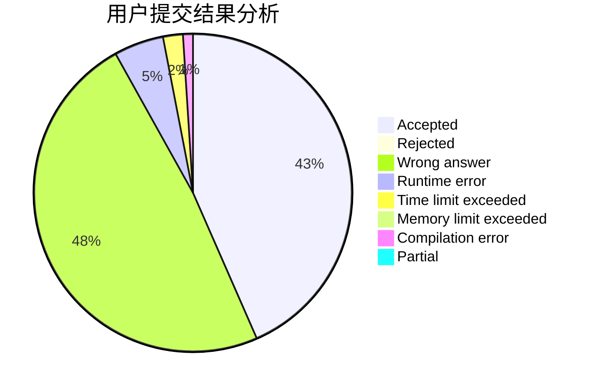
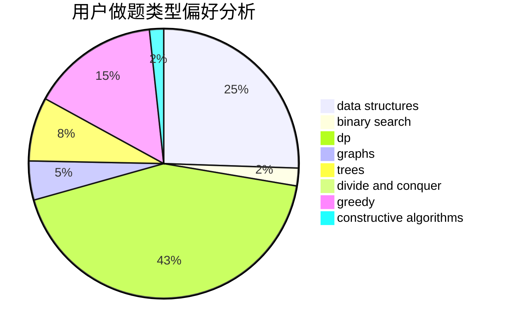
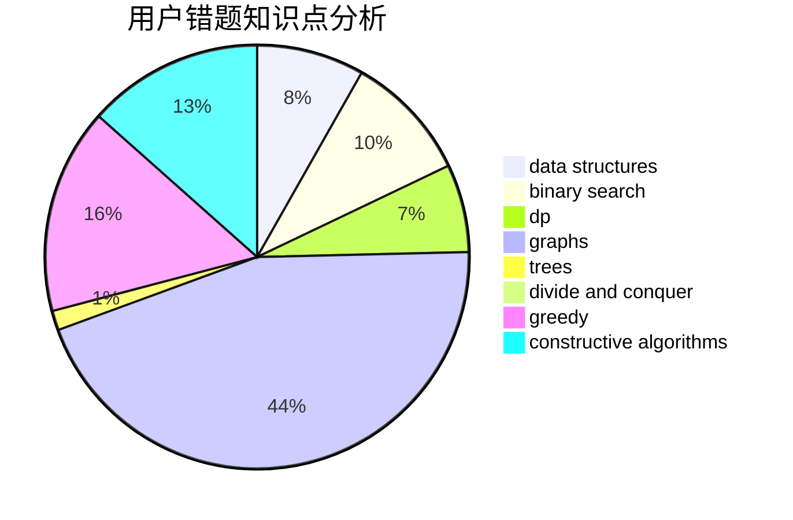

# FluffyBunny

<!-- tabs:start -->

#### **用户提交结果分析**

#### **用户做题类型偏好分析**

#### **用户错题知识点分析**

<!-- tabs:end -->
# 推荐题目
[1401E](https://codeforces.com/contest/1401/problem/E)		data structures,
                        geometry,
                        implementation,
                        sortings		  
[674G](https://codeforces.com/contest/674/problem/G)		dsu,graphs,sortings,trees		  
[1500E](https://codeforces.com/contest/1500/problem/E)		binary search,
                        data structures		  
[558A](https://codeforces.com/contest/558/problem/A)		brute force,
                        implementation,
                        sortings		  
[44G](https://codeforces.com/contest/44/problem/G)		data structures,
                        implementation		  
[1089A](https://codeforces.com/contest/1089/problem/A)		dp		  
[86C](https://codeforces.com/contest/86/problem/C)		dp,
                        string suffix structures,
                        trees		  
[50E](https://codeforces.com/contest/50/problem/E)		math		  
[86B](https://codeforces.com/contest/86/problem/B)		constructive algorithms,
                        graph matchings,
                        greedy,
                        math		  
[134B](https://codeforces.com/contest/134/problem/B)		brute force,
                        dfs and similar,
                        math,
                        number theory		  
