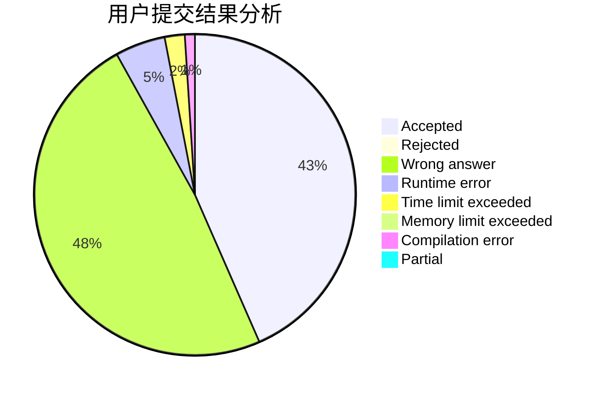
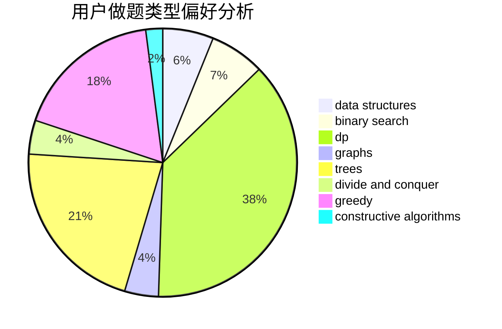
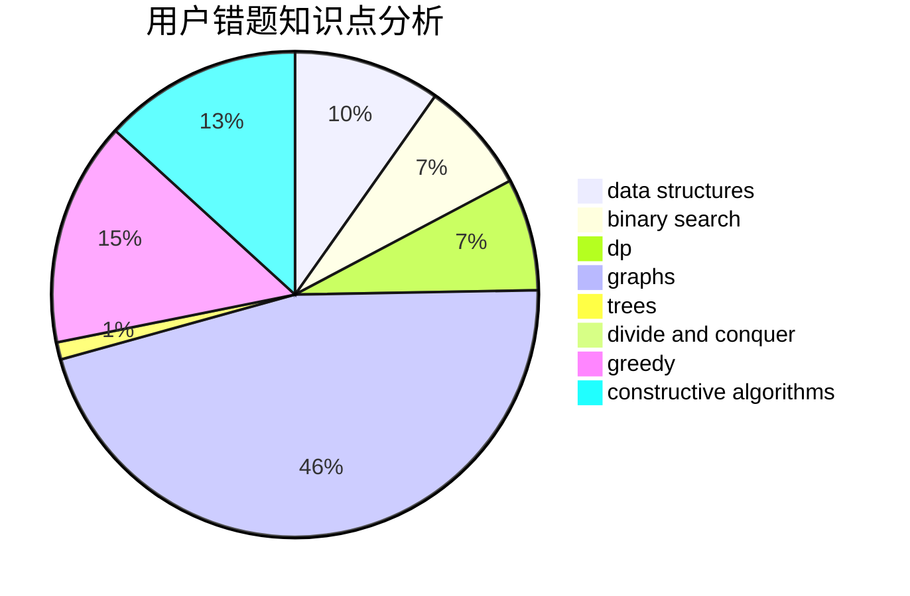

# FluffyBunny

<!-- tabs:start -->

#### **用户提交结果分析**

#### **用户做题类型偏好分析**

#### **用户错题知识点分析**

<!-- tabs:end -->
# 推荐题目
[1393E2](https://codeforces.com/contest/1393E/problem/2)		dp,
                        hashing,
                        implementation,
                        string suffix structures,
                        strings,
                        two pointers		  
[650E](https://codeforces.com/contest/650/problem/E)		data structures,
                        dfs and similar,
                        dsu,
                        greedy,
                        trees		  
[1492D](https://codeforces.com/contest/1492/problem/D)		bitmasks,
                        constructive algorithms,
                        greedy,
                        math		  
[535C](https://codeforces.com/contest/535/problem/C)		binary search,
                        greedy,
                        math		  
[429B](https://codeforces.com/contest/429/problem/B)		dp		  
[1088D](https://codeforces.com/contest/1088/problem/D)		bitmasks,
                        constructive algorithms,
                        implementation,
                        interactive		  
[851B](https://codeforces.com/contest/851/problem/B)		geometry,
                        math		  
[48A](https://codeforces.com/contest/48/problem/A)		implementation,
                        schedules		  
[851A](https://codeforces.com/contest/851/problem/A)		implementation,
                        math		  
[1343B](https://codeforces.com/contest/1343/problem/B)		constructive algorithms,
                        math		  
