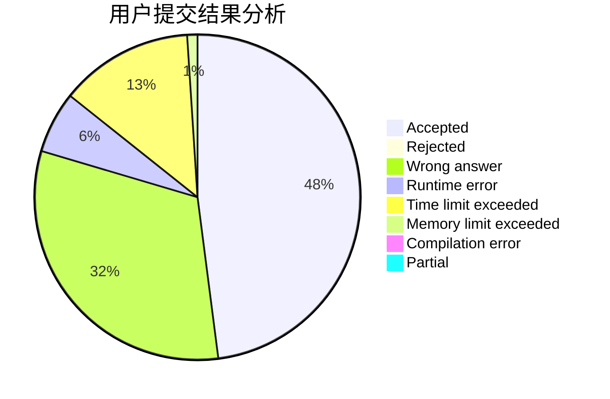
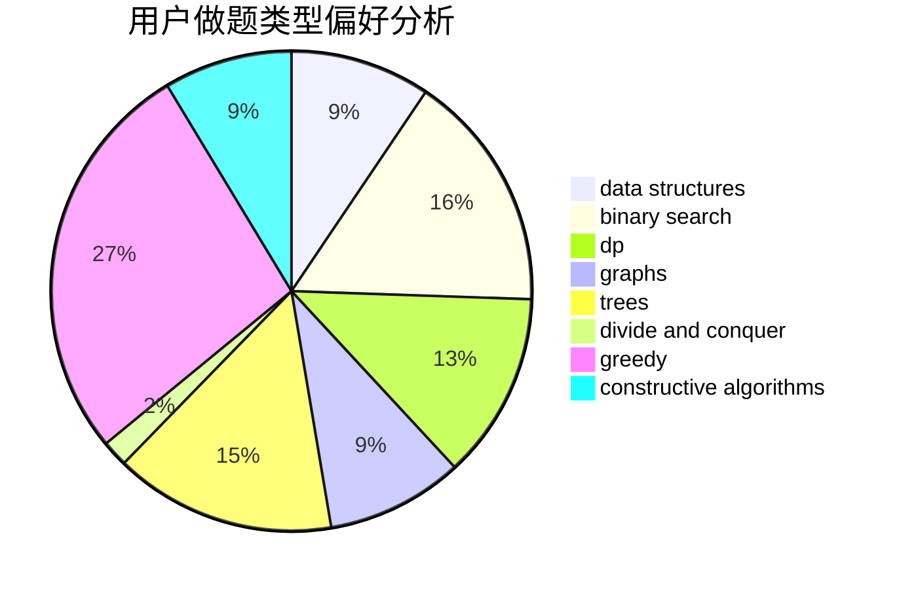
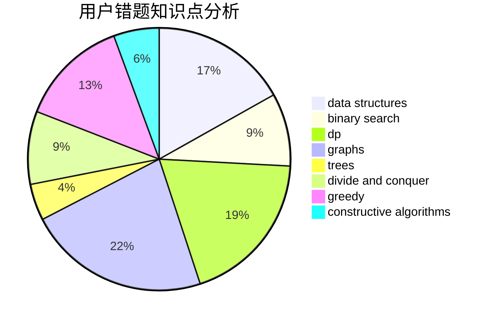

# Flying2018

<!-- tabs:start -->

#### **用户提交结果分析**

#### **用户做题类型偏好分析**

#### **用户错题知识点分析**

<!-- tabs:end -->
# 推荐题目
[730B](https://codeforces.com/contest/730/problem/B)		constructive algorithms,
                        interactive		  
[1054G](https://codeforces.com/contest/1054/problem/G)		constructive algorithms,
                        greedy,
                        math		  
[291B](https://codeforces.com/contest/291/problem/B)		*special problem,
                        implementation,
                        strings		  
[691E](https://codeforces.com/contest/691/problem/E)		matrices		  
[1213C](https://codeforces.com/contest/1213/problem/C)		math		  
[1066C](https://codeforces.com/contest/1066/problem/C)		implementation		  
[189A](https://codeforces.com/contest/189/problem/A)		brute force,
                        dp		  
[1322D](https://codeforces.com/contest/1322/problem/D)		bitmasks,
                        dp		  
[1197B](https://codeforces.com/contest/1197/problem/B)		greedy,
                        implementation		  
[851D](https://codeforces.com/contest/851/problem/D)		dsu,graphs,sortings,trees		  
