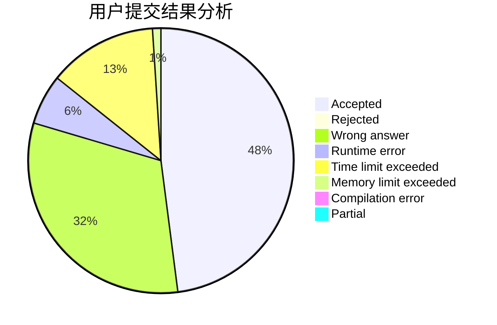
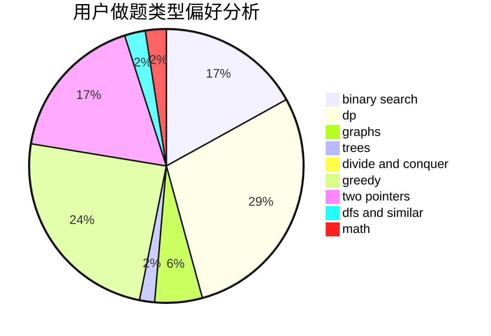

# Flying2018

<!-- tabs:start -->

#### **用户提交结果分析**

#### **用户做题类型偏好分析**

<!-- tabs:end -->
# 推荐题目
[747A](https://codeforces.com/contest/747/problem/A)
[1055B](https://codeforces.com/contest/1055/problem/B)
[306B](https://codeforces.com/contest/306/problem/B)
[711C](https://codeforces.com/contest/711/problem/C)
[1217E](https://codeforces.com/contest/1217/problem/E)
[1066F](https://codeforces.com/contest/1066/problem/F)
[212E](https://codeforces.com/contest/212/problem/E)
[1329C](https://codeforces.com/contest/1329/problem/C)
[1200D](https://codeforces.com/contest/1200/problem/D)
[870A](https://codeforces.com/contest/870/problem/A)
