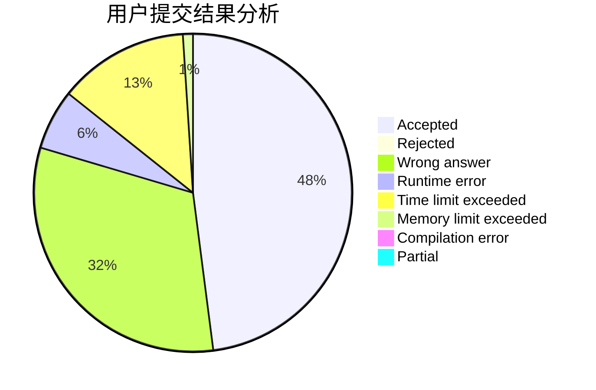
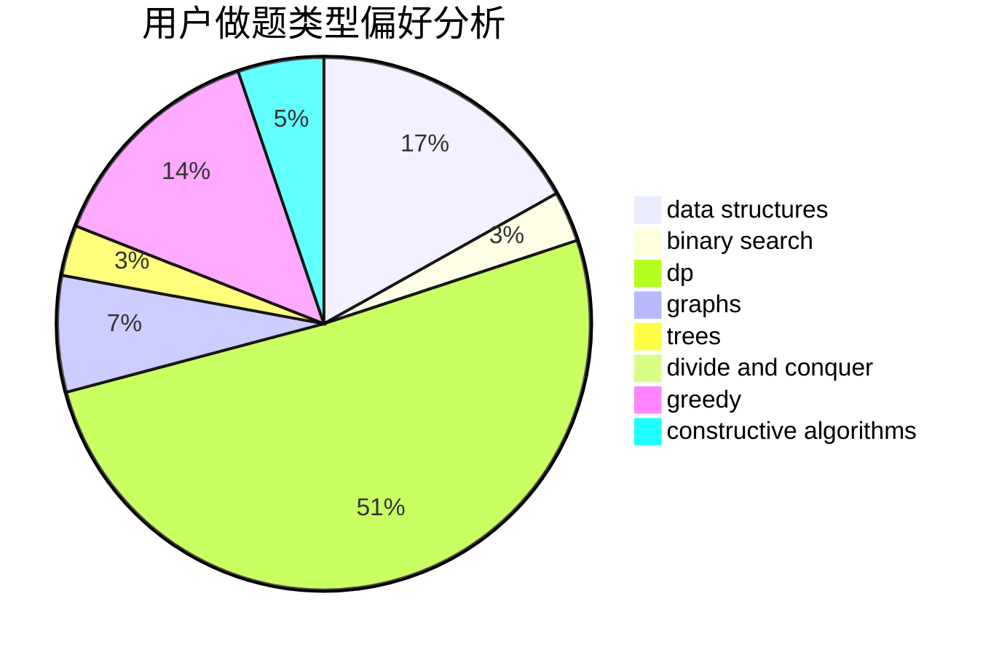
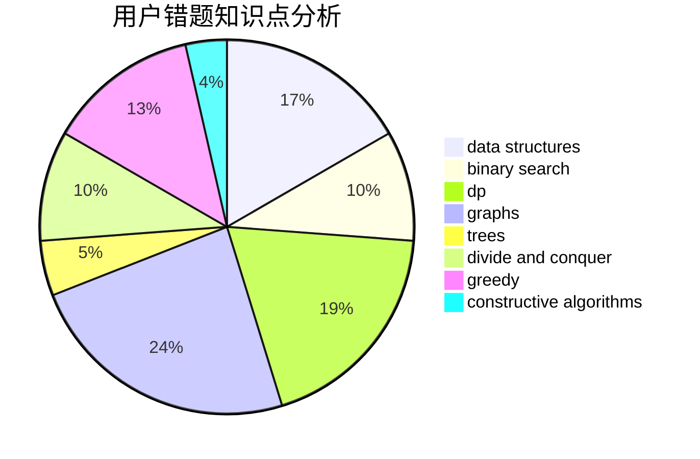

# Flying2018

<!-- tabs:start -->

#### **用户提交结果分析**

#### **用户做题类型偏好分析**

#### **用户错题知识点分析**

<!-- tabs:end -->
# 推荐题目
[747A](https://codeforces.com/contest/747/problem/A)		brute force,
                        math		  
[1055B](https://codeforces.com/contest/1055/problem/B)		dsu,
                        implementation		  
[306B](https://codeforces.com/contest/306/problem/B)		data structures,
                        greedy,
                        sortings		  
[711C](https://codeforces.com/contest/711/problem/C)		dp		  
[1217E](https://codeforces.com/contest/1217/problem/E)		data structures,
                        greedy,
                        implementation,
                        math		  
[1066F](https://codeforces.com/contest/1066/problem/F)		dp		  
[212E](https://codeforces.com/contest/212/problem/E)		dfs and similar,
                        dp,
                        trees		  
[1329C](https://codeforces.com/contest/1329/problem/C)		constructive algorithms,
                        data structures,
                        greedy,
                        implementation		  
[1200D](https://codeforces.com/contest/1200/problem/D)		brute force,
                        data structures,
                        dp,
                        implementation,
                        two pointers		  
[870A](https://codeforces.com/contest/870/problem/A)		brute force,
                        implementation		  
