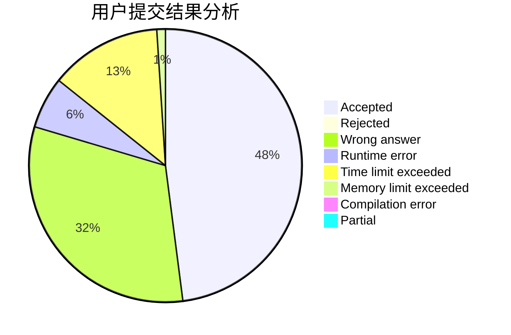
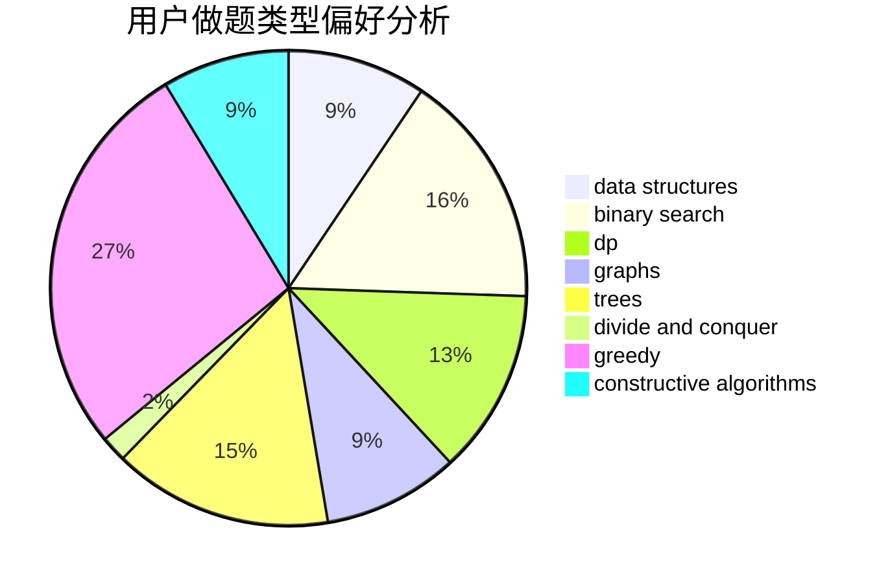
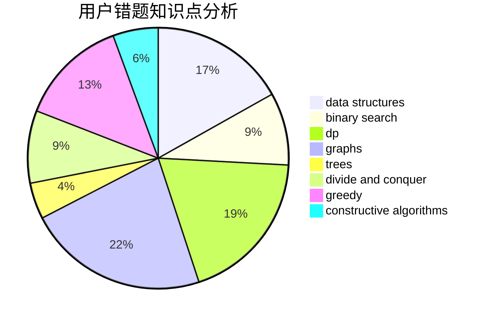

# Flying2018
<!-- tabs:start -->
#### **用户提交结果分析**

#### **用户做题类型偏好分析**

#### **用户错题知识点分析**

<!-- tabs:end -->
# 推荐题目
[Book Reading](http://codeforces.com/problemset/problem/1213/C)		math		  
[Glass Carving](http://codeforces.com/problemset/problem/527/C)		binary search,
                        data structures,
                        implementation		  
[Reality Show](http://codeforces.com/problemset/problem/1322/D)		bitmasks,
                        dp		  
[New Road Network](http://codeforces.com/problemset/problem/1054/G)		constructive algorithms,
                        greedy,
                        math		  
[Distinguish three-qubit states](http://codeforces.com/problemset/problem/1116/B1)		nan		  
[Black Square](http://codeforces.com/problemset/problem/431/A)		implementation		  
[SwapSort](http://codeforces.com/problemset/problem/489/A)		greedy,
                        implementation,
                        sortings		  
[Command Line Arguments](http://codeforces.com/problemset/problem/291/B)		*special problem,
                        implementation,
                        strings		  
[Table](http://codeforces.com/problemset/problem/232/B)		bitmasks,
                        combinatorics,
                        dp,
                        math		  
[Digits](http://codeforces.com/problemset/problem/852/A)		brute force,
                        implementation,
                        math		  
<!-- tabs:start -->
#### **data structures**
[Glass Carving](http://codeforces.com/problemset/problem/527/C)		binary search,
                        data structures,
                        implementation		  
[Yaroslav and Points](http://codeforces.com/problemset/problem/295/E)		data structures		  
[Dreamoon and Notepad](http://codeforces.com/problemset/problem/477/E)		data structures		  
[Graph Subset Problem](http://codeforces.com/problemset/problem/1439/B)		constructive algorithms,
                        data structures,
                        graphs		  
[Interesting Array](http://codeforces.com/problemset/problem/482/B)		constructive algorithms,
                        data structures,
                        trees		  
[Goodbye Souvenir](http://codeforces.com/problemset/problem/848/C)		data structures,
                        divide and conquer		  
[World of Darkraft: Battle for Azathoth](http://codeforces.com/problemset/problem/1320/C)		brute force,
                        data structures,
                        sortings		  
[Maximum width](http://codeforces.com/problemset/problem/1492/C)		binary search,
                        data structures,
                        dp,
                        greedy,
                        two pointers		  
[Old Floppy Drive](http://codeforces.com/problemset/problem/1490/G)		binary search,
                        data structures,
                        math		  
[Odd Mineral Resource](http://codeforces.com/problemset/problem/1479/D)		binary search,
                        bitmasks,
                        brute force,
                        data structures,
                        probabilities,
                        trees		  
#### **binary search**
[Glass Carving](http://codeforces.com/problemset/problem/527/C)		binary search,
                        data structures,
                        implementation		  
[Exploration plan](http://codeforces.com/problemset/problem/852/D)		binary search,
                        flows,
                        graph matchings,
                        shortest paths		  
[Maximum width](http://codeforces.com/problemset/problem/1492/C)		binary search,
                        data structures,
                        dp,
                        greedy,
                        two pointers		  
[Pairs](http://codeforces.com/problemset/problem/1463/D)		binary search,
                        constructive algorithms,
                        greedy,
                        two pointers		  
[Old Floppy Drive](http://codeforces.com/problemset/problem/1490/G)		binary search,
                        data structures,
                        math		  
[Odd Mineral Resource](http://codeforces.com/problemset/problem/1479/D)		binary search,
                        bitmasks,
                        brute force,
                        data structures,
                        probabilities,
                        trees		  
[Complicated Computations](http://codeforces.com/problemset/problem/1436/E)		binary search,
                        data structures,
                        two pointers		  
[Divide and Summarize](http://codeforces.com/problemset/problem/1461/D)		binary search,
                        brute force,
                        data structures,
                        divide and conquer,
                        implementation,
                        sortings		  
[K-beautiful Strings](http://codeforces.com/problemset/problem/1493/C)		binary search,
                        brute force,
                        constructive algorithms,
                        greedy,
                        strings		  
[Pythagorean Triples](http://codeforces.com/problemset/problem/1487/D)		binary search,
                        brute force,
                        math,
                        number theory		  
#### **dp**
[Reality Show](http://codeforces.com/problemset/problem/1322/D)		bitmasks,
                        dp		  
[Table](http://codeforces.com/problemset/problem/232/B)		bitmasks,
                        combinatorics,
                        dp,
                        math		  
[Casinos and travel](http://codeforces.com/problemset/problem/852/E)		dp		  
[Cut Ribbon](http://codeforces.com/problemset/problem/189/A)		brute force,
                        dp		  
[Magic Numbers](http://codeforces.com/problemset/problem/628/D)		dp		  
[Maximum width](http://codeforces.com/problemset/problem/1492/C)		binary search,
                        data structures,
                        dp,
                        greedy,
                        two pointers		  
[Bouncing Ball](https://codeforces.com/contest/1457/problem/C)		brute force,
                        dp,
                        implementation		  
[Pekora and Trampoline](http://codeforces.com/problemset/problem/1491/C)		brute force,
                        data structures,
                        dp,
                        greedy,
                        implementation		  
[Chef Monocarp](http://codeforces.com/problemset/problem/1437/C)		dp,
                        flows,
                        graph matchings,
                        greedy,
                        math,
                        sortings		  
[Binary Removals](http://codeforces.com/problemset/problem/1499/B)		brute force,
                        dp,
                        greedy,
                        implementation		  
#### **graph**
[Graph Subset Problem](http://codeforces.com/problemset/problem/1439/B)		constructive algorithms,
                        data structures,
                        graphs		  
[Exploration plan](http://codeforces.com/problemset/problem/852/D)		binary search,
                        flows,
                        graph matchings,
                        shortest paths		  
[Cycle](http://codeforces.com/problemset/problem/117/C)		dfs and similar,
                        graphs		  
[Minimum Ties](http://codeforces.com/problemset/problem/1487/C)		brute force,
                        constructive algorithms,
                        dfs and similar,
                        graphs,
                        greedy,
                        implementation,
                        math		  
[Chef Monocarp](http://codeforces.com/problemset/problem/1437/C)		dp,
                        flows,
                        graph matchings,
                        greedy,
                        math,
                        sortings		  
[Strange Housing](http://codeforces.com/problemset/problem/1470/D)		constructive algorithms,
                        dfs and similar,
                        graph matchings,
                        graphs,
                        greedy		  
[Longest Simple Cycle](http://codeforces.com/problemset/problem/1476/C)		dp,
                        graphs,
                        greedy		  
[Shortest and Longest LIS](http://codeforces.com/problemset/problem/1304/D)		constructive algorithms,
                        graphs,
                        greedy,
                        two pointers		  
[Ball in Berland](http://codeforces.com/problemset/problem/1475/C)		combinatorics,
                        graphs,
                        math		  
[Kyoya and Train](http://codeforces.com/problemset/problem/553/E)		dp,
                        fft,
                        graphs,
                        math,
                        probabilities		  
#### **trees**
[Interesting Array](http://codeforces.com/problemset/problem/482/B)		constructive algorithms,
                        data structures,
                        trees		  
[Odd Mineral Resource](http://codeforces.com/problemset/problem/1479/D)		binary search,
                        bitmasks,
                        brute force,
                        data structures,
                        probabilities,
                        trees		  
[Yet Another Card Deck](http://codeforces.com/problemset/problem/1511/C)		brute force,
                        data structures,
                        implementation,
                        trees		  
[Diameter Cuts](http://codeforces.com/problemset/problem/1499/F)		combinatorics,
                        dfs and similar,
                        dp,
                        trees		  
[Fib-tree](http://codeforces.com/problemset/problem/1491/E)		brute force,
                        dfs and similar,
                        divide and conquer,
                        number theory,
                        trees		  
[13th Labour of Heracles](http://codeforces.com/problemset/problem/1466/D)		data structures,
                        greedy,
                        sortings,
                        trees		  
[BFS Trees](http://codeforces.com/problemset/problem/1495/D)		combinatorics,
                        dfs and similar,
                        graphs,
                        math,
                        shortest paths,
                        trees		  
[Sum of Prefix Sums](http://codeforces.com/problemset/problem/1303/G)		data structures,
                        divide and conquer,
                        geometry,
                        trees		  
[Number of Simple Paths](http://codeforces.com/problemset/problem/1454/E)		combinatorics,
                        dfs and similar,
                        graphs,
                        trees		  
[Dogeforces](http://codeforces.com/problemset/problem/1494/D)		constructive algorithms,
                        data structures,
                        dfs and similar,
                        divide and conquer,
                        dsu,
                        greedy,
                        sortings,
                        trees		  
#### **divide and conquer**
[Goodbye Souvenir](http://codeforces.com/problemset/problem/848/C)		data structures,
                        divide and conquer		  
[Divide and Summarize](http://codeforces.com/problemset/problem/1461/D)		binary search,
                        brute force,
                        data structures,
                        divide and conquer,
                        implementation,
                        sortings		  
[Song of the Sirens](http://codeforces.com/problemset/problem/1466/G)		combinatorics,
                        divide and conquer,
                        hashing,
                        math,
                        string suffix structures,
                        strings		  
[Permutation Transformation](http://codeforces.com/problemset/problem/1490/D)		dfs and similar,
                        divide and conquer,
                        implementation		  
[Skyline Photo](https://codeforces.com/contest/1483/problem/C)		data structures,
                        divide and conquer,
                        dp		  
[Fib-tree](http://codeforces.com/problemset/problem/1491/E)		brute force,
                        dfs and similar,
                        divide and conquer,
                        number theory,
                        trees		  
[Sum of Prefix Sums](http://codeforces.com/problemset/problem/1303/G)		data structures,
                        divide and conquer,
                        geometry,
                        trees		  
[Dogeforces](http://codeforces.com/problemset/problem/1494/D)		constructive algorithms,
                        data structures,
                        dfs and similar,
                        divide and conquer,
                        dsu,
                        greedy,
                        sortings,
                        trees		  
[Logistical Questions](http://codeforces.com/problemset/problem/566/C)		dfs and similar,
                        divide and conquer,
                        trees		  
[Fruit Sequences](http://codeforces.com/problemset/problem/1428/F)		binary search,
                        data structures,
                        divide and conquer,
                        dp,
                        two pointers		  
#### **greedy**
[New Road Network](http://codeforces.com/problemset/problem/1054/G)		constructive algorithms,
                        greedy,
                        math		  
[SwapSort](http://codeforces.com/problemset/problem/489/A)		greedy,
                        implementation,
                        sortings		  
[Pillars](http://codeforces.com/problemset/problem/1197/B)		greedy,
                        implementation		  
[Assigning to Classes](http://codeforces.com/problemset/problem/1300/B)		greedy,
                        implementation,
                        sortings		  
[You Are Given Two Binary Strings...](http://codeforces.com/problemset/problem/1202/A)		bitmasks,
                        greedy		  
[Labs](http://codeforces.com/problemset/problem/1236/C)		constructive algorithms,
                        greedy,
                        implementation		  
[Maximum width](http://codeforces.com/problemset/problem/1492/C)		binary search,
                        data structures,
                        dp,
                        greedy,
                        two pointers		  
[Diamond Miner](https://codeforces.com/contest/1496/problem/C)		geometry,
                        greedy,
                        math,
                        sortings		  
[Anti-knapsack](http://codeforces.com/problemset/problem/1493/A)		constructive algorithms,
                        greedy		  
[Pairs](http://codeforces.com/problemset/problem/1463/D)		binary search,
                        constructive algorithms,
                        greedy,
                        two pointers		  
#### **constructive algorithms**
[New Road Network](http://codeforces.com/problemset/problem/1054/G)		constructive algorithms,
                        greedy,
                        math		  
[Vasya and Chess](http://codeforces.com/problemset/problem/493/D)		constructive algorithms,
                        games,
                        math		  
[Minimum and Maximum](http://codeforces.com/problemset/problem/730/B)		constructive algorithms,
                        interactive		  
[Graph Subset Problem](http://codeforces.com/problemset/problem/1439/B)		constructive algorithms,
                        data structures,
                        graphs		  
[Interesting Array](http://codeforces.com/problemset/problem/482/B)		constructive algorithms,
                        data structures,
                        trees		  
[Labs](http://codeforces.com/problemset/problem/1236/C)		constructive algorithms,
                        greedy,
                        implementation		  
[Anti-knapsack](http://codeforces.com/problemset/problem/1493/A)		constructive algorithms,
                        greedy		  
[Pairs](http://codeforces.com/problemset/problem/1463/D)		binary search,
                        constructive algorithms,
                        greedy,
                        two pointers		  
[XOR-gun](https://codeforces.com/contest/1456/problem/B)		bitmasks,
                        brute force,
                        constructive algorithms		  
[Genius's Gambit](http://codeforces.com/problemset/problem/1492/D)		bitmasks,
                        constructive algorithms,
                        greedy,
                        math		  
#### **sortings**
[SwapSort](http://codeforces.com/problemset/problem/489/A)		greedy,
                        implementation,
                        sortings		  
[The New Year: Meeting Friends](http://codeforces.com/problemset/problem/723/A)		implementation,
                        math,
                        sortings		  
[World of Darkraft: Battle for Azathoth](http://codeforces.com/problemset/problem/1320/C)		brute force,
                        data structures,
                        sortings		  
[Assigning to Classes](http://codeforces.com/problemset/problem/1300/B)		greedy,
                        implementation,
                        sortings		  
[Diamond Miner](https://codeforces.com/contest/1496/problem/C)		geometry,
                        greedy,
                        math,
                        sortings		  
[Meximization](http://codeforces.com/problemset/problem/1497/A)		brute force,
                        data structures,
                        greedy,
                        sortings		  
[Avoiding Zero](http://codeforces.com/problemset/problem/1427/A)		math,
                        sortings		  
[Divide and Summarize](http://codeforces.com/problemset/problem/1461/D)		binary search,
                        brute force,
                        data structures,
                        divide and conquer,
                        implementation,
                        sortings		  
[Chef Monocarp](http://codeforces.com/problemset/problem/1437/C)		dp,
                        flows,
                        graph matchings,
                        greedy,
                        math,
                        sortings		  
[Replacing Elements](http://codeforces.com/problemset/problem/1473/A)		greedy,
                        implementation,
                        math,
                        sortings		  
<!-- tabs:end -->
