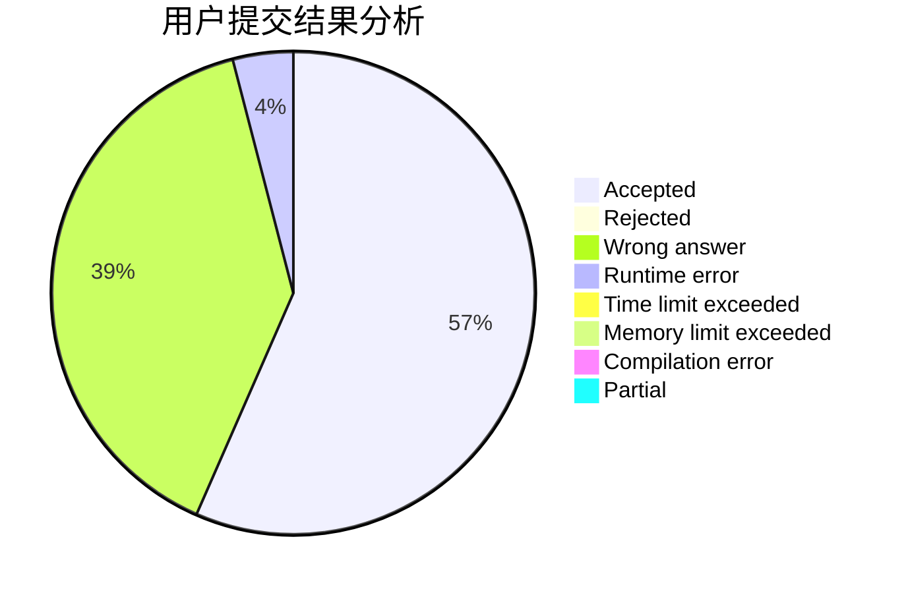
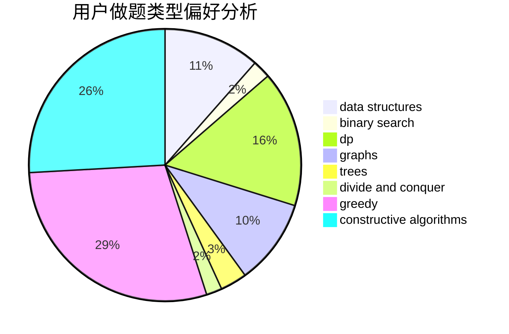
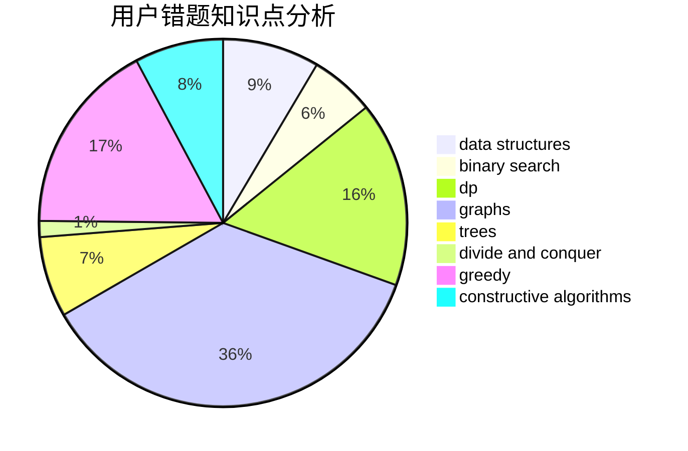

# Flying_streaky_pork

<!-- tabs:start -->

#### **用户提交结果分析**

#### **用户做题类型偏好分析**

#### **用户错题知识点分析**

<!-- tabs:end -->
# 推荐题目
[825G](https://codeforces.com/contest/825/problem/G)		dfs and similar,
                        graphs,
                        trees		  
[1297C](https://codeforces.com/contest/1297/problem/C)		*special problem,
                        greedy		  
[1307F](https://codeforces.com/contest/1307/problem/F)		dfs and similar,
                        dsu,
                        trees		  
[1060C](https://codeforces.com/contest/1060/problem/C)		binary search,
                        implementation,
                        two pointers		  
[786C](https://codeforces.com/contest/786/problem/C)		data structures,
                        divide and conquer		  
[125D](https://codeforces.com/contest/125/problem/D)		constructive algorithms,
                        greedy		  
[1070A](https://codeforces.com/contest/1070/problem/A)		dp,
                        graphs,
                        number theory,
                        shortest paths		  
[1321D](https://codeforces.com/contest/1321/problem/D)		dsu,graphs,sortings,trees		  
[543B](https://codeforces.com/contest/543/problem/B)		constructive algorithms,
                        graphs,
                        shortest paths		  
[158C](https://codeforces.com/contest/158/problem/C)		*special problem,
                        data structures,
                        implementation		  
