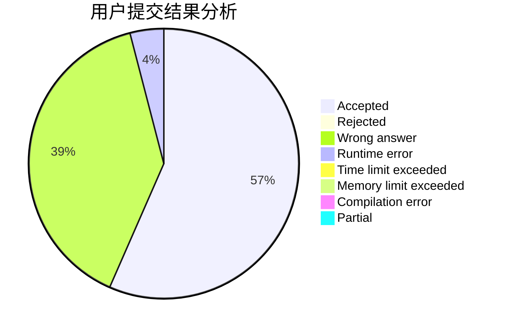
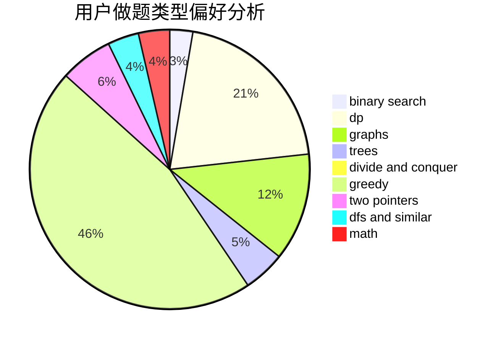

# Flying_streaky_pork

<!-- tabs:start -->

#### **用户提交结果分析**

#### **用户做题类型偏好分析**

<!-- tabs:end -->
# 推荐题目
[845C](https://codeforces.com/contest/845/problem/C)
[1304C](https://codeforces.com/contest/1304/problem/C)
[1316B](https://codeforces.com/contest/1316/problem/B)
[1060F](https://codeforces.com/contest/1060/problem/F)
[802N](https://codeforces.com/contest/802/problem/N)
[1265D](https://codeforces.com/contest/1265/problem/D)
[1070D](https://codeforces.com/contest/1070/problem/D)
[1328C](https://codeforces.com/contest/1328/problem/C)
[567D](https://codeforces.com/contest/567/problem/D)
[180C](https://codeforces.com/contest/180/problem/C)
