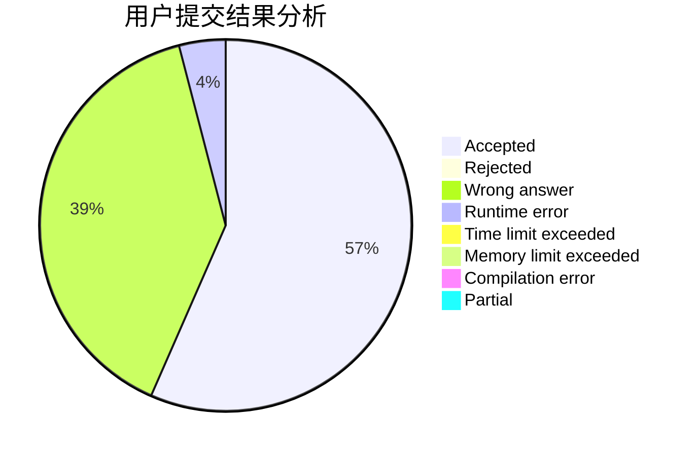
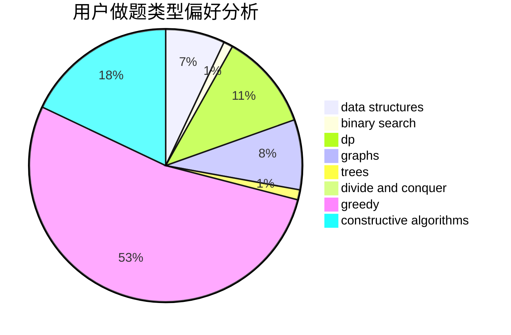
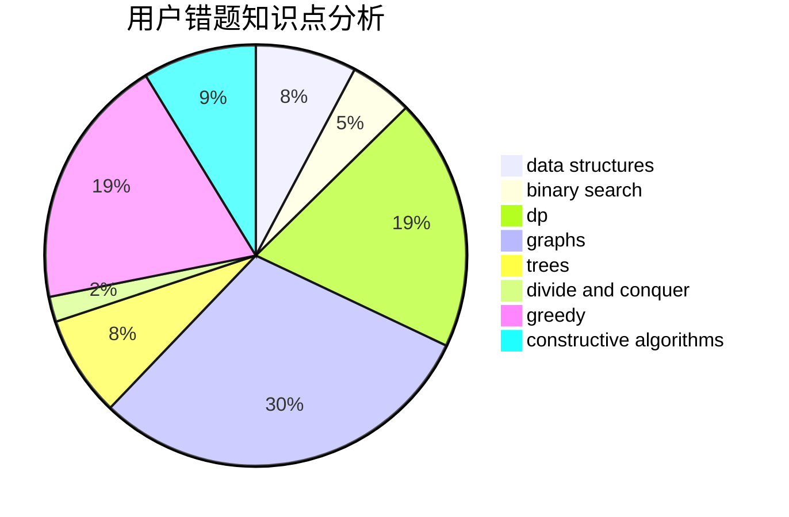

# Flying_streaky_pork

<!-- tabs:start -->

#### **用户提交结果分析**

#### **用户做题类型偏好分析**

#### **用户错题知识点分析**

<!-- tabs:end -->
# 推荐题目
[845C](https://codeforces.com/contest/845/problem/C)		data structures,
                        greedy,
                        sortings		  
[1304C](https://codeforces.com/contest/1304/problem/C)		dp,
                        greedy,
                        implementation,
                        sortings,
                        two pointers		  
[1316B](https://codeforces.com/contest/1316/problem/B)		brute force,
                        constructive algorithms,
                        implementation,
                        sortings,
                        strings		  
[1060F](https://codeforces.com/contest/1060/problem/F)		combinatorics,
                        dp		  
[802N](https://codeforces.com/contest/802/problem/N)		binary search,
                        flows,
                        graphs		  
[1265D](https://codeforces.com/contest/1265/problem/D)		dsu,graphs,sortings,trees		  
[1070D](https://codeforces.com/contest/1070/problem/D)		greedy		  
[1328C](https://codeforces.com/contest/1328/problem/C)		greedy,
                        implementation		  
[567D](https://codeforces.com/contest/567/problem/D)		binary search,
                        data structures,
                        greedy,
                        sortings		  
[180C](https://codeforces.com/contest/180/problem/C)		dp		  
