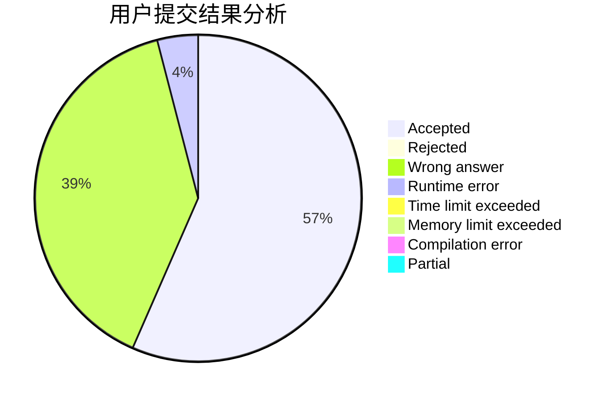
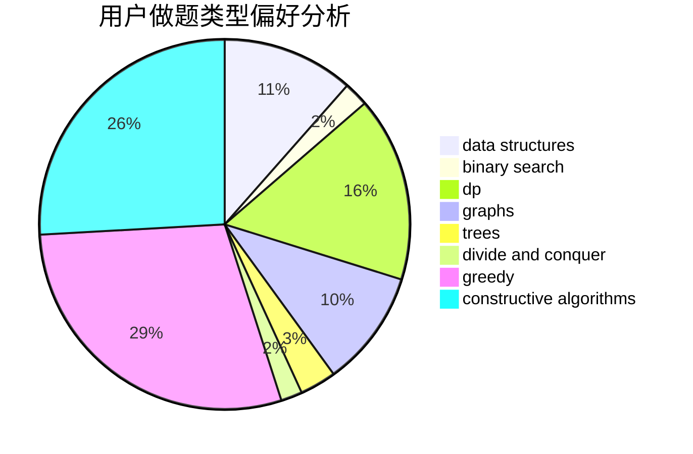
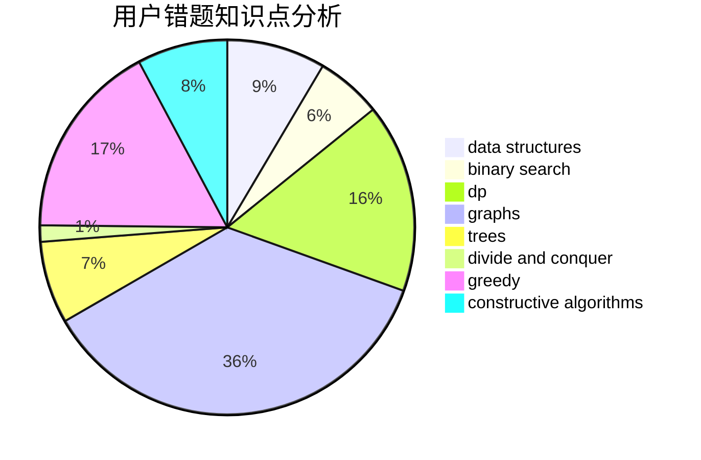

# Flying_streaky_pork
<!-- tabs:start -->
#### **用户提交结果分析**

#### **用户做题类型偏好分析**

#### **用户错题知识点分析**

<!-- tabs:end -->
# 推荐题目
[Find a Number](http://codeforces.com/problemset/problem/1070/A)		dp,
                        graphs,
                        number theory,
                        shortest paths		  
[Tree Generator™](http://codeforces.com/problemset/problem/1149/C)		data structures,
                        implementation,
                        trees		  
[Game](http://codeforces.com/problemset/problem/513/A)		constructive algorithms,
                        math		  
[Good Contest](http://codeforces.com/problemset/problem/1295/F)		combinatorics,
                        dp,
                        probabilities		  
[Diamond Miner](http://codeforces.com/problemset/problem/1495/A)		geometry,
                        greedy,
                        math,
                        sortings		  
[Till I Collapse](http://codeforces.com/problemset/problem/786/C)		data structures,
                        divide and conquer		  
[Cow and Vacation](http://codeforces.com/problemset/problem/1307/F)		dfs and similar,
                        dsu,
                        trees		  
[XOR Equation](https://codeforces.com/contest/634/problem/B)		dp,
                        math		  
[Destroying Roads](http://codeforces.com/problemset/problem/543/B)		constructive algorithms,
                        graphs,
                        shortest paths		  
[Two progressions](http://codeforces.com/problemset/problem/125/D)		constructive algorithms,
                        greedy		  
<!-- tabs:start -->
#### **data structures**
[Find a Number](http://codeforces.com/problemset/problem/1149/C)		data structures,
                        implementation,
                        trees		  
[Tree Generator™](http://codeforces.com/problemset/problem/786/C)		data structures,
                        divide and conquer		  
[Game](http://codeforces.com/problemset/problem/12/D)		data structures,
                        sortings		  
[Good Contest](http://codeforces.com/problemset/problem/802/O)		binary search,
                        data structures,
                        flows		  
[Diamond Miner](http://codeforces.com/problemset/problem/158/C)		*special problem,
                        data structures,
                        implementation		  
[Till I Collapse](http://codeforces.com/problemset/problem/681/C)		constructive algorithms,
                        data structures,
                        greedy		  
[Cow and Vacation](http://codeforces.com/problemset/problem/1042/D)		data structures,
                        divide and conquer,
                        two pointers		  
[XOR Equation](http://codeforces.com/problemset/problem/555/B)		data structures,
                        greedy,
                        sortings		  
[Destroying Roads](http://codeforces.com/problemset/problem/486/E)		data structures,
                        dp,
                        greedy,
                        hashing,
                        math		  
[Two progressions](http://codeforces.com/problemset/problem/853/C)		data structures		  
#### **binary search**
[Find a Number](http://codeforces.com/problemset/problem/314/B)		binary search,
                        dfs and similar,
                        strings		  
[Tree Generator™](http://codeforces.com/problemset/problem/802/O)		binary search,
                        data structures,
                        flows		  
[Game](https://codeforces.com/contest/737/problem/A)		binary search,
                        greedy,
                        sortings		  
[Good Contest](https://codeforces.com/contest/1509/problem/E)		binary search,
                        bitmasks,
                        combinatorics,
                        constructive algorithms,
                        implementation,
                        math		  
[Diamond Miner](http://codeforces.com/problemset/problem/853/D)		binary search,
                        dp,
                        greedy		  
[Till I Collapse](http://codeforces.com/problemset/problem/253/B)		binary search,
                        dp,
                        sortings,
                        two pointers		  
[Cow and Vacation](http://codeforces.com/problemset/problem/274/A)		binary search,
                        greedy,
                        sortings		  
[XOR Equation](http://codeforces.com/problemset/problem/1060/C)		binary search,
                        implementation,
                        two pointers		  
[Destroying Roads](http://codeforces.com/problemset/problem/1492/C)		binary search,
                        data structures,
                        dp,
                        greedy,
                        two pointers		  
[Two progressions](http://codeforces.com/problemset/problem/1463/D)		binary search,
                        constructive algorithms,
                        greedy,
                        two pointers		  
#### **dp**
[Find a Number](http://codeforces.com/problemset/problem/1070/A)		dp,
                        graphs,
                        number theory,
                        shortest paths		  
[Tree Generator™](http://codeforces.com/problemset/problem/1295/F)		combinatorics,
                        dp,
                        probabilities		  
[Game](https://codeforces.com/contest/634/problem/B)		dp,
                        math		  
[Good Contest](http://codeforces.com/problemset/problem/118/D)		dp		  
[Diamond Miner](http://codeforces.com/problemset/problem/758/E)		dfs and similar,
                        dp,
                        graphs,
                        greedy,
                        trees		  
[Till I Collapse](http://codeforces.com/problemset/problem/1214/D)		dfs and similar,
                        dp,
                        flows,
                        hashing		  
[Cow and Vacation](http://codeforces.com/problemset/problem/486/E)		data structures,
                        dp,
                        greedy,
                        hashing,
                        math		  
[XOR Equation](http://codeforces.com/problemset/problem/853/D)		binary search,
                        dp,
                        greedy		  
[Destroying Roads](https://codeforces.com/contest/1384/problem/E)		bitmasks,
                        dp,
                        graphs,
                        trees		  
[Two progressions](http://codeforces.com/problemset/problem/253/B)		binary search,
                        dp,
                        sortings,
                        two pointers		  
#### **graph**
[Find a Number](http://codeforces.com/problemset/problem/1070/A)		dp,
                        graphs,
                        number theory,
                        shortest paths		  
[Tree Generator™](http://codeforces.com/problemset/problem/543/B)		constructive algorithms,
                        graphs,
                        shortest paths		  
[Game](http://codeforces.com/problemset/problem/1368/E)		constructive algorithms,
                        graphs,
                        greedy		  
[Good Contest](http://codeforces.com/problemset/problem/825/G)		dfs and similar,
                        graphs,
                        trees		  
[Diamond Miner](https://codeforces.com/contest/1321/problem/D)		dfs and similar,
                        graphs,
                        shortest paths		  
[Till I Collapse](http://codeforces.com/problemset/problem/196/E)		dsu,
                        graphs,
                        shortest paths		  
[Cow and Vacation](http://codeforces.com/problemset/problem/758/E)		dfs and similar,
                        dp,
                        graphs,
                        greedy,
                        trees		  
[XOR Equation](http://codeforces.com/problemset/problem/852/I)		brute force,
                        dfs and similar,
                        graphs,
                        trees		  
[Destroying Roads](https://codeforces.com/contest/1384/problem/E)		bitmasks,
                        dp,
                        graphs,
                        trees		  
[Two progressions](http://codeforces.com/problemset/problem/682/C)		dfs and similar,
                        dp,
                        graphs,
                        trees		  
#### **trees**
[Find a Number](http://codeforces.com/problemset/problem/1149/C)		data structures,
                        implementation,
                        trees		  
[Tree Generator™](http://codeforces.com/problemset/problem/1307/F)		dfs and similar,
                        dsu,
                        trees		  
[Game](http://codeforces.com/problemset/problem/825/G)		dfs and similar,
                        graphs,
                        trees		  
[Good Contest](http://codeforces.com/problemset/problem/758/E)		dfs and similar,
                        dp,
                        graphs,
                        greedy,
                        trees		  
[Diamond Miner](http://codeforces.com/problemset/problem/852/I)		brute force,
                        dfs and similar,
                        graphs,
                        trees		  
[Till I Collapse](https://codeforces.com/contest/1384/problem/E)		bitmasks,
                        dp,
                        graphs,
                        trees		  
[Cow and Vacation](http://codeforces.com/problemset/problem/682/C)		dfs and similar,
                        dp,
                        graphs,
                        trees		  
[XOR Equation](http://codeforces.com/problemset/problem/1479/D)		binary search,
                        bitmasks,
                        brute force,
                        data structures,
                        probabilities,
                        trees		  
[Destroying Roads](http://codeforces.com/problemset/problem/1511/C)		brute force,
                        data structures,
                        implementation,
                        trees		  
[Two progressions](http://codeforces.com/problemset/problem/1499/F)		combinatorics,
                        dfs and similar,
                        dp,
                        trees		  
#### **divide and conquer**
[Find a Number](http://codeforces.com/problemset/problem/786/C)		data structures,
                        divide and conquer		  
[Tree Generator™](http://codeforces.com/problemset/problem/1042/D)		data structures,
                        divide and conquer,
                        two pointers		  
[Game](http://codeforces.com/problemset/problem/1461/D)		binary search,
                        brute force,
                        data structures,
                        divide and conquer,
                        implementation,
                        sortings		  
[Good Contest](http://codeforces.com/problemset/problem/1466/G)		combinatorics,
                        divide and conquer,
                        hashing,
                        math,
                        string suffix structures,
                        strings		  
[Diamond Miner](http://codeforces.com/problemset/problem/1490/D)		dfs and similar,
                        divide and conquer,
                        implementation		  
[Till I Collapse](https://codeforces.com/contest/1483/problem/C)		data structures,
                        divide and conquer,
                        dp		  
[Cow and Vacation](http://codeforces.com/problemset/problem/1491/E)		brute force,
                        dfs and similar,
                        divide and conquer,
                        number theory,
                        trees		  
[XOR Equation](http://codeforces.com/problemset/problem/1303/G)		data structures,
                        divide and conquer,
                        geometry,
                        trees		  
[Destroying Roads](http://codeforces.com/problemset/problem/1494/D)		constructive algorithms,
                        data structures,
                        dfs and similar,
                        divide and conquer,
                        dsu,
                        greedy,
                        sortings,
                        trees		  
[Two progressions](http://codeforces.com/problemset/problem/1482/E)		data structures,
                        divide and conquer,
                        dp		  
#### **greedy**
[Find a Number](http://codeforces.com/problemset/problem/1495/A)		geometry,
                        greedy,
                        math,
                        sortings		  
[Tree Generator™](http://codeforces.com/problemset/problem/125/D)		constructive algorithms,
                        greedy		  
[Game](http://codeforces.com/problemset/problem/1368/E)		constructive algorithms,
                        graphs,
                        greedy		  
[Good Contest](http://codeforces.com/problemset/problem/1297/C)		*special problem,
                        greedy		  
[Diamond Miner](http://codeforces.com/problemset/problem/33/C)		greedy		  
[Till I Collapse](http://codeforces.com/problemset/problem/749/A)		greedy,
                        implementation,
                        math,
                        number theory		  
[Cow and Vacation](https://codeforces.com/contest/737/problem/A)		binary search,
                        greedy,
                        sortings		  
[XOR Equation](http://codeforces.com/problemset/problem/681/C)		constructive algorithms,
                        data structures,
                        greedy		  
[Destroying Roads](http://codeforces.com/problemset/problem/758/E)		dfs and similar,
                        dp,
                        graphs,
                        greedy,
                        trees		  
[Two progressions](http://codeforces.com/problemset/problem/555/B)		data structures,
                        greedy,
                        sortings		  
#### **constructive algorithms**
[Find a Number](http://codeforces.com/problemset/problem/513/A)		constructive algorithms,
                        math		  
[Tree Generator™](http://codeforces.com/problemset/problem/543/B)		constructive algorithms,
                        graphs,
                        shortest paths		  
[Game](http://codeforces.com/problemset/problem/125/D)		constructive algorithms,
                        greedy		  
[Good Contest](http://codeforces.com/problemset/problem/1368/E)		constructive algorithms,
                        graphs,
                        greedy		  
[Diamond Miner](http://codeforces.com/problemset/problem/730/H)		constructive algorithms,
                        implementation		  
[Till I Collapse](https://codeforces.com/contest/1130/problem/E)		constructive algorithms		  
[Cow and Vacation](https://codeforces.com/contest/1509/problem/E)		binary search,
                        bitmasks,
                        combinatorics,
                        constructive algorithms,
                        implementation,
                        math		  
[XOR Equation](http://codeforces.com/problemset/problem/681/C)		constructive algorithms,
                        data structures,
                        greedy		  
[Destroying Roads](http://codeforces.com/problemset/problem/600/C)		constructive algorithms,
                        greedy,
                        strings		  
[Two progressions](https://codeforces.com/contest/716/problem/C)		constructive algorithms,
                        math		  
#### **sortings**
[Find a Number](http://codeforces.com/problemset/problem/1495/A)		geometry,
                        greedy,
                        math,
                        sortings		  
[Tree Generator™](http://codeforces.com/problemset/problem/12/D)		data structures,
                        sortings		  
[Game](https://codeforces.com/contest/737/problem/A)		binary search,
                        greedy,
                        sortings		  
[Good Contest](http://codeforces.com/problemset/problem/555/B)		data structures,
                        greedy,
                        sortings		  
[Diamond Miner](http://codeforces.com/problemset/problem/253/B)		binary search,
                        dp,
                        sortings,
                        two pointers		  
[Till I Collapse](http://codeforces.com/problemset/problem/1198/A)		sortings,
                        two pointers		  
[Cow and Vacation](http://codeforces.com/problemset/problem/274/A)		binary search,
                        greedy,
                        sortings		  
[XOR Equation](http://codeforces.com/problemset/problem/853/B)		greedy,
                        sortings,
                        two pointers		  
[Destroying Roads](https://codeforces.com/contest/1496/problem/C)		geometry,
                        greedy,
                        math,
                        sortings		  
[Two progressions](http://codeforces.com/problemset/problem/1495/A)		geometry,
                        greedy,
                        math,
                        sortings		  
<!-- tabs:end -->
