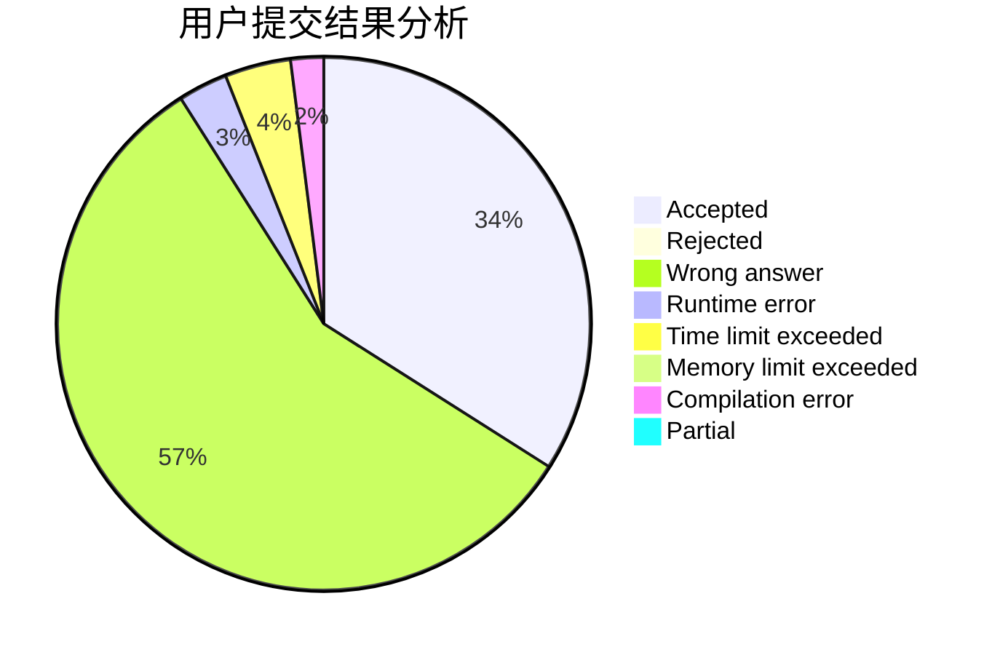
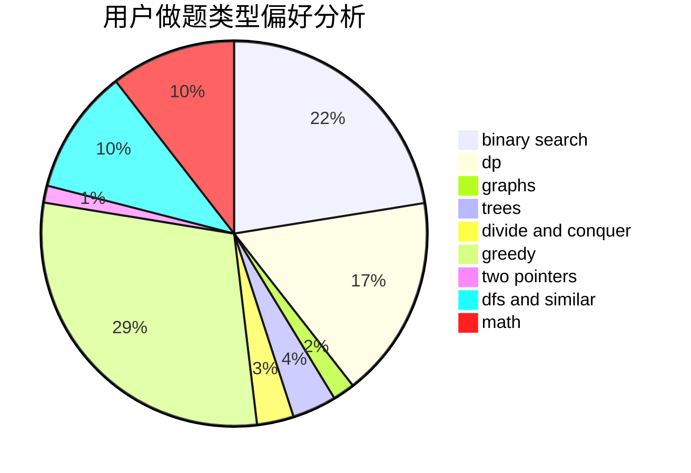

# Flyzz

<!-- tabs:start -->

#### **用户提交结果分析**

#### **用户做题类型偏好分析**

<!-- tabs:end -->
# 推荐题目
[1332C](https://codeforces.com/contest/1332/problem/C)
[1397C](https://codeforces.com/contest/1397/problem/C)
[1029C](https://codeforces.com/contest/1029/problem/C)
[666A](https://codeforces.com/contest/666/problem/A)
[578B](https://codeforces.com/contest/578/problem/B)
[656F](https://codeforces.com/contest/656/problem/F)
[710C](https://codeforces.com/contest/710/problem/C)
[1389E](https://codeforces.com/contest/1389/problem/E)
[873A](https://codeforces.com/contest/873/problem/A)
[1010F](https://codeforces.com/contest/1010/problem/F)
