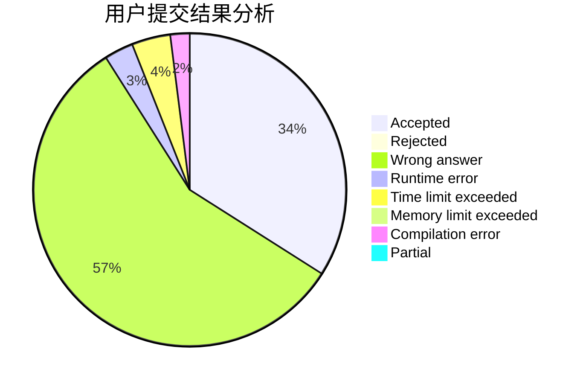
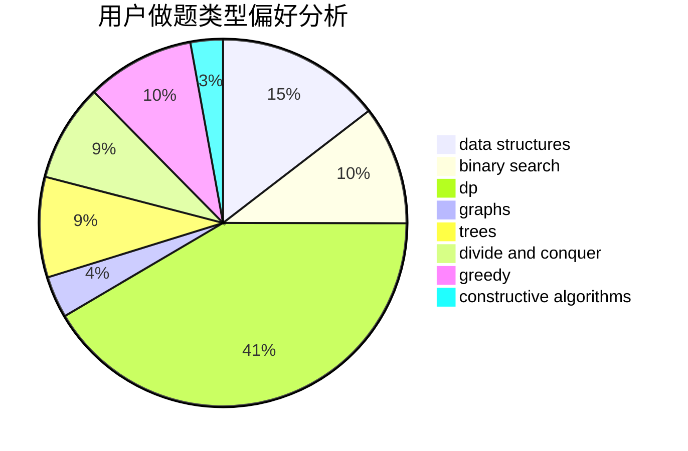
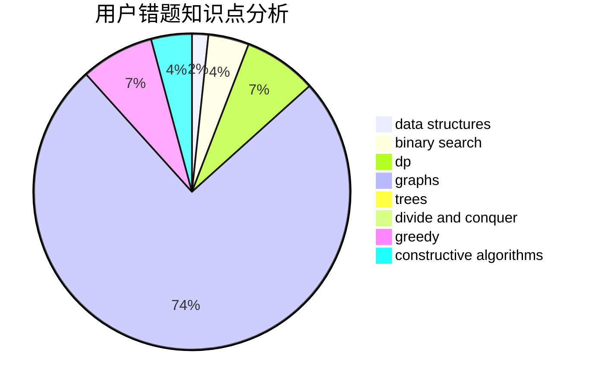

# Flyzz

<!-- tabs:start -->

#### **用户提交结果分析**

#### **用户做题类型偏好分析**

#### **用户错题知识点分析**

<!-- tabs:end -->
# 推荐题目
[1332C](https://codeforces.com/contest/1332/problem/C)		dfs and similar,
                        dsu,
                        greedy,
                        implementation,
                        strings		  
[1397C](https://codeforces.com/contest/1397/problem/C)		dsu,graphs,sortings,trees		  
[1029C](https://codeforces.com/contest/1029/problem/C)		greedy,
                        math,
                        sortings		  
[666A](https://codeforces.com/contest/666/problem/A)		dp,
                        implementation,
                        strings		  
[578B](https://codeforces.com/contest/578/problem/B)		brute force,
                        greedy		  
[656F](https://codeforces.com/contest/656/problem/F)		*special problem		  
[710C](https://codeforces.com/contest/710/problem/C)		constructive algorithms,
                        math		  
[1389E](https://codeforces.com/contest/1389/problem/E)		math,
                        number theory		  
[873A](https://codeforces.com/contest/873/problem/A)		implementation		  
[1010F](https://codeforces.com/contest/1010/problem/F)		fft,
                        graphs,
                        trees		  
