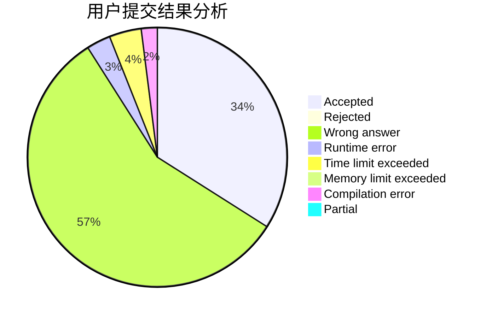
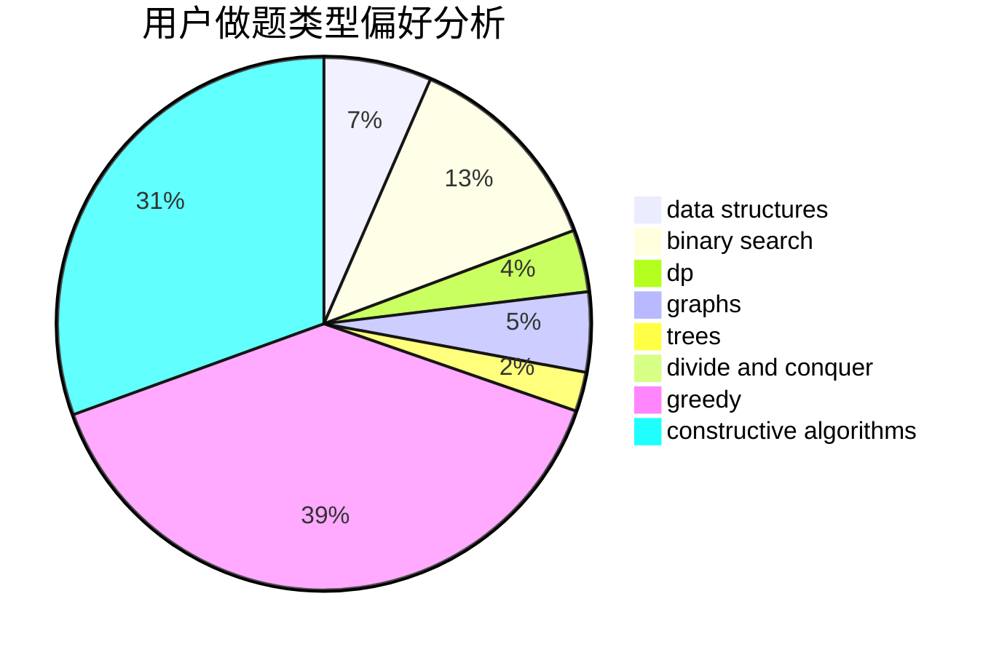

# Flyzz

<!-- tabs:start -->

#### **用户提交结果分析**

#### **用户做题类型偏好分析**

#### **用户错题知识点分析**

<!-- tabs:end -->
# 推荐题目
[1326A](https://codeforces.com/contest/1326/problem/A)		constructive algorithms,
                        number theory		  
[1387C](https://codeforces.com/contest/1387/problem/C)		*special problem,
                        dp,
                        shortest paths,
                        string suffix structures		  
[1028H](https://codeforces.com/contest/1028/problem/H)		math		  
[633F](https://codeforces.com/contest/633/problem/F)		dfs and similar,
                        dp,
                        graphs,
                        trees		  
[552E](https://codeforces.com/contest/552/problem/E)		brute force,
                        dp,
                        expression parsing,
                        greedy,
                        implementation,
                        strings		  
[628F](https://codeforces.com/contest/628/problem/F)		flows		  
[690A2](https://codeforces.com/contest/690A/problem/2)		nan		  
[1380B](https://codeforces.com/contest/1380/problem/B)		greedy		  
[854C](https://codeforces.com/contest/854/problem/C)		dsu,graphs,sortings,trees		  
[1010C](https://codeforces.com/contest/1010/problem/C)		number theory		  
