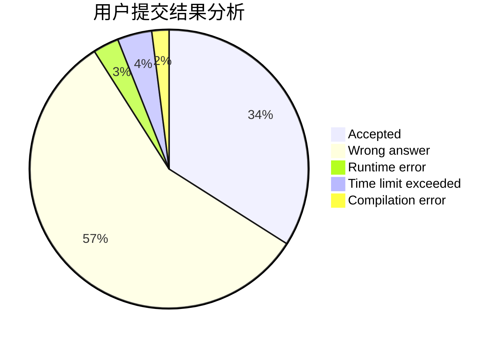
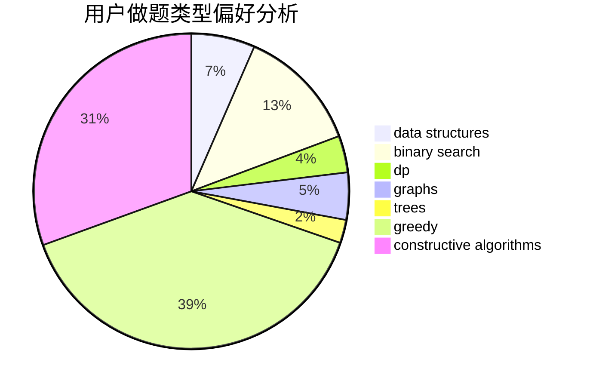
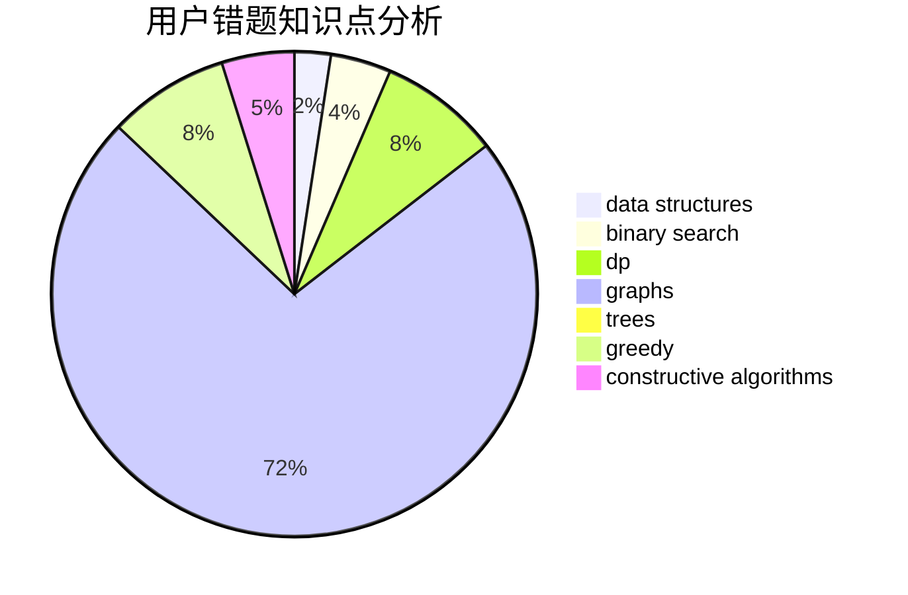

# Flyzz
<!-- tabs:start -->
#### **用户提交结果分析**

#### **用户做题类型偏好分析**

#### **用户错题知识点分析**

<!-- tabs:end -->
# 推荐题目
[The Chocolate Spree](http://codeforces.com/problemset/problem/633/F)		dfs and similar,
                        dp,
                        graphs,
                        trees		  
[Set Merging](http://codeforces.com/problemset/problem/1375/H)		constructive algorithms,
                        divide and conquer		  
[Awesome Substrings](http://codeforces.com/problemset/problem/1270/F)		math,
                        strings		  
[Universal Solution](http://codeforces.com/problemset/problem/1380/B)		greedy		  
[Vanya and Brackets](http://codeforces.com/problemset/problem/552/E)		brute force,
                        dp,
                        expression parsing,
                        greedy,
                        implementation,
                        strings		  
[Make Square](http://codeforces.com/problemset/problem/1028/H)		math		  
[Bear and Fair Set](http://codeforces.com/problemset/problem/628/F)		flows		  
[Zuma](https://codeforces.com/contest/608/problem/D)		dp		  
[Magnets](http://codeforces.com/problemset/problem/344/A)		implementation		  
[Viruses](http://codeforces.com/problemset/problem/1387/C)		*special problem,
                        dp,
                        shortest paths,
                        string suffix structures		  
<!-- tabs:start -->
#### **data structures**
[Heidi and the Turing Test (Medium)](http://codeforces.com/problemset/problem/1184/C2)		data structures		  
[Marvolo Gaunt's Ring](http://codeforces.com/problemset/problem/855/B)		brute force,
                        data structures,
                        dp		  
[Choosing Ads](https://codeforces.com/contest/674/problem/G)		data structures		  
[A-Z Graph](http://codeforces.com/problemset/problem/1494/E)		constructive algorithms,
                        data structures,
                        graphs,
                        hashing		  
[A Heap of Heaps](http://codeforces.com/problemset/problem/538/F)		brute force,
                        data structures,
                        math,
                        sortings		  
[Corrupted Array](http://codeforces.com/problemset/problem/1512/D)		constructive algorithms,
                        data structures,
                        greedy		  
[Maximum width](http://codeforces.com/problemset/problem/1492/C)		binary search,
                        data structures,
                        dp,
                        greedy,
                        two pointers		  
[Old Floppy Drive](http://codeforces.com/problemset/problem/1490/G)		binary search,
                        data structures,
                        math		  
[Odd Mineral Resource](http://codeforces.com/problemset/problem/1479/D)		binary search,
                        bitmasks,
                        brute force,
                        data structures,
                        probabilities,
                        trees		  
[Meximization](http://codeforces.com/problemset/problem/1497/A)		brute force,
                        data structures,
                        greedy,
                        sortings		  
#### **binary search**
[Lonely Numbers](https://codeforces.com/contest/1424/problem/J)		binary search,
                        math,
                        number theory,
                        two pointers		  
[Maximum width](http://codeforces.com/problemset/problem/1492/C)		binary search,
                        data structures,
                        dp,
                        greedy,
                        two pointers		  
[Pairs](http://codeforces.com/problemset/problem/1463/D)		binary search,
                        constructive algorithms,
                        greedy,
                        two pointers		  
[Old Floppy Drive](http://codeforces.com/problemset/problem/1490/G)		binary search,
                        data structures,
                        math		  
[Odd Mineral Resource](http://codeforces.com/problemset/problem/1479/D)		binary search,
                        bitmasks,
                        brute force,
                        data structures,
                        probabilities,
                        trees		  
[Complicated Computations](http://codeforces.com/problemset/problem/1436/E)		binary search,
                        data structures,
                        two pointers		  
[Divide and Summarize](http://codeforces.com/problemset/problem/1461/D)		binary search,
                        brute force,
                        data structures,
                        divide and conquer,
                        implementation,
                        sortings		  
[K-beautiful Strings](http://codeforces.com/problemset/problem/1493/C)		binary search,
                        brute force,
                        constructive algorithms,
                        greedy,
                        strings		  
[Pythagorean Triples](http://codeforces.com/problemset/problem/1487/D)		binary search,
                        brute force,
                        math,
                        number theory		  
[Eastern Exhibition](http://codeforces.com/problemset/problem/1486/B)		binary search,
                        geometry,
                        shortest paths,
                        sortings		  
#### **dp**
[The Chocolate Spree](http://codeforces.com/problemset/problem/633/F)		dfs and similar,
                        dp,
                        graphs,
                        trees		  
[Vanya and Brackets](http://codeforces.com/problemset/problem/552/E)		brute force,
                        dp,
                        expression parsing,
                        greedy,
                        implementation,
                        strings		  
[Zuma](https://codeforces.com/contest/608/problem/D)		dp		  
[Viruses](http://codeforces.com/problemset/problem/1387/C)		*special problem,
                        dp,
                        shortest paths,
                        string suffix structures		  
[Marvolo Gaunt's Ring](http://codeforces.com/problemset/problem/855/B)		brute force,
                        data structures,
                        dp		  
[Make Product Equal One](http://codeforces.com/problemset/problem/1206/B)		dp,
                        implementation		  
[Salazar Slytherin's Locket](http://codeforces.com/problemset/problem/855/E)		bitmasks,
                        dp		  
[Sum Balance](https://codeforces.com/contest/1243/problem/E)		bitmasks,
                        dfs and similar,
                        dp,
                        graphs		  
[Unambiguous Arithmetic Expression](http://codeforces.com/problemset/problem/115/D)		dp,
                        expression parsing		  
[Helga Hufflepuff's Cup](http://codeforces.com/problemset/problem/855/C)		dp,
                        trees		  
#### **graph**
[The Chocolate Spree](http://codeforces.com/problemset/problem/633/F)		dfs and similar,
                        dp,
                        graphs,
                        trees		  
[Make It Connected](https://codeforces.com/contest/1489/problem/G)		dsu,
                        graphs,
                        greedy		  
[Sum Balance](https://codeforces.com/contest/1243/problem/E)		bitmasks,
                        dfs and similar,
                        dp,
                        graphs		  
[Balance](http://codeforces.com/problemset/problem/317/C)		constructive algorithms,
                        dfs and similar,
                        graphs,
                        trees		  
[st-Spanning Tree](http://codeforces.com/problemset/problem/723/F)		dsu,
                        graphs,
                        greedy,
                        implementation		  
[A-Z Graph](http://codeforces.com/problemset/problem/1494/E)		constructive algorithms,
                        data structures,
                        graphs,
                        hashing		  
[Minimum Ties](http://codeforces.com/problemset/problem/1487/C)		brute force,
                        constructive algorithms,
                        dfs and similar,
                        graphs,
                        greedy,
                        implementation,
                        math		  
[Chef Monocarp](http://codeforces.com/problemset/problem/1437/C)		dp,
                        flows,
                        graph matchings,
                        greedy,
                        math,
                        sortings		  
[Strange Housing](http://codeforces.com/problemset/problem/1470/D)		constructive algorithms,
                        dfs and similar,
                        graph matchings,
                        graphs,
                        greedy		  
[Longest Simple Cycle](http://codeforces.com/problemset/problem/1476/C)		dp,
                        graphs,
                        greedy		  
#### **trees**
[The Chocolate Spree](http://codeforces.com/problemset/problem/633/F)		dfs and similar,
                        dp,
                        graphs,
                        trees		  
[Balance](http://codeforces.com/problemset/problem/317/C)		constructive algorithms,
                        dfs and similar,
                        graphs,
                        trees		  
[Helga Hufflepuff's Cup](http://codeforces.com/problemset/problem/855/C)		dp,
                        trees		  
[Fox And Travelling](http://codeforces.com/problemset/problem/512/D)		dp,
                        trees		  
[Odd Mineral Resource](http://codeforces.com/problemset/problem/1479/D)		binary search,
                        bitmasks,
                        brute force,
                        data structures,
                        probabilities,
                        trees		  
[Yet Another Card Deck](http://codeforces.com/problemset/problem/1511/C)		brute force,
                        data structures,
                        implementation,
                        trees		  
[Diameter Cuts](http://codeforces.com/problemset/problem/1499/F)		combinatorics,
                        dfs and similar,
                        dp,
                        trees		  
[Fib-tree](http://codeforces.com/problemset/problem/1491/E)		brute force,
                        dfs and similar,
                        divide and conquer,
                        number theory,
                        trees		  
[13th Labour of Heracles](http://codeforces.com/problemset/problem/1466/D)		data structures,
                        greedy,
                        sortings,
                        trees		  
[BFS Trees](http://codeforces.com/problemset/problem/1495/D)		combinatorics,
                        dfs and similar,
                        graphs,
                        math,
                        shortest paths,
                        trees		  
#### **divide and conquer**
[Set Merging](http://codeforces.com/problemset/problem/1375/H)		constructive algorithms,
                        divide and conquer		  
[Divide and Summarize](http://codeforces.com/problemset/problem/1461/D)		binary search,
                        brute force,
                        data structures,
                        divide and conquer,
                        implementation,
                        sortings		  
[Song of the Sirens](http://codeforces.com/problemset/problem/1466/G)		combinatorics,
                        divide and conquer,
                        hashing,
                        math,
                        string suffix structures,
                        strings		  
[Permutation Transformation](http://codeforces.com/problemset/problem/1490/D)		dfs and similar,
                        divide and conquer,
                        implementation		  
[Skyline Photo](https://codeforces.com/contest/1483/problem/C)		data structures,
                        divide and conquer,
                        dp		  
[Fib-tree](http://codeforces.com/problemset/problem/1491/E)		brute force,
                        dfs and similar,
                        divide and conquer,
                        number theory,
                        trees		  
[Sum of Prefix Sums](http://codeforces.com/problemset/problem/1303/G)		data structures,
                        divide and conquer,
                        geometry,
                        trees		  
[Dogeforces](http://codeforces.com/problemset/problem/1494/D)		constructive algorithms,
                        data structures,
                        dfs and similar,
                        divide and conquer,
                        dsu,
                        greedy,
                        sortings,
                        trees		  
[Logistical Questions](http://codeforces.com/problemset/problem/566/C)		dfs and similar,
                        divide and conquer,
                        trees		  
[Fruit Sequences](http://codeforces.com/problemset/problem/1428/F)		binary search,
                        data structures,
                        divide and conquer,
                        dp,
                        two pointers		  
#### **greedy**
[Universal Solution](http://codeforces.com/problemset/problem/1380/B)		greedy		  
[Vanya and Brackets](http://codeforces.com/problemset/problem/552/E)		brute force,
                        dp,
                        expression parsing,
                        greedy,
                        implementation,
                        strings		  
[Have You Ever Heard About the Word?](http://codeforces.com/problemset/problem/319/D)		greedy,
                        hashing,
                        string suffix structures,
                        strings		  
[Make It Connected](https://codeforces.com/contest/1489/problem/G)		dsu,
                        graphs,
                        greedy		  
[Planning](https://codeforces.com/contest/854/problem/C)		greedy		  
[st-Spanning Tree](http://codeforces.com/problemset/problem/723/F)		dsu,
                        graphs,
                        greedy,
                        implementation		  
[Substring Removal Game](http://codeforces.com/problemset/problem/1398/B)		games,
                        greedy,
                        sortings		  
[Corrupted Array](http://codeforces.com/problemset/problem/1512/D)		constructive algorithms,
                        data structures,
                        greedy		  
[Maximum width](http://codeforces.com/problemset/problem/1492/C)		binary search,
                        data structures,
                        dp,
                        greedy,
                        two pointers		  
[Diamond Miner](https://codeforces.com/contest/1496/problem/C)		geometry,
                        greedy,
                        math,
                        sortings		  
#### **constructive algorithms**
[Set Merging](http://codeforces.com/problemset/problem/1375/H)		constructive algorithms,
                        divide and conquer		  
[Fraction](http://codeforces.com/problemset/problem/854/A)		brute force,
                        constructive algorithms,
                        math		  
[Maxim Buys an Apartment](http://codeforces.com/problemset/problem/854/B)		constructive algorithms,
                        math		  
[Balance](http://codeforces.com/problemset/problem/317/C)		constructive algorithms,
                        dfs and similar,
                        graphs,
                        trees		  
[Bad Ugly Numbers](http://codeforces.com/problemset/problem/1326/A)		constructive algorithms,
                        number theory		  
[A-Z Graph](http://codeforces.com/problemset/problem/1494/E)		constructive algorithms,
                        data structures,
                        graphs,
                        hashing		  
[Corrupted Array](http://codeforces.com/problemset/problem/1512/D)		constructive algorithms,
                        data structures,
                        greedy		  
[Anti-knapsack](http://codeforces.com/problemset/problem/1493/A)		constructive algorithms,
                        greedy		  
[Pairs](http://codeforces.com/problemset/problem/1463/D)		binary search,
                        constructive algorithms,
                        greedy,
                        two pointers		  
[XOR-gun](https://codeforces.com/contest/1456/problem/B)		bitmasks,
                        brute force,
                        constructive algorithms		  
#### **sortings**
[Substring Removal Game](http://codeforces.com/problemset/problem/1398/B)		games,
                        greedy,
                        sortings		  
[A Heap of Heaps](http://codeforces.com/problemset/problem/538/F)		brute force,
                        data structures,
                        math,
                        sortings		  
[Diamond Miner](https://codeforces.com/contest/1496/problem/C)		geometry,
                        greedy,
                        math,
                        sortings		  
[Meximization](http://codeforces.com/problemset/problem/1497/A)		brute force,
                        data structures,
                        greedy,
                        sortings		  
[Avoiding Zero](http://codeforces.com/problemset/problem/1427/A)		math,
                        sortings		  
[Divide and Summarize](http://codeforces.com/problemset/problem/1461/D)		binary search,
                        brute force,
                        data structures,
                        divide and conquer,
                        implementation,
                        sortings		  
[Chef Monocarp](http://codeforces.com/problemset/problem/1437/C)		dp,
                        flows,
                        graph matchings,
                        greedy,
                        math,
                        sortings		  
[Replacing Elements](http://codeforces.com/problemset/problem/1473/A)		greedy,
                        implementation,
                        math,
                        sortings		  
[Eastern Exhibition](http://codeforces.com/problemset/problem/1486/B)		binary search,
                        geometry,
                        shortest paths,
                        sortings		  
[The Great Hero](http://codeforces.com/problemset/problem/1480/B)		greedy,
                        implementation,
                        sortings		  
<!-- tabs:end -->
