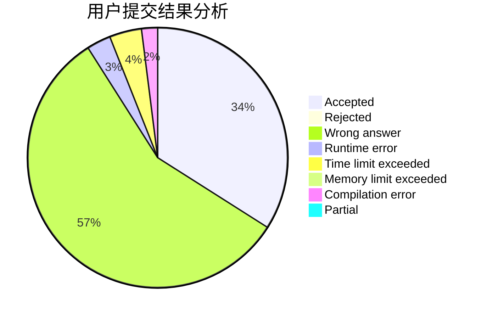
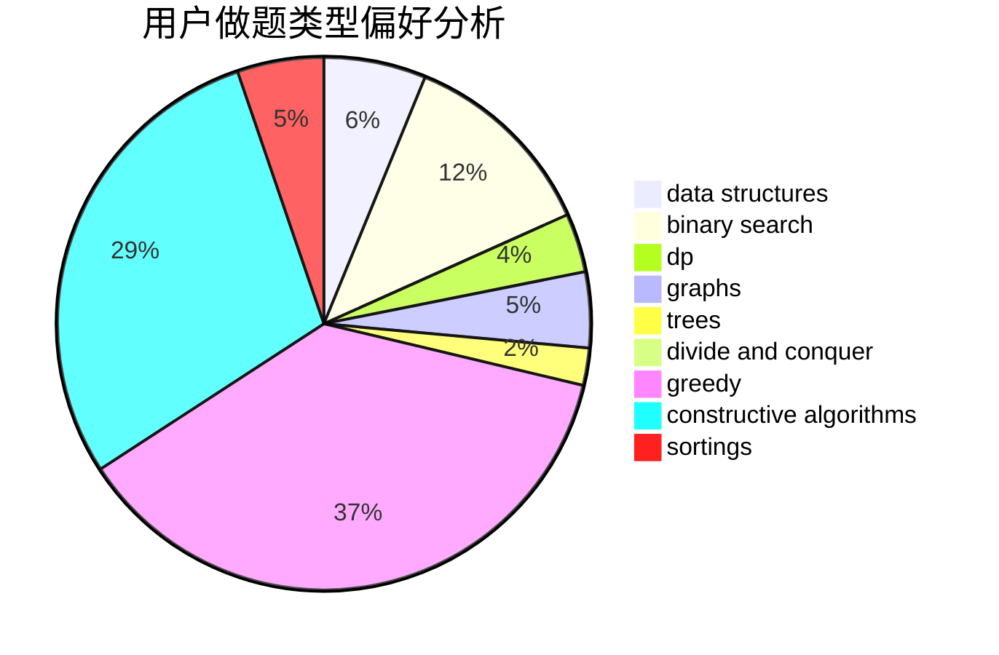
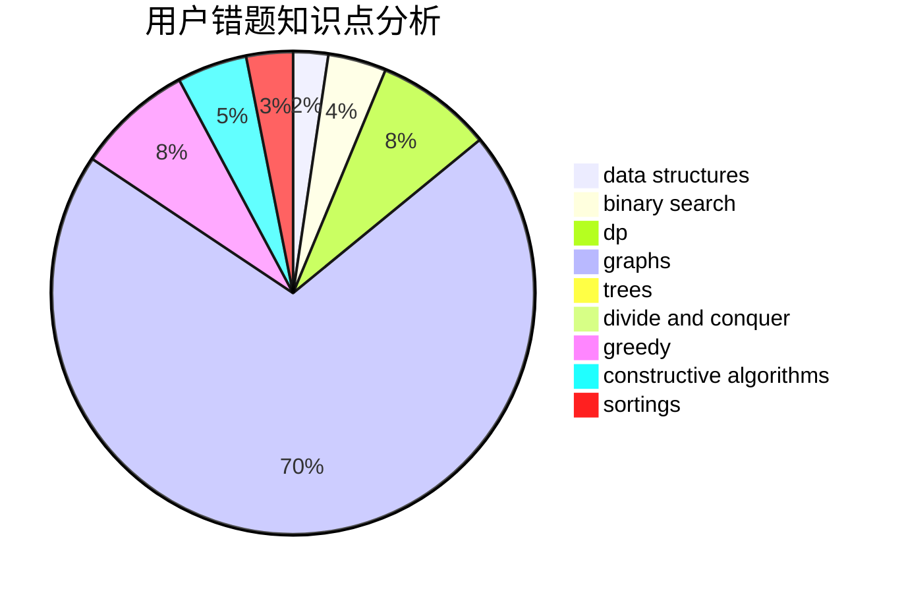

# Flyzz
<!-- tabs:start -->
#### **用户提交结果分析**

#### **用户做题类型偏好分析**

#### **用户错题知识点分析**

<!-- tabs:end -->
# 推荐题目
[633F](http://codeforces.com/problemset/problem/633/F)		dfs and similar,
                        dp,
                        graphs,
                        trees		  
[1375H](http://codeforces.com/problemset/problem/1375/H)		constructive algorithms,
                        divide and conquer		  
[1270F](http://codeforces.com/problemset/problem/1270/F)		math,
                        strings		  
[1380B](http://codeforces.com/problemset/problem/1380/B)		greedy		  
[552E](http://codeforces.com/problemset/problem/552/E)		brute force,
                        dp,
                        expression parsing,
                        greedy,
                        implementation,
                        strings		  
[1028H](http://codeforces.com/problemset/problem/1028/H)		math		  
[628F](http://codeforces.com/problemset/problem/628/F)		flows		  
[608D](https://codeforces.com/contest/608/problem/D)		dp		  
[344A](http://codeforces.com/problemset/problem/344/A)		implementation		  
[1387C](http://codeforces.com/problemset/problem/1387/C)		*special problem,
                        dp,
                        shortest paths,
                        string suffix structures		  
<!-- tabs:start -->
#### **data structures**
[1184C2](http://codeforces.com/problemset/problem/1184/C2)		data structures		  
[855B](http://codeforces.com/problemset/problem/855/B)		brute force,
                        data structures,
                        dp		  
[674G](https://codeforces.com/contest/674/problem/G)		data structures		  
[1494E](http://codeforces.com/problemset/problem/1494/E)		constructive algorithms,
                        data structures,
                        graphs,
                        hashing		  
[538F](http://codeforces.com/problemset/problem/538/F)		brute force,
                        data structures,
                        math,
                        sortings		  
[1512D](http://codeforces.com/problemset/problem/1512/D)		constructive algorithms,
                        data structures,
                        greedy		  
[1492C](http://codeforces.com/problemset/problem/1492/C)		binary search,
                        data structures,
                        dp,
                        greedy,
                        two pointers		  
[1490G](http://codeforces.com/problemset/problem/1490/G)		binary search,
                        data structures,
                        math		  
[1479D](http://codeforces.com/problemset/problem/1479/D)		binary search,
                        bitmasks,
                        brute force,
                        data structures,
                        probabilities,
                        trees		  
[1497A](http://codeforces.com/problemset/problem/1497/A)		brute force,
                        data structures,
                        greedy,
                        sortings		  
#### **binary search**
[1424J](https://codeforces.com/contest/1424/problem/J)		binary search,
                        math,
                        number theory,
                        two pointers		  
[1492C](http://codeforces.com/problemset/problem/1492/C)		binary search,
                        data structures,
                        dp,
                        greedy,
                        two pointers		  
[1463D](http://codeforces.com/problemset/problem/1463/D)		binary search,
                        constructive algorithms,
                        greedy,
                        two pointers		  
[1490G](http://codeforces.com/problemset/problem/1490/G)		binary search,
                        data structures,
                        math		  
[1479D](http://codeforces.com/problemset/problem/1479/D)		binary search,
                        bitmasks,
                        brute force,
                        data structures,
                        probabilities,
                        trees		  
[1436E](http://codeforces.com/problemset/problem/1436/E)		binary search,
                        data structures,
                        two pointers		  
[1461D](http://codeforces.com/problemset/problem/1461/D)		binary search,
                        brute force,
                        data structures,
                        divide and conquer,
                        implementation,
                        sortings		  
[1493C](http://codeforces.com/problemset/problem/1493/C)		binary search,
                        brute force,
                        constructive algorithms,
                        greedy,
                        strings		  
[1487D](http://codeforces.com/problemset/problem/1487/D)		binary search,
                        brute force,
                        math,
                        number theory		  
[1486B](http://codeforces.com/problemset/problem/1486/B)		binary search,
                        geometry,
                        shortest paths,
                        sortings		  
#### **dp**
[633F](http://codeforces.com/problemset/problem/633/F)		dfs and similar,
                        dp,
                        graphs,
                        trees		  
[552E](http://codeforces.com/problemset/problem/552/E)		brute force,
                        dp,
                        expression parsing,
                        greedy,
                        implementation,
                        strings		  
[608D](https://codeforces.com/contest/608/problem/D)		dp		  
[1387C](http://codeforces.com/problemset/problem/1387/C)		*special problem,
                        dp,
                        shortest paths,
                        string suffix structures		  
[855B](http://codeforces.com/problemset/problem/855/B)		brute force,
                        data structures,
                        dp		  
[1206B](http://codeforces.com/problemset/problem/1206/B)		dp,
                        implementation		  
[855E](http://codeforces.com/problemset/problem/855/E)		bitmasks,
                        dp		  
[1243E](https://codeforces.com/contest/1243/problem/E)		bitmasks,
                        dfs and similar,
                        dp,
                        graphs		  
[115D](http://codeforces.com/problemset/problem/115/D)		dp,
                        expression parsing		  
[855C](http://codeforces.com/problemset/problem/855/C)		dp,
                        trees		  
#### **graph**
[633F](http://codeforces.com/problemset/problem/633/F)		dfs and similar,
                        dp,
                        graphs,
                        trees		  
[1489G](https://codeforces.com/contest/1489/problem/G)		dsu,
                        graphs,
                        greedy		  
[1243E](https://codeforces.com/contest/1243/problem/E)		bitmasks,
                        dfs and similar,
                        dp,
                        graphs		  
[317C](http://codeforces.com/problemset/problem/317/C)		constructive algorithms,
                        dfs and similar,
                        graphs,
                        trees		  
[723F](http://codeforces.com/problemset/problem/723/F)		dsu,
                        graphs,
                        greedy,
                        implementation		  
[1494E](http://codeforces.com/problemset/problem/1494/E)		constructive algorithms,
                        data structures,
                        graphs,
                        hashing		  
[1487C](http://codeforces.com/problemset/problem/1487/C)		brute force,
                        constructive algorithms,
                        dfs and similar,
                        graphs,
                        greedy,
                        implementation,
                        math		  
[1437C](http://codeforces.com/problemset/problem/1437/C)		dp,
                        flows,
                        graph matchings,
                        greedy,
                        math,
                        sortings		  
[1470D](http://codeforces.com/problemset/problem/1470/D)		constructive algorithms,
                        dfs and similar,
                        graph matchings,
                        graphs,
                        greedy		  
[1476C](http://codeforces.com/problemset/problem/1476/C)		dp,
                        graphs,
                        greedy		  
#### **trees**
[633F](http://codeforces.com/problemset/problem/633/F)		dfs and similar,
                        dp,
                        graphs,
                        trees		  
[317C](http://codeforces.com/problemset/problem/317/C)		constructive algorithms,
                        dfs and similar,
                        graphs,
                        trees		  
[855C](http://codeforces.com/problemset/problem/855/C)		dp,
                        trees		  
[512D](http://codeforces.com/problemset/problem/512/D)		dp,
                        trees		  
[1479D](http://codeforces.com/problemset/problem/1479/D)		binary search,
                        bitmasks,
                        brute force,
                        data structures,
                        probabilities,
                        trees		  
[1511C](http://codeforces.com/problemset/problem/1511/C)		brute force,
                        data structures,
                        implementation,
                        trees		  
[1499F](http://codeforces.com/problemset/problem/1499/F)		combinatorics,
                        dfs and similar,
                        dp,
                        trees		  
[1491E](http://codeforces.com/problemset/problem/1491/E)		brute force,
                        dfs and similar,
                        divide and conquer,
                        number theory,
                        trees		  
[1466D](http://codeforces.com/problemset/problem/1466/D)		data structures,
                        greedy,
                        sortings,
                        trees		  
[1495D](http://codeforces.com/problemset/problem/1495/D)		combinatorics,
                        dfs and similar,
                        graphs,
                        math,
                        shortest paths,
                        trees		  
#### **divide and conquer**
[1375H](http://codeforces.com/problemset/problem/1375/H)		constructive algorithms,
                        divide and conquer		  
[1461D](http://codeforces.com/problemset/problem/1461/D)		binary search,
                        brute force,
                        data structures,
                        divide and conquer,
                        implementation,
                        sortings		  
[1466G](http://codeforces.com/problemset/problem/1466/G)		combinatorics,
                        divide and conquer,
                        hashing,
                        math,
                        string suffix structures,
                        strings		  
[1490D](http://codeforces.com/problemset/problem/1490/D)		dfs and similar,
                        divide and conquer,
                        implementation		  
[1483C](https://codeforces.com/contest/1483/problem/C)		data structures,
                        divide and conquer,
                        dp		  
[1491E](http://codeforces.com/problemset/problem/1491/E)		brute force,
                        dfs and similar,
                        divide and conquer,
                        number theory,
                        trees		  
[1303G](http://codeforces.com/problemset/problem/1303/G)		data structures,
                        divide and conquer,
                        geometry,
                        trees		  
[1494D](http://codeforces.com/problemset/problem/1494/D)		constructive algorithms,
                        data structures,
                        dfs and similar,
                        divide and conquer,
                        dsu,
                        greedy,
                        sortings,
                        trees		  
[1482E](http://codeforces.com/problemset/problem/1482/E)		data structures,
                        divide and conquer,
                        dp		  
[566C](http://codeforces.com/problemset/problem/566/C)		dfs and similar,
                        divide and conquer,
                        trees		  
#### **greedy**
[1380B](http://codeforces.com/problemset/problem/1380/B)		greedy		  
[552E](http://codeforces.com/problemset/problem/552/E)		brute force,
                        dp,
                        expression parsing,
                        greedy,
                        implementation,
                        strings		  
[319D](http://codeforces.com/problemset/problem/319/D)		greedy,
                        hashing,
                        string suffix structures,
                        strings		  
[1489G](https://codeforces.com/contest/1489/problem/G)		dsu,
                        graphs,
                        greedy		  
[854C](https://codeforces.com/contest/854/problem/C)		greedy		  
[723F](http://codeforces.com/problemset/problem/723/F)		dsu,
                        graphs,
                        greedy,
                        implementation		  
[1398B](http://codeforces.com/problemset/problem/1398/B)		games,
                        greedy,
                        sortings		  
[1512D](http://codeforces.com/problemset/problem/1512/D)		constructive algorithms,
                        data structures,
                        greedy		  
[1492C](http://codeforces.com/problemset/problem/1492/C)		binary search,
                        data structures,
                        dp,
                        greedy,
                        two pointers		  
[1496C](https://codeforces.com/contest/1496/problem/C)		geometry,
                        greedy,
                        math,
                        sortings		  
#### **constructive algorithms**
[1375H](http://codeforces.com/problemset/problem/1375/H)		constructive algorithms,
                        divide and conquer		  
[854A](http://codeforces.com/problemset/problem/854/A)		brute force,
                        constructive algorithms,
                        math		  
[854B](http://codeforces.com/problemset/problem/854/B)		constructive algorithms,
                        math		  
[317C](http://codeforces.com/problemset/problem/317/C)		constructive algorithms,
                        dfs and similar,
                        graphs,
                        trees		  
[1326A](http://codeforces.com/problemset/problem/1326/A)		constructive algorithms,
                        number theory		  
[1494E](http://codeforces.com/problemset/problem/1494/E)		constructive algorithms,
                        data structures,
                        graphs,
                        hashing		  
[1512D](http://codeforces.com/problemset/problem/1512/D)		constructive algorithms,
                        data structures,
                        greedy		  
[1493A](http://codeforces.com/problemset/problem/1493/A)		constructive algorithms,
                        greedy		  
[1463D](http://codeforces.com/problemset/problem/1463/D)		binary search,
                        constructive algorithms,
                        greedy,
                        two pointers		  
[1456B](https://codeforces.com/contest/1456/problem/B)		bitmasks,
                        brute force,
                        constructive algorithms		  
#### **sortings**
[1398B](http://codeforces.com/problemset/problem/1398/B)		games,
                        greedy,
                        sortings		  
[538F](http://codeforces.com/problemset/problem/538/F)		brute force,
                        data structures,
                        math,
                        sortings		  
[1496C](https://codeforces.com/contest/1496/problem/C)		geometry,
                        greedy,
                        math,
                        sortings		  
[1495A](http://codeforces.com/problemset/problem/1495/A)		geometry,
                        greedy,
                        math,
                        sortings		  
[1497A](http://codeforces.com/problemset/problem/1497/A)		brute force,
                        data structures,
                        greedy,
                        sortings		  
[1427A](http://codeforces.com/problemset/problem/1427/A)		math,
                        sortings		  
[1461D](http://codeforces.com/problemset/problem/1461/D)		binary search,
                        brute force,
                        data structures,
                        divide and conquer,
                        implementation,
                        sortings		  
[1437C](http://codeforces.com/problemset/problem/1437/C)		dp,
                        flows,
                        graph matchings,
                        greedy,
                        math,
                        sortings		  
[1473A](http://codeforces.com/problemset/problem/1473/A)		greedy,
                        implementation,
                        math,
                        sortings		  
[1486B](http://codeforces.com/problemset/problem/1486/B)		binary search,
                        geometry,
                        shortest paths,
                        sortings		  
<!-- tabs:end -->
