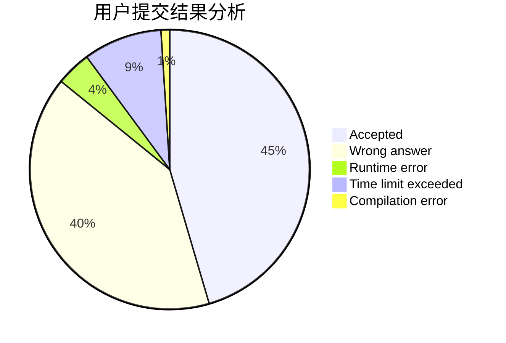
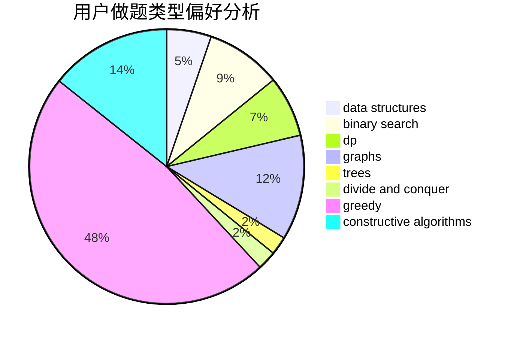
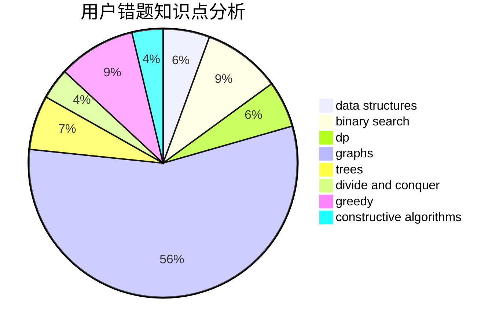

# Food_Chain_Rule
<!-- tabs:start -->
#### **用户提交结果分析**

#### **用户做题类型偏好分析**

#### **用户错题知识点分析**

<!-- tabs:end -->
# 推荐题目
[Reorder](http://codeforces.com/problemset/problem/1436/A)		math		  
[Days of Floral Colours](http://codeforces.com/problemset/problem/848/E)		combinatorics,
                        divide and conquer,
                        dp,
                        fft,
                        math		  
[Two Tables](http://codeforces.com/problemset/problem/228/B)		brute force,
                        implementation		  
[Om Nom and Spiders](http://codeforces.com/problemset/problem/436/B)		implementation,
                        math		  
[Lucky Conversion](http://codeforces.com/problemset/problem/145/A)		greedy,
                        implementation		  
[Xor Permutations](http://codeforces.com/problemset/problem/1168/E)		constructive algorithms,
                        math		  
[Meeting Her](http://codeforces.com/problemset/problem/238/E)		dp,
                        graphs,
                        shortest paths		  
[Nagini](http://codeforces.com/problemset/problem/855/F)		binary search,
                        data structures		  
[Colorful Stones](http://codeforces.com/problemset/problem/264/D)		dp,
                        two pointers		  
[Removing Leaves](http://codeforces.com/problemset/problem/1385/F)		data structures,
                        greedy,
                        implementation,
                        trees		  
<!-- tabs:start -->
#### **data structures**
[Nagini](http://codeforces.com/problemset/problem/855/F)		binary search,
                        data structures		  
[Removing Leaves](http://codeforces.com/problemset/problem/1385/F)		data structures,
                        greedy,
                        implementation,
                        trees		  
[Alyona and a tree](https://codeforces.com/contest/740/problem/D)		binary search,
                        data structures,
                        dfs and similar,
                        graphs,
                        trees		  
[Subarray Sorting](http://codeforces.com/problemset/problem/1187/D)		data structures,
                        sortings		  
[Reorder the Array](https://codeforces.com/contest/1008/problem/C)		combinatorics,
                        data structures,
                        math,
                        sortings,
                        two pointers		  
[Forced Online Queries Problem](http://codeforces.com/problemset/problem/1217/F)		data structures,
                        divide and conquer,
                        dsu,
                        graphs,
                        trees		  
[Design Tutorial: Increase the Constraints](http://codeforces.com/problemset/problem/472/G)		bitmasks,
                        data structures,
                        fft		  
[Ray in the tube](http://codeforces.com/problemset/problem/1041/F)		data structures,
                        divide and conquer,
                        dp,
                        math		  
[Cinema](http://codeforces.com/problemset/problem/200/A)		brute force,
                        data structures		  
[Huffman Coding on Segment](http://codeforces.com/problemset/problem/700/D)		data structures,
                        greedy		  
#### **binary search**
[Nagini](http://codeforces.com/problemset/problem/855/F)		binary search,
                        data structures		  
[Alyona and a tree](https://codeforces.com/contest/740/problem/D)		binary search,
                        data structures,
                        dfs and similar,
                        graphs,
                        trees		  
[Game with modulo](https://codeforces.com/contest/1104/problem/D)		binary search,
                        constructive algorithms,
                        interactive		  
[Morning run](http://codeforces.com/problemset/problem/309/A)		binary search,
                        math,
                        two pointers		  
[Balanced Removals (Harder)](http://codeforces.com/problemset/problem/1237/C2)		binary search,
                        constructive algorithms,
                        divide and conquer,
                        greedy,
                        implementation,
                        sortings		  
[Chain Reaction](http://codeforces.com/problemset/problem/607/A)		binary search,
                        dp		  
[Maximum width](http://codeforces.com/problemset/problem/1492/C)		binary search,
                        data structures,
                        dp,
                        greedy,
                        two pointers		  
[Pairs](http://codeforces.com/problemset/problem/1463/D)		binary search,
                        constructive algorithms,
                        greedy,
                        two pointers		  
[Old Floppy Drive](http://codeforces.com/problemset/problem/1490/G)		binary search,
                        data structures,
                        math		  
[Odd Mineral Resource](http://codeforces.com/problemset/problem/1479/D)		binary search,
                        bitmasks,
                        brute force,
                        data structures,
                        probabilities,
                        trees		  
#### **dp**
[Days of Floral Colours](http://codeforces.com/problemset/problem/848/E)		combinatorics,
                        divide and conquer,
                        dp,
                        fft,
                        math		  
[Meeting Her](http://codeforces.com/problemset/problem/238/E)		dp,
                        graphs,
                        shortest paths		  
[Colorful Stones](http://codeforces.com/problemset/problem/264/D)		dp,
                        two pointers		  
[Eleventh Birthday](http://codeforces.com/problemset/problem/856/C)		combinatorics,
                        dp,
                        math		  
[Polo the Penguin and Matrix](http://codeforces.com/problemset/problem/289/B)		brute force,
                        dp,
                        implementation,
                        sortings,
                        ternary search		  
[Rotate Columns (hard version)](http://codeforces.com/problemset/problem/1209/E2)		bitmasks,
                        dp,
                        greedy,
                        sortings		  
[Dreamoon and Strings](https://codeforces.com/contest/477/problem/C)		dp,
                        strings		  
[Knapsack](http://codeforces.com/problemset/problem/1132/E)		dfs and similar,
                        dp,
                        greedy		  
[Decorate Apple Tree](http://codeforces.com/problemset/problem/1056/D)		constructive algorithms,
                        dfs and similar,
                        dp,
                        graphs,
                        greedy,
                        sortings,
                        trees		  
[Ray in the tube](http://codeforces.com/problemset/problem/1041/F)		data structures,
                        divide and conquer,
                        dp,
                        math		  
#### **graph**
[Meeting Her](http://codeforces.com/problemset/problem/238/E)		dp,
                        graphs,
                        shortest paths		  
[Navigation System](https://codeforces.com/contest/1321/problem/D)		dfs and similar,
                        graphs,
                        shortest paths		  
[Alyona and a tree](https://codeforces.com/contest/740/problem/D)		binary search,
                        data structures,
                        dfs and similar,
                        graphs,
                        trees		  
[Forced Online Queries Problem](http://codeforces.com/problemset/problem/1217/F)		data structures,
                        divide and conquer,
                        dsu,
                        graphs,
                        trees		  
[Decorate Apple Tree](http://codeforces.com/problemset/problem/1056/D)		constructive algorithms,
                        dfs and similar,
                        dp,
                        graphs,
                        greedy,
                        sortings,
                        trees		  
[Harry Vs Voldemort](http://codeforces.com/problemset/problem/855/G)		dfs and similar,
                        dp,
                        graphs,
                        trees		  
[Cycle](http://codeforces.com/problemset/problem/117/C)		dfs and similar,
                        graphs		  
[Minimum Ties](http://codeforces.com/problemset/problem/1487/C)		brute force,
                        constructive algorithms,
                        dfs and similar,
                        graphs,
                        greedy,
                        implementation,
                        math		  
[Chef Monocarp](http://codeforces.com/problemset/problem/1437/C)		dp,
                        flows,
                        graph matchings,
                        greedy,
                        math,
                        sortings		  
[Strange Housing](http://codeforces.com/problemset/problem/1470/D)		constructive algorithms,
                        dfs and similar,
                        graph matchings,
                        graphs,
                        greedy		  
#### **trees**
[Removing Leaves](http://codeforces.com/problemset/problem/1385/F)		data structures,
                        greedy,
                        implementation,
                        trees		  
[Alyona and a tree](https://codeforces.com/contest/740/problem/D)		binary search,
                        data structures,
                        dfs and similar,
                        graphs,
                        trees		  
[Forced Online Queries Problem](http://codeforces.com/problemset/problem/1217/F)		data structures,
                        divide and conquer,
                        dsu,
                        graphs,
                        trees		  
[Decorate Apple Tree](http://codeforces.com/problemset/problem/1056/D)		constructive algorithms,
                        dfs and similar,
                        dp,
                        graphs,
                        greedy,
                        sortings,
                        trees		  
[Harry Vs Voldemort](http://codeforces.com/problemset/problem/855/G)		dfs and similar,
                        dp,
                        graphs,
                        trees		  
[Odd Mineral Resource](http://codeforces.com/problemset/problem/1479/D)		binary search,
                        bitmasks,
                        brute force,
                        data structures,
                        probabilities,
                        trees		  
[Yet Another Card Deck](http://codeforces.com/problemset/problem/1511/C)		brute force,
                        data structures,
                        implementation,
                        trees		  
[Diameter Cuts](http://codeforces.com/problemset/problem/1499/F)		combinatorics,
                        dfs and similar,
                        dp,
                        trees		  
[Fib-tree](http://codeforces.com/problemset/problem/1491/E)		brute force,
                        dfs and similar,
                        divide and conquer,
                        number theory,
                        trees		  
[13th Labour of Heracles](http://codeforces.com/problemset/problem/1466/D)		data structures,
                        greedy,
                        sortings,
                        trees		  
#### **divide and conquer**
[Days of Floral Colours](http://codeforces.com/problemset/problem/848/E)		combinatorics,
                        divide and conquer,
                        dp,
                        fft,
                        math		  
[Forced Online Queries Problem](http://codeforces.com/problemset/problem/1217/F)		data structures,
                        divide and conquer,
                        dsu,
                        graphs,
                        trees		  
[Ray in the tube](http://codeforces.com/problemset/problem/1041/F)		data structures,
                        divide and conquer,
                        dp,
                        math		  
[Balanced Removals (Harder)](http://codeforces.com/problemset/problem/1237/C2)		binary search,
                        constructive algorithms,
                        divide and conquer,
                        greedy,
                        implementation,
                        sortings		  
[Divide and Summarize](http://codeforces.com/problemset/problem/1461/D)		binary search,
                        brute force,
                        data structures,
                        divide and conquer,
                        implementation,
                        sortings		  
[Song of the Sirens](http://codeforces.com/problemset/problem/1466/G)		combinatorics,
                        divide and conquer,
                        hashing,
                        math,
                        string suffix structures,
                        strings		  
[Permutation Transformation](http://codeforces.com/problemset/problem/1490/D)		dfs and similar,
                        divide and conquer,
                        implementation		  
[Skyline Photo](https://codeforces.com/contest/1483/problem/C)		data structures,
                        divide and conquer,
                        dp		  
[Fib-tree](http://codeforces.com/problemset/problem/1491/E)		brute force,
                        dfs and similar,
                        divide and conquer,
                        number theory,
                        trees		  
[Sum of Prefix Sums](http://codeforces.com/problemset/problem/1303/G)		data structures,
                        divide and conquer,
                        geometry,
                        trees		  
#### **greedy**
[Lucky Conversion](http://codeforces.com/problemset/problem/145/A)		greedy,
                        implementation		  
[Removing Leaves](http://codeforces.com/problemset/problem/1385/F)		data structures,
                        greedy,
                        implementation,
                        trees		  
[Rotate Columns (hard version)](http://codeforces.com/problemset/problem/1209/E2)		bitmasks,
                        dp,
                        greedy,
                        sortings		  
[Mister B and Boring Game](http://codeforces.com/problemset/problem/819/A)		games,
                        greedy		  
[Cram Time](https://codeforces.com/contest/1072/problem/C)		greedy		  
[Unusual Competitions](https://codeforces.com/contest/1323/problem/C)		greedy		  
[Vasya and Arrays](http://codeforces.com/problemset/problem/1036/D)		greedy,
                        two pointers		  
[Yuhao and a Parenthesis](http://codeforces.com/problemset/problem/1097/C)		greedy,
                        implementation		  
[Knapsack](http://codeforces.com/problemset/problem/1132/E)		dfs and similar,
                        dp,
                        greedy		  
[Decorate Apple Tree](http://codeforces.com/problemset/problem/1056/D)		constructive algorithms,
                        dfs and similar,
                        dp,
                        graphs,
                        greedy,
                        sortings,
                        trees		  
#### **constructive algorithms**
[Xor Permutations](http://codeforces.com/problemset/problem/1168/E)		constructive algorithms,
                        math		  
[Game with modulo](https://codeforces.com/contest/1104/problem/D)		binary search,
                        constructive algorithms,
                        interactive		  
[Karen and Test](https://codeforces.com/contest/816/problem/D)		brute force,
                        combinatorics,
                        constructive algorithms,
                        math		  
[Decorate Apple Tree](http://codeforces.com/problemset/problem/1056/D)		constructive algorithms,
                        dfs and similar,
                        dp,
                        graphs,
                        greedy,
                        sortings,
                        trees		  
[Lexicography](http://codeforces.com/problemset/problem/1267/L)		constructive algorithms,
                        strings		  
[Balanced Removals (Harder)](http://codeforces.com/problemset/problem/1237/C2)		binary search,
                        constructive algorithms,
                        divide and conquer,
                        greedy,
                        implementation,
                        sortings		  
[Sorted Adjacent Differences](http://codeforces.com/problemset/problem/1339/B)		constructive algorithms,
                        sortings		  
[Restoring the Permutation](http://codeforces.com/problemset/problem/1506/E)		constructive algorithms,
                        implementation		  
[Anti-knapsack](http://codeforces.com/problemset/problem/1493/A)		constructive algorithms,
                        greedy		  
[Pairs](http://codeforces.com/problemset/problem/1463/D)		binary search,
                        constructive algorithms,
                        greedy,
                        two pointers		  
#### **sortings**
[Polo the Penguin and Matrix](http://codeforces.com/problemset/problem/289/B)		brute force,
                        dp,
                        implementation,
                        sortings,
                        ternary search		  
[Rotate Columns (hard version)](http://codeforces.com/problemset/problem/1209/E2)		bitmasks,
                        dp,
                        greedy,
                        sortings		  
[Subarray Sorting](http://codeforces.com/problemset/problem/1187/D)		data structures,
                        sortings		  
[Reorder the Array](https://codeforces.com/contest/1008/problem/C)		combinatorics,
                        data structures,
                        math,
                        sortings,
                        two pointers		  
[Decorate Apple Tree](http://codeforces.com/problemset/problem/1056/D)		constructive algorithms,
                        dfs and similar,
                        dp,
                        graphs,
                        greedy,
                        sortings,
                        trees		  
[Balanced Removals (Harder)](http://codeforces.com/problemset/problem/1237/C2)		binary search,
                        constructive algorithms,
                        divide and conquer,
                        greedy,
                        implementation,
                        sortings		  
[Zero Remainder Array](http://codeforces.com/problemset/problem/1374/D)		math,
                        sortings,
                        two pointers		  
[Sorted Adjacent Differences](http://codeforces.com/problemset/problem/1339/B)		constructive algorithms,
                        sortings		  
[Strange Beauty](http://codeforces.com/problemset/problem/1475/G)		dp,
                        math,
                        number theory,
                        sortings		  
[Diamond Miner](https://codeforces.com/contest/1496/problem/C)		geometry,
                        greedy,
                        math,
                        sortings		  
<!-- tabs:end -->
