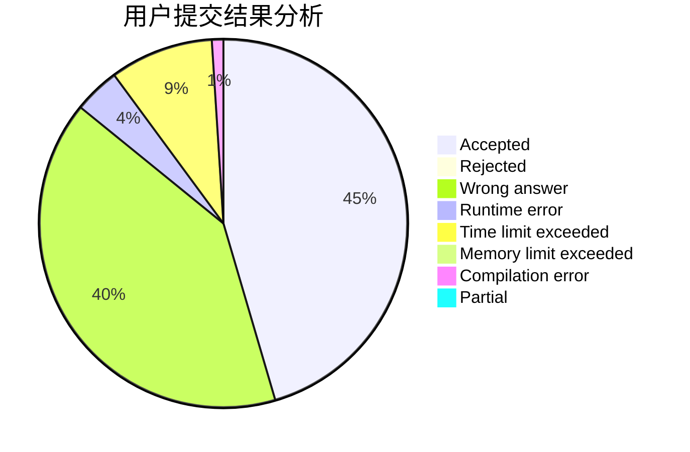
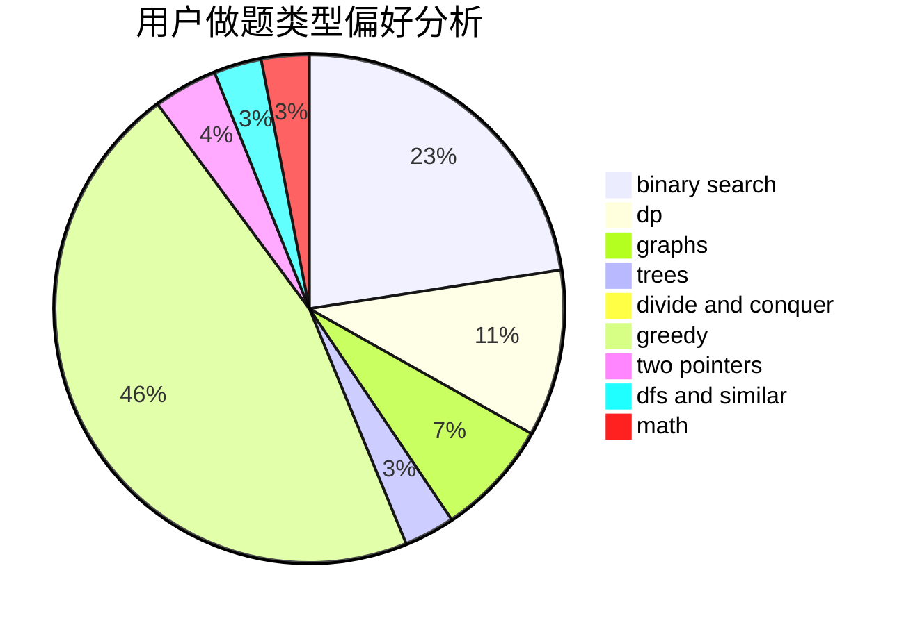

# Food_Chain_Rule

<!-- tabs:start -->

#### **用户提交结果分析**

#### **用户做题类型偏好分析**

<!-- tabs:end -->
# 推荐题目
[14461](https://codeforces.com/contest/1446/problem/1)
[1215B](https://codeforces.com/contest/1215/problem/B)
[1191A](https://codeforces.com/contest/1191/problem/A)
[456B](https://codeforces.com/contest/456/problem/B)
[1395F](https://codeforces.com/contest/1395/problem/F)
[1328C](https://codeforces.com/contest/1328/problem/C)
[875A](https://codeforces.com/contest/875/problem/A)
[190E](https://codeforces.com/contest/190/problem/E)
[246C](https://codeforces.com/contest/246/problem/C)
[1136D](https://codeforces.com/contest/1136/problem/D)
