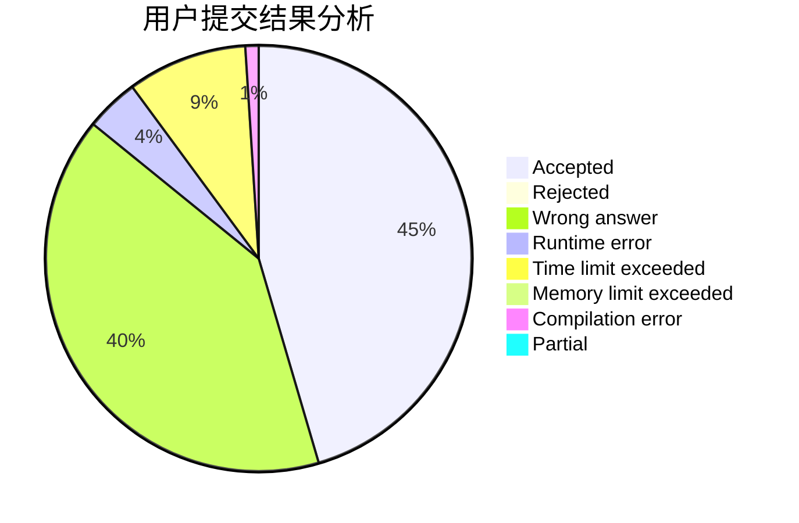
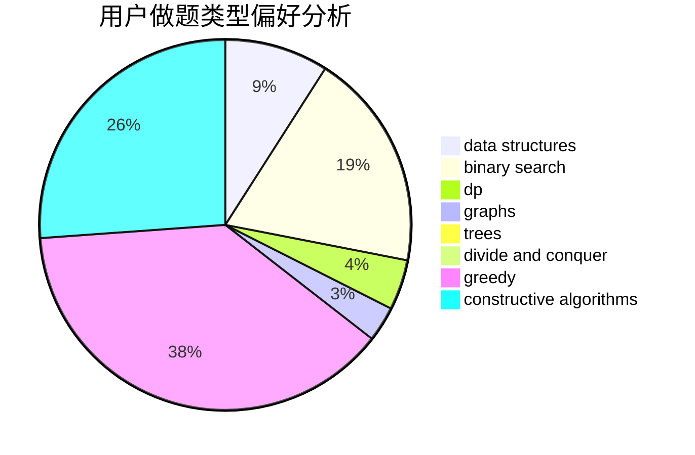
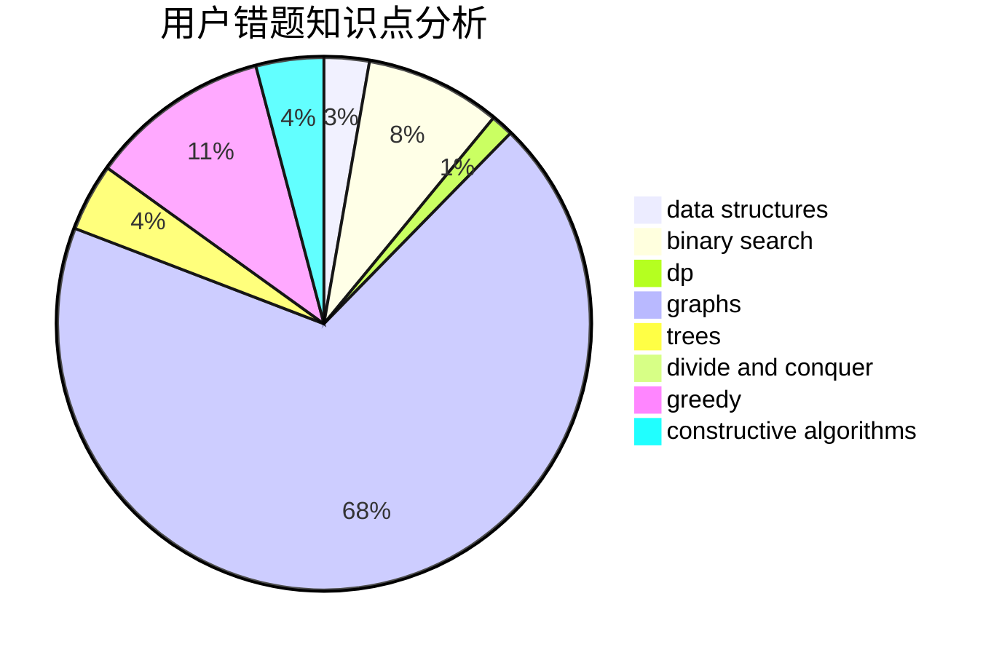

# Food_Chain_Rule

<!-- tabs:start -->

#### **用户提交结果分析**

#### **用户做题类型偏好分析**

#### **用户错题知识点分析**

<!-- tabs:end -->
# 推荐题目
[14461](https://codeforces.com/contest/1446/problem/1)		dsu,graphs,sortings,trees		  
[1215B](https://codeforces.com/contest/1215/problem/B)		combinatorics,
                        dp,
                        implementation		  
[1191A](https://codeforces.com/contest/1191/problem/A)		brute force		  
[456B](https://codeforces.com/contest/456/problem/B)		math,
                        number theory		  
[1395F](https://codeforces.com/contest/1395/problem/F)		dsu,graphs,sortings,trees		  
[1328C](https://codeforces.com/contest/1328/problem/C)		greedy,
                        implementation		  
[875A](https://codeforces.com/contest/875/problem/A)		brute force,
                        math		  
[190E](https://codeforces.com/contest/190/problem/E)		data structures,
                        dsu,
                        graphs,
                        hashing,
                        sortings		  
[246C](https://codeforces.com/contest/246/problem/C)		brute force,
                        constructive algorithms,
                        greedy		  
[1136D](https://codeforces.com/contest/1136/problem/D)		greedy		  
