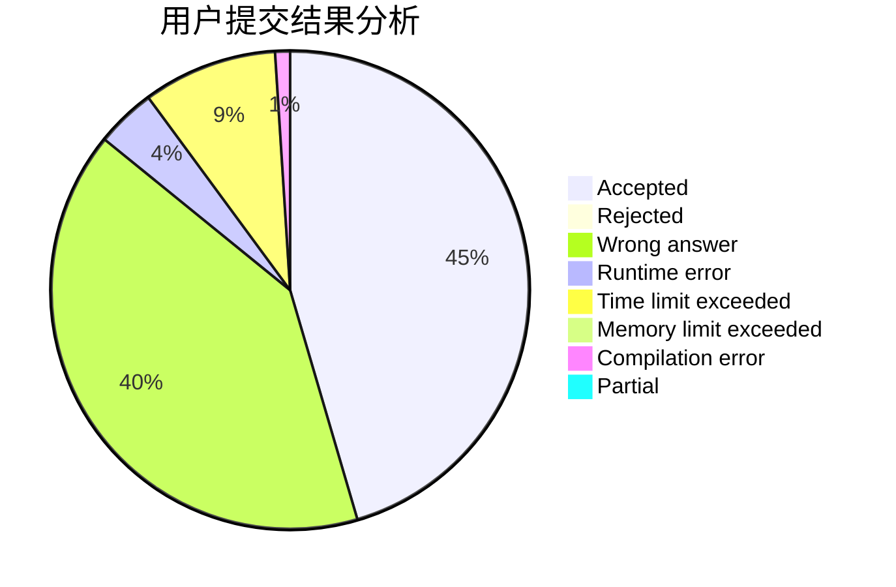
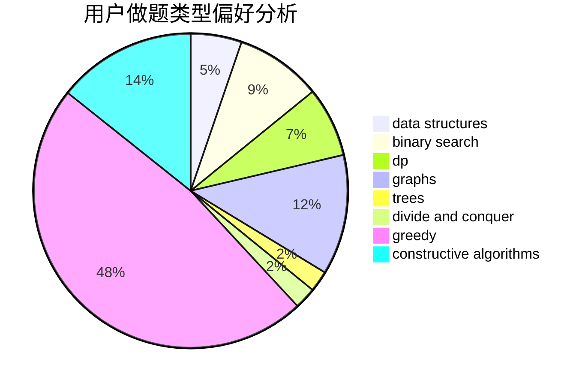
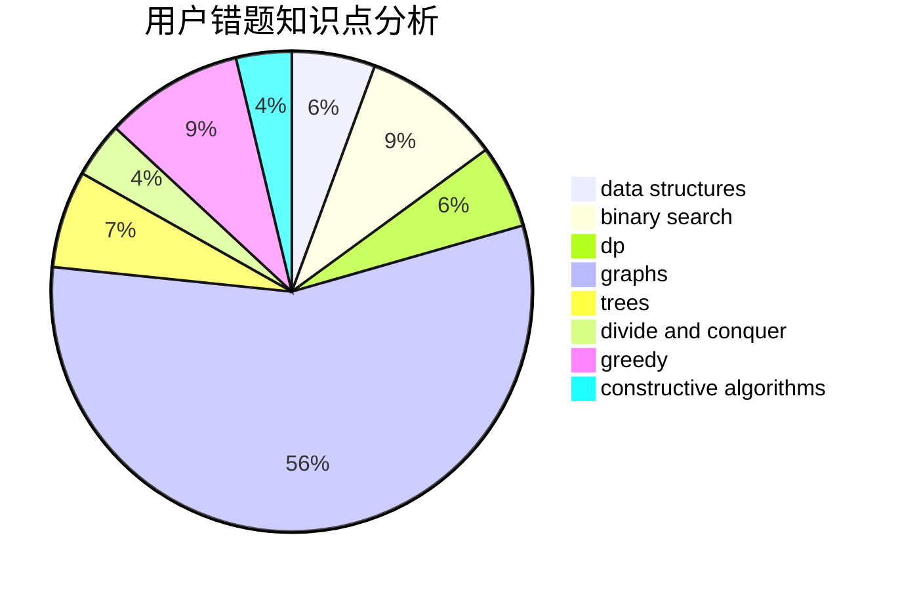

# Food_Chain_Rule

<!-- tabs:start -->

#### **用户提交结果分析**

#### **用户做题类型偏好分析**

#### **用户错题知识点分析**

<!-- tabs:end -->
# 推荐题目
[1436A](https://codeforces.com/contest/1436/problem/A)		math		  
[1209E2](https://codeforces.com/contest/1209E/problem/2)		bitmasks,
                        dp,
                        greedy,
                        sortings		  
[1187D](https://codeforces.com/contest/1187/problem/D)		data structures,
                        sortings		  
[436B](https://codeforces.com/contest/436/problem/B)		implementation,
                        math		  
[1385F](https://codeforces.com/contest/1385/problem/F)		data structures,
                        greedy,
                        implementation,
                        trees		  
[1321D](https://codeforces.com/contest/1321/problem/D)		dsu,graphs,sortings,trees		  
[855F](https://codeforces.com/contest/855/problem/F)		binary search,
                        data structures		  
[165E](https://codeforces.com/contest/165/problem/E)		bitmasks,
                        brute force,
                        dfs and similar,
                        dp		  
[228B](https://codeforces.com/contest/228/problem/B)		brute force,
                        implementation		  
[1132E](https://codeforces.com/contest/1132/problem/E)		dfs and similar,
                        dp,
                        greedy		  
