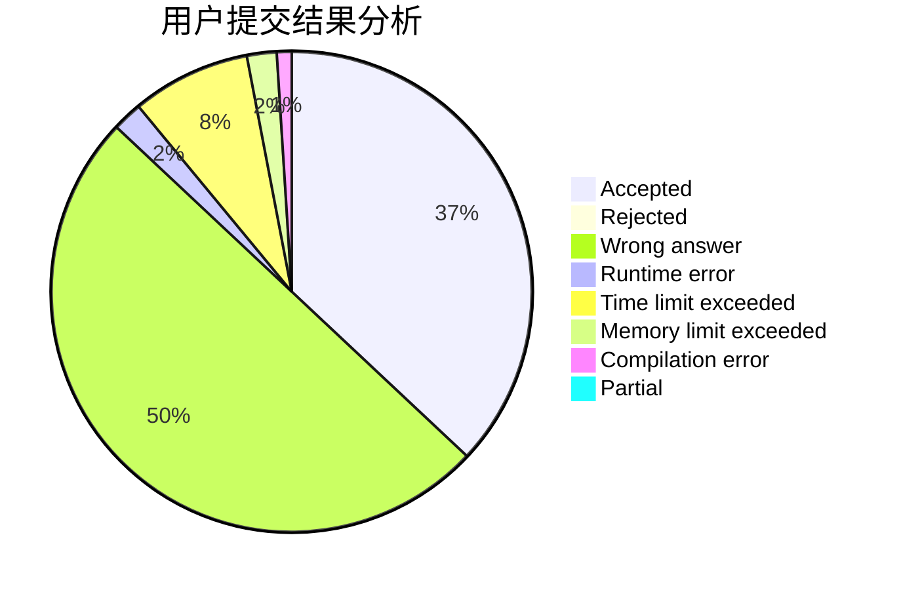
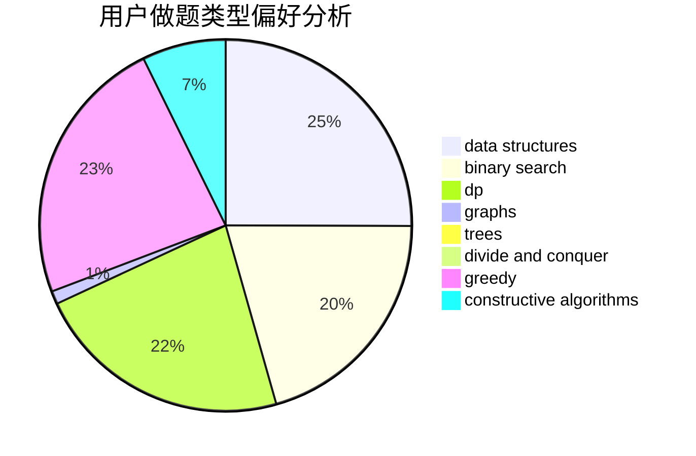

# Fool.
<!-- tabs:start -->
#### **用户提交结果分析**

#### **用户做题类型偏好分析**

#### **用户错题知识点分析**

<!-- tabs:end -->
# 推荐题目
[Amr and Pins](http://codeforces.com/problemset/problem/507/B)		geometry,
                        math		  
[To Play or not to Play](http://codeforces.com/problemset/problem/856/F)		greedy		  
[Fake News (easy)](http://codeforces.com/problemset/problem/802/G)		implementation,
                        strings		  
[Satellites](http://codeforces.com/problemset/problem/856/E)		nan		  
[AI robots](http://codeforces.com/problemset/problem/1045/G)		data structures		  
[Masha and Cactus](http://codeforces.com/problemset/problem/856/D)		dp,
                        trees		  
[Prefix Flip (Easy Version)](http://codeforces.com/problemset/problem/1381/A1)		constructive algorithms,
                        data structures,
                        strings		  
[Fox and Meteor Shower](http://codeforces.com/problemset/problem/388/E)		geometry		  
[Magic Box](http://codeforces.com/problemset/problem/231/D)		brute force,
                        geometry		  
[Metro](http://codeforces.com/problemset/problem/1055/A)		graphs		  
<!-- tabs:start -->
#### **data structures**
[Amr and Pins](http://codeforces.com/problemset/problem/1045/G)		data structures		  
[To Play or not to Play](http://codeforces.com/problemset/problem/1381/A1)		constructive algorithms,
                        data structures,
                        strings		  
[Fake News (easy)](http://codeforces.com/problemset/problem/1104/B)		data structures,
                        implementation,
                        math		  
[Satellites](http://codeforces.com/problemset/problem/1042/D)		data structures,
                        divide and conquer,
                        two pointers		  
[AI robots](http://codeforces.com/problemset/problem/725/D)		data structures,
                        greedy		  
[Masha and Cactus](http://codeforces.com/problemset/problem/1263/E)		data structures,
                        implementation		  
[Prefix Flip (Easy Version)](http://codeforces.com/problemset/problem/1313/C2)		data structures,
                        dp,
                        greedy		  
[Fox and Meteor Shower](http://codeforces.com/problemset/problem/1492/C)		binary search,
                        data structures,
                        dp,
                        greedy,
                        two pointers		  
[Magic Box](http://codeforces.com/problemset/problem/1490/G)		binary search,
                        data structures,
                        math		  
[Metro](http://codeforces.com/problemset/problem/1479/D)		binary search,
                        bitmasks,
                        brute force,
                        data structures,
                        probabilities,
                        trees		  
#### **binary search**
[Amr and Pins](http://codeforces.com/problemset/problem/1492/C)		binary search,
                        data structures,
                        dp,
                        greedy,
                        two pointers		  
[To Play or not to Play](http://codeforces.com/problemset/problem/1463/D)		binary search,
                        constructive algorithms,
                        greedy,
                        two pointers		  
[Fake News (easy)](http://codeforces.com/problemset/problem/1490/G)		binary search,
                        data structures,
                        math		  
[Satellites](http://codeforces.com/problemset/problem/1479/D)		binary search,
                        bitmasks,
                        brute force,
                        data structures,
                        probabilities,
                        trees		  
[AI robots](http://codeforces.com/problemset/problem/1436/E)		binary search,
                        data structures,
                        two pointers		  
[Masha and Cactus](http://codeforces.com/problemset/problem/1461/D)		binary search,
                        brute force,
                        data structures,
                        divide and conquer,
                        implementation,
                        sortings		  
[Prefix Flip (Easy Version)](http://codeforces.com/problemset/problem/1493/C)		binary search,
                        brute force,
                        constructive algorithms,
                        greedy,
                        strings		  
[Fox and Meteor Shower](http://codeforces.com/problemset/problem/1487/D)		binary search,
                        brute force,
                        math,
                        number theory		  
[Magic Box](http://codeforces.com/problemset/problem/1486/B)		binary search,
                        geometry,
                        shortest paths,
                        sortings		  
[Metro](http://codeforces.com/problemset/problem/1486/C1)		binary search,
                        interactive		  
#### **dp**
[Amr and Pins](http://codeforces.com/problemset/problem/856/D)		dp,
                        trees		  
[To Play or not to Play](http://codeforces.com/problemset/problem/1156/F)		dp,
                        math,
                        probabilities		  
[Fake News (easy)](http://codeforces.com/problemset/problem/1016/F)		dfs and similar,
                        dp,
                        trees		  
[Satellites](http://codeforces.com/problemset/problem/1439/D)		combinatorics,
                        dp,
                        fft		  
[AI robots](http://codeforces.com/problemset/problem/1214/D)		dfs and similar,
                        dp,
                        flows,
                        hashing		  
[Masha and Cactus](http://codeforces.com/problemset/problem/1276/A)		dp,
                        greedy		  
[Prefix Flip (Easy Version)](http://codeforces.com/problemset/problem/1313/C2)		data structures,
                        dp,
                        greedy		  
[Fox and Meteor Shower](http://codeforces.com/problemset/problem/1492/C)		binary search,
                        data structures,
                        dp,
                        greedy,
                        two pointers		  
[Magic Box](https://codeforces.com/contest/1457/problem/C)		brute force,
                        dp,
                        implementation		  
[Metro](http://codeforces.com/problemset/problem/1491/C)		brute force,
                        data structures,
                        dp,
                        greedy,
                        implementation		  
#### **graph**
[Amr and Pins](http://codeforces.com/problemset/problem/1055/A)		graphs		  
[To Play or not to Play](https://codeforces.com/contest/742/problem/E)		constructive algorithms,
                        dfs and similar,
                        graphs		  
[Fake News (easy)](http://codeforces.com/problemset/problem/1439/A2)		constructive algorithms,
                        graphs,
                        greedy,
                        implementation		  
[Satellites](http://codeforces.com/problemset/problem/1487/C)		brute force,
                        constructive algorithms,
                        dfs and similar,
                        graphs,
                        greedy,
                        implementation,
                        math		  
[AI robots](http://codeforces.com/problemset/problem/1437/C)		dp,
                        flows,
                        graph matchings,
                        greedy,
                        math,
                        sortings		  
[Masha and Cactus](http://codeforces.com/problemset/problem/1470/D)		constructive algorithms,
                        dfs and similar,
                        graph matchings,
                        graphs,
                        greedy		  
[Prefix Flip (Easy Version)](http://codeforces.com/problemset/problem/1476/C)		dp,
                        graphs,
                        greedy		  
[Fox and Meteor Shower](http://codeforces.com/problemset/problem/1304/D)		constructive algorithms,
                        graphs,
                        greedy,
                        two pointers		  
[Magic Box](http://codeforces.com/problemset/problem/1475/C)		combinatorics,
                        graphs,
                        math		  
[Metro](http://codeforces.com/problemset/problem/553/E)		dp,
                        fft,
                        graphs,
                        math,
                        probabilities		  
#### **trees**
[Amr and Pins](http://codeforces.com/problemset/problem/856/D)		dp,
                        trees		  
[To Play or not to Play](http://codeforces.com/problemset/problem/1016/F)		dfs and similar,
                        dp,
                        trees		  
[Fake News (easy)](http://codeforces.com/problemset/problem/1479/D)		binary search,
                        bitmasks,
                        brute force,
                        data structures,
                        probabilities,
                        trees		  
[Satellites](http://codeforces.com/problemset/problem/1511/C)		brute force,
                        data structures,
                        implementation,
                        trees		  
[AI robots](http://codeforces.com/problemset/problem/1499/F)		combinatorics,
                        dfs and similar,
                        dp,
                        trees		  
[Masha and Cactus](http://codeforces.com/problemset/problem/1491/E)		brute force,
                        dfs and similar,
                        divide and conquer,
                        number theory,
                        trees		  
[Prefix Flip (Easy Version)](http://codeforces.com/problemset/problem/1466/D)		data structures,
                        greedy,
                        sortings,
                        trees		  
[Fox and Meteor Shower](http://codeforces.com/problemset/problem/1495/D)		combinatorics,
                        dfs and similar,
                        graphs,
                        math,
                        shortest paths,
                        trees		  
[Magic Box](http://codeforces.com/problemset/problem/1303/G)		data structures,
                        divide and conquer,
                        geometry,
                        trees		  
[Metro](http://codeforces.com/problemset/problem/1454/E)		combinatorics,
                        dfs and similar,
                        graphs,
                        trees		  
#### **divide and conquer**
[Amr and Pins](http://codeforces.com/problemset/problem/1042/D)		data structures,
                        divide and conquer,
                        two pointers		  
[To Play or not to Play](http://codeforces.com/problemset/problem/1461/D)		binary search,
                        brute force,
                        data structures,
                        divide and conquer,
                        implementation,
                        sortings		  
[Fake News (easy)](http://codeforces.com/problemset/problem/1466/G)		combinatorics,
                        divide and conquer,
                        hashing,
                        math,
                        string suffix structures,
                        strings		  
[Satellites](http://codeforces.com/problemset/problem/1490/D)		dfs and similar,
                        divide and conquer,
                        implementation		  
[AI robots](https://codeforces.com/contest/1483/problem/C)		data structures,
                        divide and conquer,
                        dp		  
[Masha and Cactus](http://codeforces.com/problemset/problem/1491/E)		brute force,
                        dfs and similar,
                        divide and conquer,
                        number theory,
                        trees		  
[Prefix Flip (Easy Version)](http://codeforces.com/problemset/problem/1303/G)		data structures,
                        divide and conquer,
                        geometry,
                        trees		  
[Fox and Meteor Shower](http://codeforces.com/problemset/problem/1494/D)		constructive algorithms,
                        data structures,
                        dfs and similar,
                        divide and conquer,
                        dsu,
                        greedy,
                        sortings,
                        trees		  
[Magic Box](http://codeforces.com/problemset/problem/1482/E)		data structures,
                        divide and conquer,
                        dp		  
[Metro](http://codeforces.com/problemset/problem/566/C)		dfs and similar,
                        divide and conquer,
                        trees		  
#### **greedy**
[Amr and Pins](http://codeforces.com/problemset/problem/856/F)		greedy		  
[To Play or not to Play](http://codeforces.com/problemset/problem/725/D)		data structures,
                        greedy		  
[Fake News (easy)](http://codeforces.com/problemset/problem/1276/A)		dp,
                        greedy		  
[Satellites](https://codeforces.com/contest/1300/problem/C)		brute force,
                        greedy,
                        math		  
[AI robots](http://codeforces.com/problemset/problem/339/E)		constructive algorithms,
                        dfs and similar,
                        greedy		  
[Masha and Cactus](http://codeforces.com/problemset/problem/1439/A2)		constructive algorithms,
                        graphs,
                        greedy,
                        implementation		  
[Prefix Flip (Easy Version)](http://codeforces.com/problemset/problem/1313/C2)		data structures,
                        dp,
                        greedy		  
[Fox and Meteor Shower](http://codeforces.com/problemset/problem/1106/C)		greedy,
                        implementation,
                        math,
                        sortings		  
[Magic Box](http://codeforces.com/problemset/problem/1385/B)		greedy		  
[Metro](http://codeforces.com/problemset/problem/1492/C)		binary search,
                        data structures,
                        dp,
                        greedy,
                        two pointers		  
#### **constructive algorithms**
[Amr and Pins](http://codeforces.com/problemset/problem/1381/A1)		constructive algorithms,
                        data structures,
                        strings		  
[To Play or not to Play](https://codeforces.com/contest/742/problem/E)		constructive algorithms,
                        dfs and similar,
                        graphs		  
[Fake News (easy)](http://codeforces.com/problemset/problem/339/E)		constructive algorithms,
                        dfs and similar,
                        greedy		  
[Satellites](http://codeforces.com/problemset/problem/1439/A2)		constructive algorithms,
                        graphs,
                        greedy,
                        implementation		  
[AI robots](http://codeforces.com/problemset/problem/1493/A)		constructive algorithms,
                        greedy		  
[Masha and Cactus](http://codeforces.com/problemset/problem/1463/D)		binary search,
                        constructive algorithms,
                        greedy,
                        two pointers		  
[Prefix Flip (Easy Version)](https://codeforces.com/contest/1456/problem/B)		bitmasks,
                        brute force,
                        constructive algorithms		  
[Fox and Meteor Shower](http://codeforces.com/problemset/problem/1492/D)		bitmasks,
                        constructive algorithms,
                        greedy,
                        math		  
[Magic Box](https://codeforces.com/contest/1504/problem/D)		constructive algorithms,
                        games,
                        interactive		  
[Metro](https://codeforces.com/contest/1483/problem/A)		brute force,
                        constructive algorithms,
                        greedy,
                        implementation		  
#### **sortings**
[Amr and Pins](http://codeforces.com/problemset/problem/560/A)		implementation,
                        sortings		  
[To Play or not to Play](http://codeforces.com/problemset/problem/141/A)		implementation,
                        sortings,
                        strings		  
[Fake News (easy)](http://codeforces.com/problemset/problem/1106/C)		greedy,
                        implementation,
                        math,
                        sortings		  
[Satellites](https://codeforces.com/contest/1496/problem/C)		geometry,
                        greedy,
                        math,
                        sortings		  
[AI robots](http://codeforces.com/problemset/problem/1495/A)		geometry,
                        greedy,
                        math,
                        sortings		  
[Masha and Cactus](http://codeforces.com/problemset/problem/1497/A)		brute force,
                        data structures,
                        greedy,
                        sortings		  
[Prefix Flip (Easy Version)](http://codeforces.com/problemset/problem/1427/A)		math,
                        sortings		  
[Fox and Meteor Shower](http://codeforces.com/problemset/problem/1461/D)		binary search,
                        brute force,
                        data structures,
                        divide and conquer,
                        implementation,
                        sortings		  
[Magic Box](http://codeforces.com/problemset/problem/1437/C)		dp,
                        flows,
                        graph matchings,
                        greedy,
                        math,
                        sortings		  
[Metro](http://codeforces.com/problemset/problem/1473/A)		greedy,
                        implementation,
                        math,
                        sortings		  
<!-- tabs:end -->
