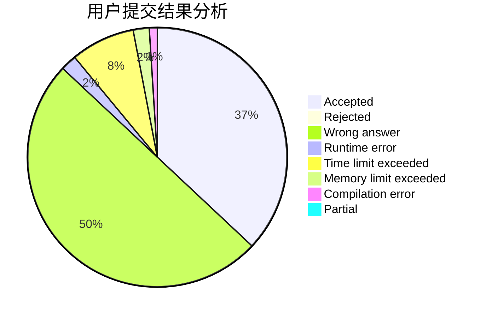
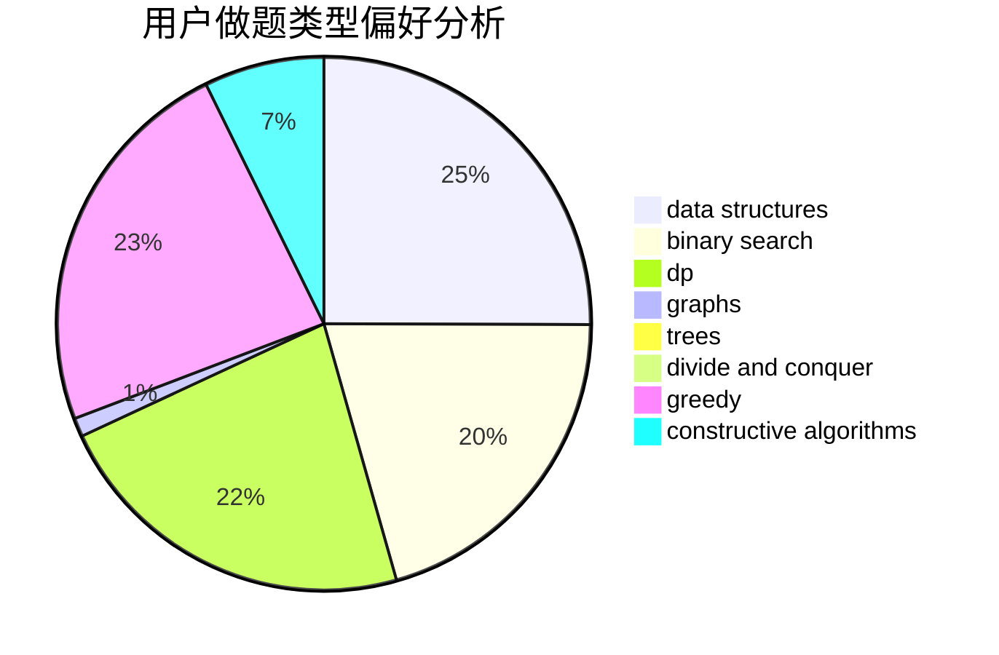

# Fool.

<!-- tabs:start -->

#### **用户提交结果分析**

#### **用户做题类型偏好分析**

#### **用户错题知识点分析**

<!-- tabs:end -->
# 推荐题目
[507B](https://codeforces.com/contest/507/problem/B)		geometry,
                        math		  
[856F](https://codeforces.com/contest/856/problem/F)		greedy		  
[1045G](https://codeforces.com/contest/1045/problem/G)		data structures		  
[560A](https://codeforces.com/contest/560/problem/A)		implementation,
                        sortings		  
[1016F](https://codeforces.com/contest/1016/problem/F)		dfs and similar,
                        dp,
                        trees		  
[856D](https://codeforces.com/contest/856/problem/D)		dp,
                        trees		  
[1214D](https://codeforces.com/contest/1214/problem/D)		dfs and similar,
                        dp,
                        flows,
                        hashing		  
[725D](https://codeforces.com/contest/725/problem/D)		data structures,
                        greedy		  
[1276A](https://codeforces.com/contest/1276/problem/A)		dp,
                        greedy		  
[388E](https://codeforces.com/contest/388/problem/E)		geometry		  
