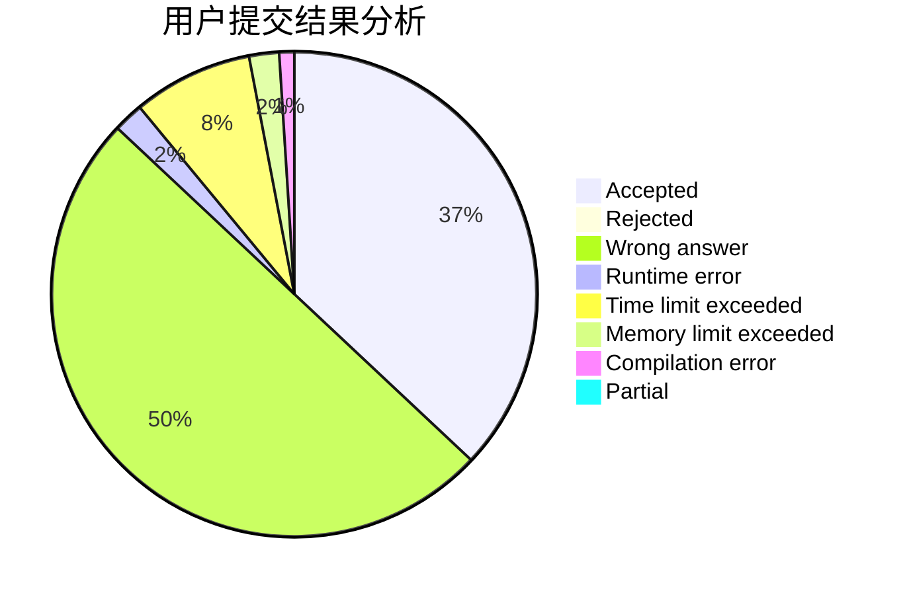
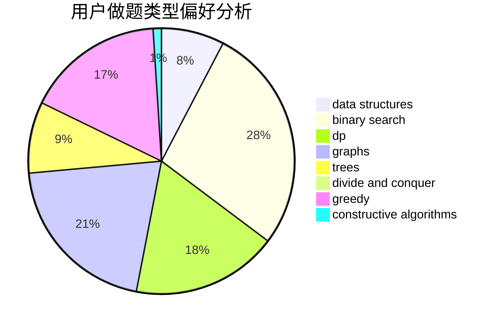
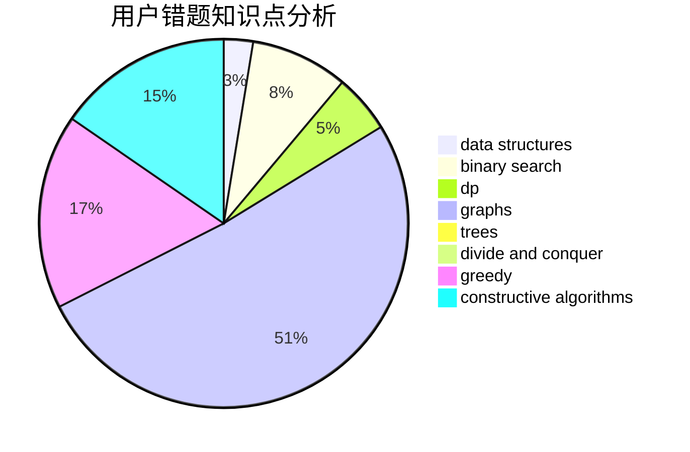

# Fool.

<!-- tabs:start -->

#### **用户提交结果分析**

#### **用户做题类型偏好分析**

#### **用户错题知识点分析**

<!-- tabs:end -->
# 推荐题目
[527C](https://codeforces.com/contest/527/problem/C)		binary search,
                        data structures,
                        implementation		  
[875F](https://codeforces.com/contest/875/problem/F)		dsu,
                        graphs,
                        greedy		  
[1045J](https://codeforces.com/contest/1045/problem/J)		data structures,
                        strings,
                        trees		  
[584C](https://codeforces.com/contest/584/problem/C)		constructive algorithms,
                        greedy,
                        strings		  
[1017B](https://codeforces.com/contest/1017/problem/B)		implementation,
                        math		  
[875D](https://codeforces.com/contest/875/problem/D)		binary search,
                        bitmasks,
                        combinatorics,
                        data structures,
                        divide and conquer		  
[121E](https://codeforces.com/contest/121/problem/E)		data structures		  
[743D](https://codeforces.com/contest/743/problem/D)		dfs and similar,
                        dp,
                        graphs,
                        trees		  
[1282A](https://codeforces.com/contest/1282/problem/A)		implementation,
                        math		  
[418B](https://codeforces.com/contest/418/problem/B)		dsu,graphs,sortings,trees		  
