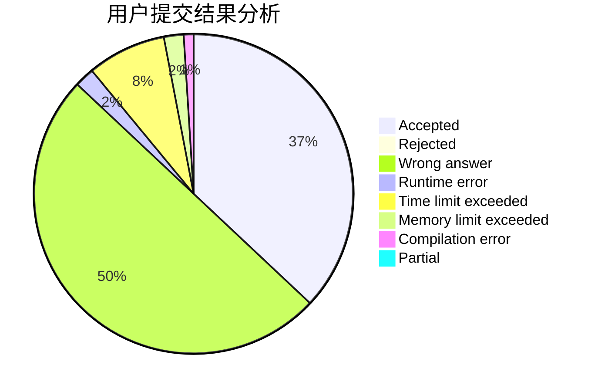
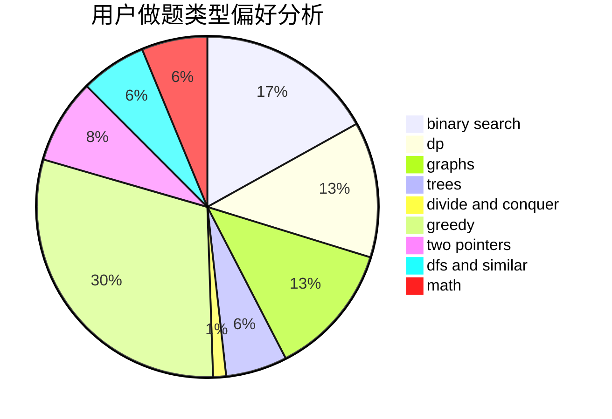

# Fool.

<!-- tabs:start -->

#### **用户提交结果分析**

#### **用户做题类型偏好分析**

<!-- tabs:end -->
# 推荐题目
[527C](https://codeforces.com/contest/527/problem/C)
[875F](https://codeforces.com/contest/875/problem/F)
[1045J](https://codeforces.com/contest/1045/problem/J)
[584C](https://codeforces.com/contest/584/problem/C)
[1017B](https://codeforces.com/contest/1017/problem/B)
[875D](https://codeforces.com/contest/875/problem/D)
[121E](https://codeforces.com/contest/121/problem/E)
[743D](https://codeforces.com/contest/743/problem/D)
[1282A](https://codeforces.com/contest/1282/problem/A)
[418B](https://codeforces.com/contest/418/problem/B)
