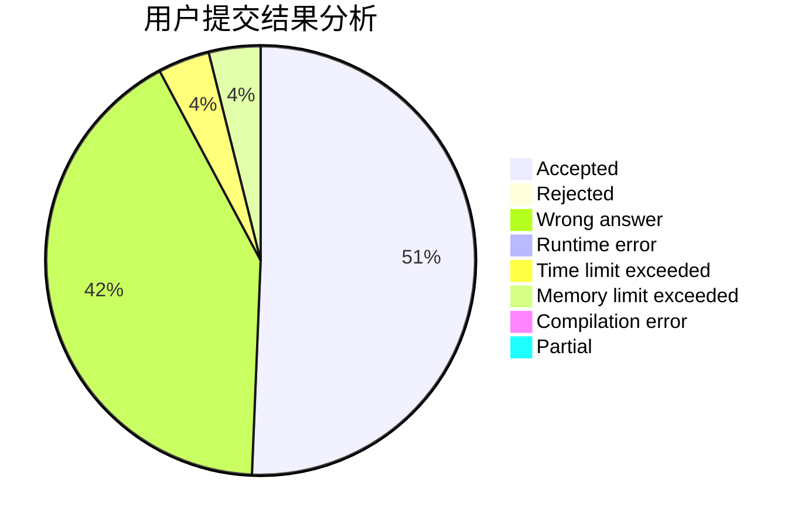
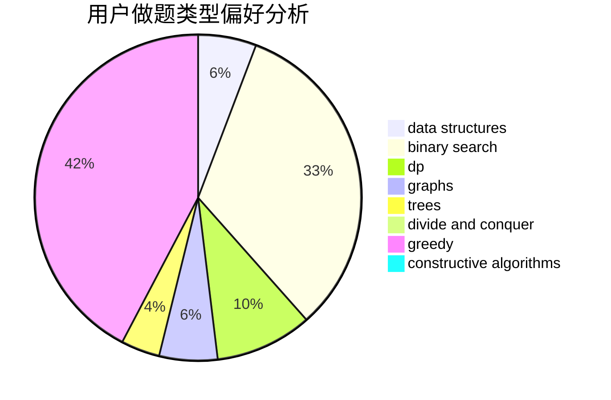
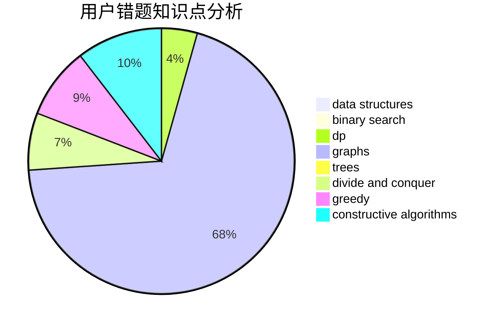

# Fop_zzZ

<!-- tabs:start -->

#### **用户提交结果分析**

#### **用户做题类型偏好分析**

#### **用户错题知识点分析**

<!-- tabs:end -->
# 推荐题目
[289D](https://codeforces.com/contest/289/problem/D)		dsu,graphs,sortings,trees		  
[771D](https://codeforces.com/contest/771/problem/D)		dp		  
[793G](https://codeforces.com/contest/793/problem/G)		data structures,
                        divide and conquer,
                        flows,
                        graph matchings		  
[1039C](https://codeforces.com/contest/1039/problem/C)		dfs and similar,
                        dsu,
                        graphs,
                        math,
                        sortings		  
[475A](https://codeforces.com/contest/475/problem/A)		implementation		  
[1415C](https://codeforces.com/contest/1415/problem/C)		brute force,
                        dp,
                        implementation		  
[607D](https://codeforces.com/contest/607/problem/D)		data structures,
                        trees		  
[279E](https://codeforces.com/contest/279/problem/E)		dp,
                        games,
                        greedy,
                        number theory		  
[801B](https://codeforces.com/contest/801/problem/B)		constructive algorithms,
                        greedy,
                        strings		  
[1190A](https://codeforces.com/contest/1190/problem/A)		implementation,
                        two pointers		  
