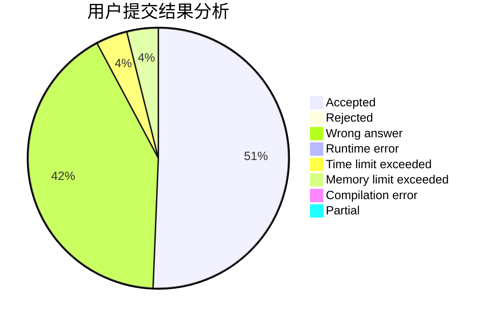
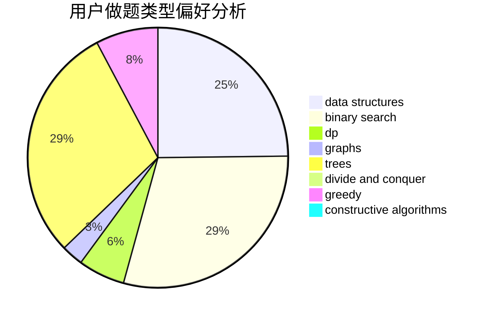
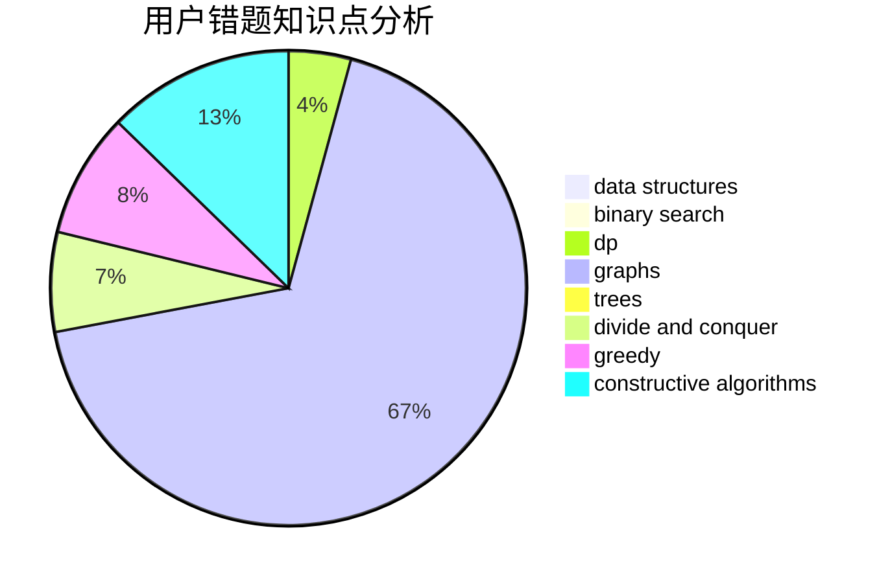

# Fop_zzZ

<!-- tabs:start -->

#### **用户提交结果分析**

#### **用户做题类型偏好分析**

#### **用户错题知识点分析**

<!-- tabs:end -->
# 推荐题目
[273E](https://codeforces.com/contest/273/problem/E)		dp,
                        games		  
[750H](https://codeforces.com/contest/750/problem/H)		dfs and similar,
                        dsu,
                        graphs,
                        interactive		  
[776A](https://codeforces.com/contest/776/problem/A)		brute force,
                        implementation,
                        strings		  
[1038E](https://codeforces.com/contest/1038/problem/E)		bitmasks,
                        brute force,
                        dfs and similar,
                        dp,
                        graphs		  
[453B](https://codeforces.com/contest/453/problem/B)		bitmasks,
                        brute force,
                        dp		  
[1404A](https://codeforces.com/contest/1404/problem/A)		implementation,
                        strings		  
[587C](https://codeforces.com/contest/587/problem/C)		data structures,
                        trees		  
[261B](https://codeforces.com/contest/261/problem/B)		dp,
                        math,
                        probabilities		  
[784B](https://codeforces.com/contest/784/problem/B)		*special problem		  
[1186D](https://codeforces.com/contest/1186/problem/D)		constructive algorithms,
                        greedy,
                        math		  
