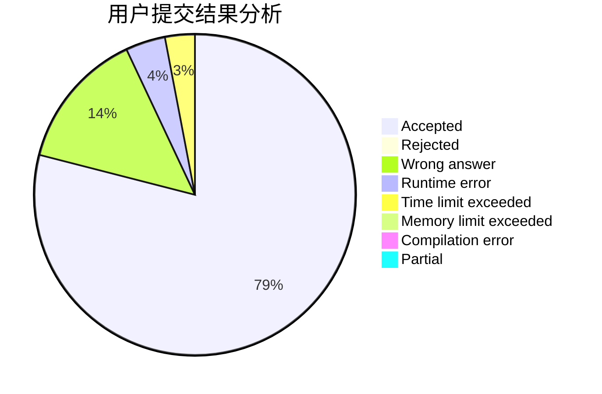
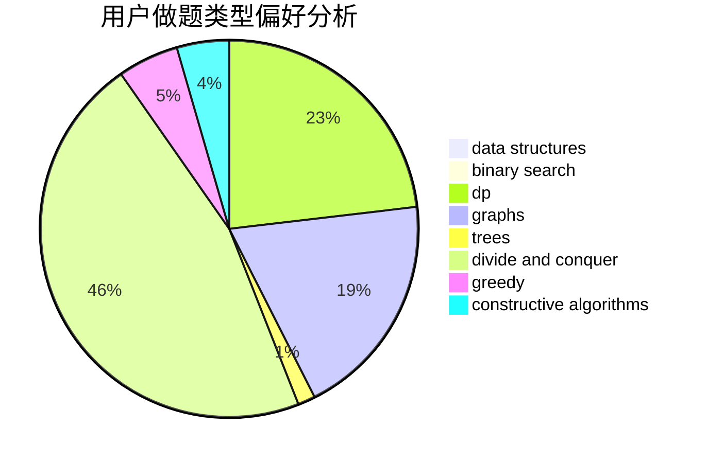

# Forever_Pursuit

<!-- tabs:start -->

#### **用户提交结果分析**

#### **用户做题类型偏好分析**

#### **用户错题知识点分析**

<!-- tabs:end -->
# 推荐题目
[265D](https://codeforces.com/contest/265/problem/D)		dsu,graphs,sortings,trees		  
[203B](https://codeforces.com/contest/203/problem/B)		brute force,
                        implementation		  
[1271C](https://codeforces.com/contest/1271/problem/C)		brute force,
                        geometry,
                        greedy,
                        implementation		  
[1138A](https://codeforces.com/contest/1138/problem/A)		binary search,
                        greedy,
                        implementation		  
[797D](https://codeforces.com/contest/797/problem/D)		data structures,
                        dfs and similar		  
[254C](https://codeforces.com/contest/254/problem/C)		greedy,
                        strings		  
[1190C](https://codeforces.com/contest/1190/problem/C)		brute force,
                        games,
                        greedy		  
[740D](https://codeforces.com/contest/740/problem/D)		dsu,graphs,sortings,trees		  
[1237G](https://codeforces.com/contest/1237/problem/G)		data structures,
                        dp,
                        greedy		  
[1208C](https://codeforces.com/contest/1208/problem/C)		constructive algorithms		  
