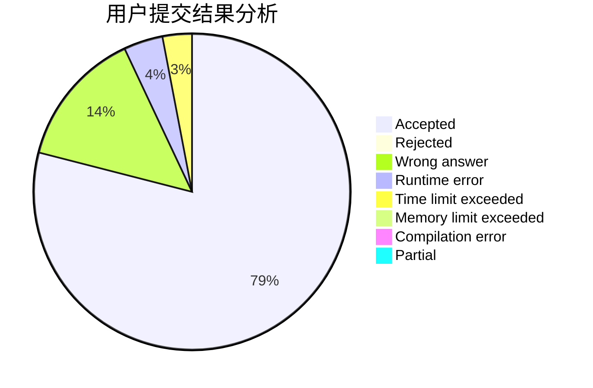
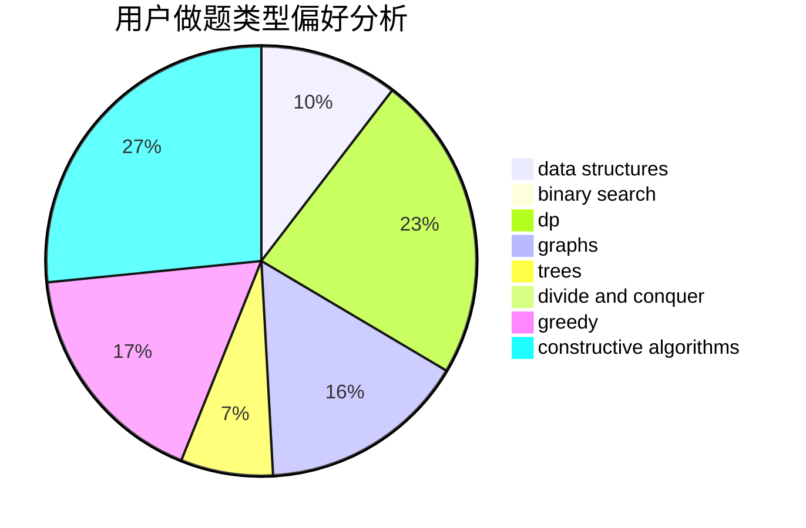

# Forever_Pursuit

<!-- tabs:start -->

#### **用户提交结果分析**

#### **用户做题类型偏好分析**

#### **用户错题知识点分析**

<!-- tabs:end -->
# 推荐题目
[281A](https://codeforces.com/contest/281/problem/A)		implementation,
                        strings		  
[227A](https://codeforces.com/contest/227/problem/A)		geometry		  
[1280E](https://codeforces.com/contest/1280/problem/E)		math		  
[113C](https://codeforces.com/contest/113/problem/C)		brute force,
                        math,
                        number theory		  
[811C](https://codeforces.com/contest/811/problem/C)		dp,
                        implementation		  
[272E](https://codeforces.com/contest/272/problem/E)		combinatorics,
                        constructive algorithms,
                        graphs		  
[1196A](https://codeforces.com/contest/1196/problem/A)		brute force,
                        constructive algorithms,
                        math		  
[761F](https://codeforces.com/contest/761/problem/F)		brute force,
                        data structures,
                        dp,
                        implementation		  
[1242E](https://codeforces.com/contest/1242/problem/E)		constructive algorithms,
                        graphs		  
[1213G](https://codeforces.com/contest/1213/problem/G)		divide and conquer,
                        dsu,
                        graphs,
                        sortings,
                        trees		  
