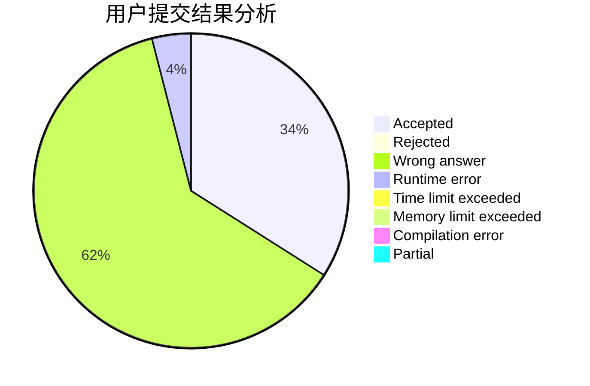
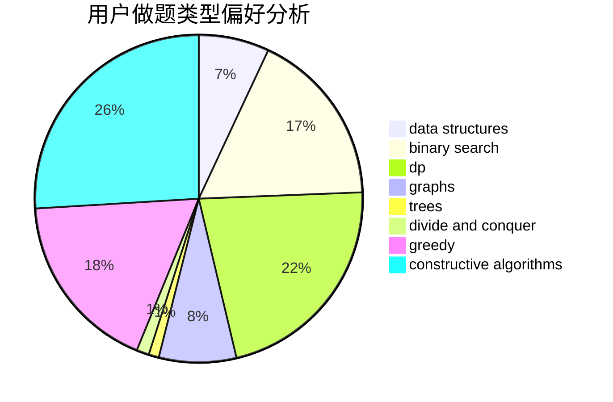
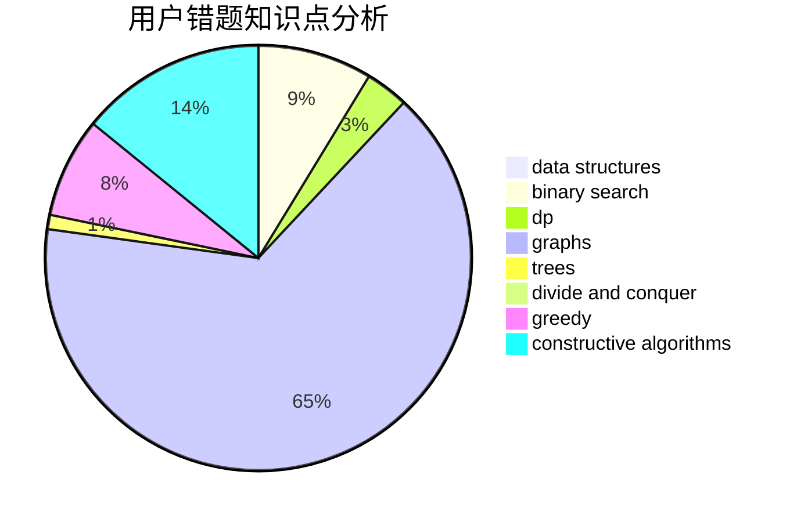

# ForneverXY

<!-- tabs:start -->

#### **用户提交结果分析**

#### **用户做题类型偏好分析**

#### **用户错题知识点分析**

<!-- tabs:end -->
# 推荐题目
[1478D](https://codeforces.com/contest/1478/problem/D)		dsu,graphs,sortings,trees		  
[1398A](https://codeforces.com/contest/1398/problem/A)		geometry,
                        math		  
[1290C](https://codeforces.com/contest/1290/problem/C)		dfs and similar,
                        dsu,
                        graphs		  
[1217A](https://codeforces.com/contest/1217/problem/A)		binary search,
                        math		  
[1183A](https://codeforces.com/contest/1183/problem/A)		implementation		  
[600D](https://codeforces.com/contest/600/problem/D)		geometry		  
[385E](https://codeforces.com/contest/385/problem/E)		math,
                        matrices		  
[858A](https://codeforces.com/contest/858/problem/A)		brute force,
                        math,
                        number theory		  
[588B](https://codeforces.com/contest/588/problem/B)		math		  
[681B](https://codeforces.com/contest/681/problem/B)		brute force		  
