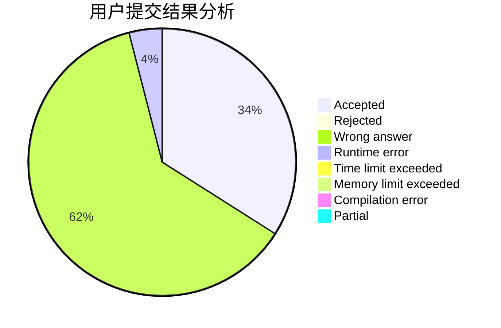
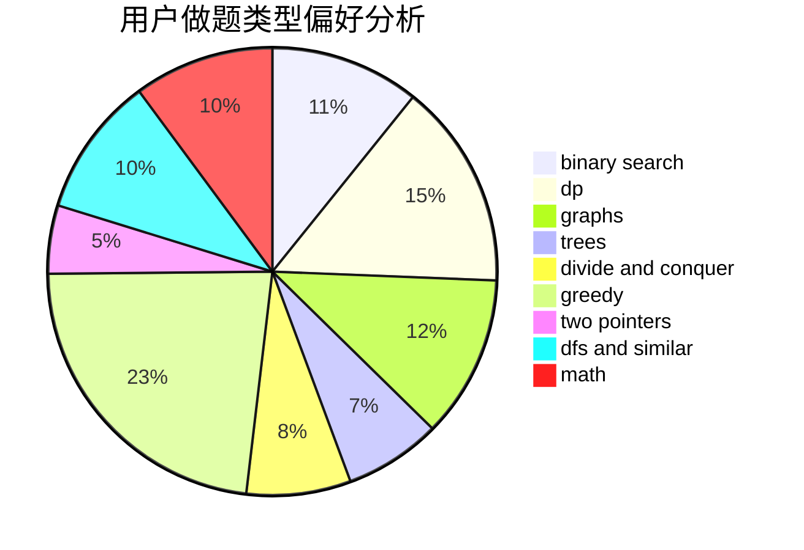

# ForneverXY

<!-- tabs:start -->

#### **用户提交结果分析**

#### **用户做题类型偏好分析**

<!-- tabs:end -->
# 推荐题目
[1487B](https://codeforces.com/contest/1487/problem/B)
[1406E](https://codeforces.com/contest/1406/problem/E)
[1296F](https://codeforces.com/contest/1296/problem/F)
[1223E](https://codeforces.com/contest/1223/problem/E)
[1185D](https://codeforces.com/contest/1185/problem/D)
[61E](https://codeforces.com/contest/61/problem/E)
[415A](https://codeforces.com/contest/415/problem/A)
[876A](https://codeforces.com/contest/876/problem/A)
[608D](https://codeforces.com/contest/608/problem/D)
[705A](https://codeforces.com/contest/705/problem/A)
