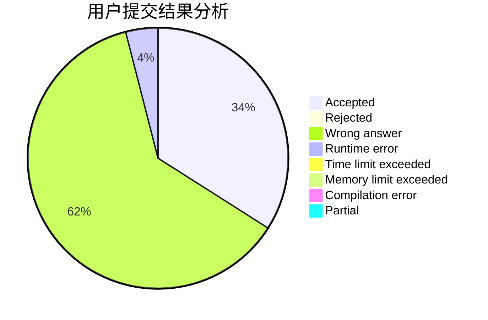
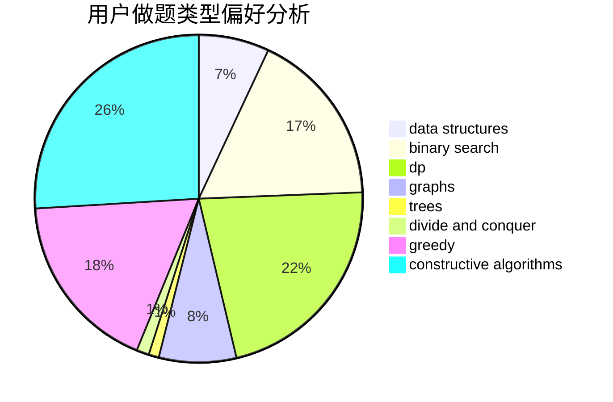
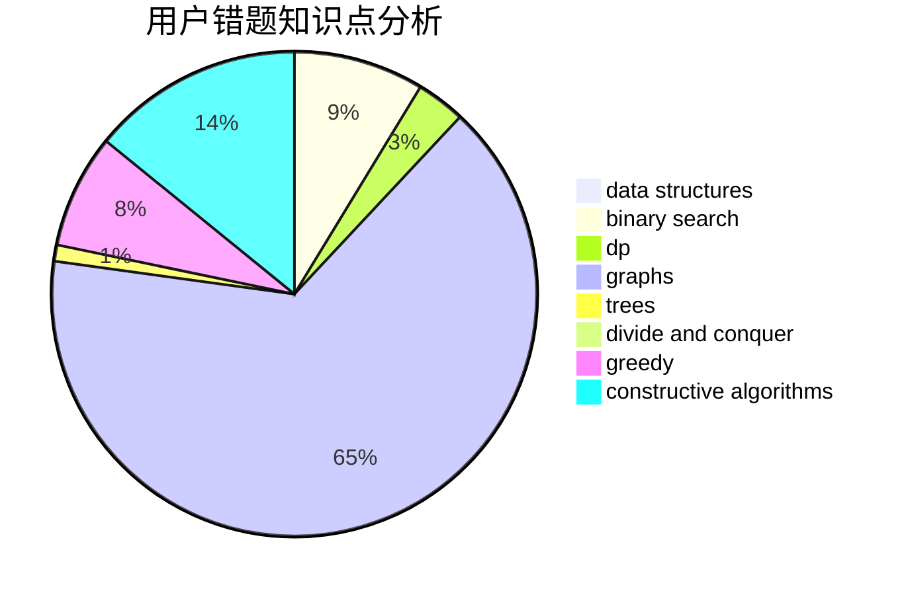

# ForneverXY
<!-- tabs:start -->
#### **用户提交结果分析**

#### **用户做题类型偏好分析**

#### **用户错题知识点分析**

<!-- tabs:end -->
# 推荐题目
[Nezzar and Board](https://codeforces.com/contest/1478/problem/D)		constructive algorithms,
                        math,
                        number theory		  
[Creating a Character](http://codeforces.com/problemset/problem/1217/A)		binary search,
                        math		  
[Area of Two Circles' Intersection](http://codeforces.com/problemset/problem/600/D)		geometry		  
[Little Dima and Equation](http://codeforces.com/problemset/problem/460/B)		brute force,
                        implementation,
                        math,
                        number theory		  
[Prefix Enlightenment](http://codeforces.com/problemset/problem/1290/C)		dfs and similar,
                        dsu,
                        graphs		  
[Bad Triangle](http://codeforces.com/problemset/problem/1398/A)		geometry,
                        math		  
[Tanya is 5!](http://codeforces.com/problemset/problem/737/E)		graph matchings,
                        graphs,
                        greedy,
                        schedules		  
[Bear in the Field](http://codeforces.com/problemset/problem/385/E)		math,
                        matrices		  
[Economy Game](http://codeforces.com/problemset/problem/681/B)		brute force		  
[k-rounding](http://codeforces.com/problemset/problem/858/A)		brute force,
                        math,
                        number theory		  
<!-- tabs:start -->
#### **data structures**
[Nezzar and Board](http://codeforces.com/problemset/problem/1277/D)		data structures,
                        hashing,
                        implementation,
                        math		  
[Creating a Character](http://codeforces.com/problemset/problem/845/D)		data structures,
                        dp,
                        greedy		  
[Area of Two Circles' Intersection](http://codeforces.com/problemset/problem/671/D)		data structures,
                        dp,
                        greedy		  
[Little Dima and Equation](http://codeforces.com/problemset/problem/377/B)		binary search,
                        data structures,
                        greedy,
                        sortings		  
[Prefix Enlightenment](http://codeforces.com/problemset/problem/629/D)		data structures,
                        dp		  
[Bad Triangle](http://codeforces.com/problemset/problem/555/B)		data structures,
                        greedy,
                        sortings		  
[Tanya is 5!](http://codeforces.com/problemset/problem/1156/E)		data structures,
                        divide and conquer,
                        dsu,
                        two pointers		  
[Bear in the Field](http://codeforces.com/problemset/problem/1492/C)		binary search,
                        data structures,
                        dp,
                        greedy,
                        two pointers		  
[Economy Game](http://codeforces.com/problemset/problem/1490/G)		binary search,
                        data structures,
                        math		  
[k-rounding](http://codeforces.com/problemset/problem/1479/D)		binary search,
                        bitmasks,
                        brute force,
                        data structures,
                        probabilities,
                        trees		  
#### **binary search**
[Nezzar and Board](http://codeforces.com/problemset/problem/1217/A)		binary search,
                        math		  
[Creating a Character](http://codeforces.com/problemset/problem/1119/B)		binary search,
                        flows,
                        greedy,
                        sortings		  
[Area of Two Circles' Intersection](http://codeforces.com/problemset/problem/377/B)		binary search,
                        data structures,
                        greedy,
                        sortings		  
[Little Dima and Equation](http://codeforces.com/problemset/problem/380/A)		binary search,
                        brute force		  
[Prefix Enlightenment](http://codeforces.com/problemset/problem/1492/C)		binary search,
                        data structures,
                        dp,
                        greedy,
                        two pointers		  
[Bad Triangle](http://codeforces.com/problemset/problem/1463/D)		binary search,
                        constructive algorithms,
                        greedy,
                        two pointers		  
[Tanya is 5!](http://codeforces.com/problemset/problem/1490/G)		binary search,
                        data structures,
                        math		  
[Bear in the Field](http://codeforces.com/problemset/problem/1479/D)		binary search,
                        bitmasks,
                        brute force,
                        data structures,
                        probabilities,
                        trees		  
[Economy Game](http://codeforces.com/problemset/problem/1436/E)		binary search,
                        data structures,
                        two pointers		  
[k-rounding](http://codeforces.com/problemset/problem/1461/D)		binary search,
                        brute force,
                        data structures,
                        divide and conquer,
                        implementation,
                        sortings		  
#### **dp**
[Nezzar and Board](http://codeforces.com/problemset/problem/845/D)		data structures,
                        dp,
                        greedy		  
[Creating a Character](http://codeforces.com/problemset/problem/858/C)		dp,
                        greedy,
                        implementation		  
[Area of Two Circles' Intersection](http://codeforces.com/problemset/problem/671/D)		data structures,
                        dp,
                        greedy		  
[Little Dima and Equation](http://codeforces.com/problemset/problem/629/D)		data structures,
                        dp		  
[Prefix Enlightenment](http://codeforces.com/problemset/problem/730/J)		dp		  
[Bad Triangle](http://codeforces.com/problemset/problem/1439/D)		combinatorics,
                        dp,
                        fft		  
[Tanya is 5!](http://codeforces.com/problemset/problem/1215/B)		combinatorics,
                        dp,
                        implementation		  
[Bear in the Field](http://codeforces.com/problemset/problem/1248/D1)		brute force,
                        dp,
                        greedy,
                        implementation		  
[Economy Game](http://codeforces.com/problemset/problem/1492/C)		binary search,
                        data structures,
                        dp,
                        greedy,
                        two pointers		  
[k-rounding](https://codeforces.com/contest/1457/problem/C)		brute force,
                        dp,
                        implementation		  
#### **graph**
[Nezzar and Board](http://codeforces.com/problemset/problem/1290/C)		dfs and similar,
                        dsu,
                        graphs		  
[Creating a Character](http://codeforces.com/problemset/problem/737/E)		graph matchings,
                        graphs,
                        greedy,
                        schedules		  
[Area of Two Circles' Intersection](http://codeforces.com/problemset/problem/858/F)		constructive algorithms,
                        dfs and similar,
                        graphs		  
[Little Dima and Equation](http://codeforces.com/problemset/problem/1487/C)		brute force,
                        constructive algorithms,
                        dfs and similar,
                        graphs,
                        greedy,
                        implementation,
                        math		  
[Prefix Enlightenment](http://codeforces.com/problemset/problem/1437/C)		dp,
                        flows,
                        graph matchings,
                        greedy,
                        math,
                        sortings		  
[Bad Triangle](http://codeforces.com/problemset/problem/1470/D)		constructive algorithms,
                        dfs and similar,
                        graph matchings,
                        graphs,
                        greedy		  
[Tanya is 5!](http://codeforces.com/problemset/problem/1476/C)		dp,
                        graphs,
                        greedy		  
[Bear in the Field](http://codeforces.com/problemset/problem/1304/D)		constructive algorithms,
                        graphs,
                        greedy,
                        two pointers		  
[Economy Game](http://codeforces.com/problemset/problem/1475/C)		combinatorics,
                        graphs,
                        math		  
[k-rounding](http://codeforces.com/problemset/problem/553/E)		dp,
                        fft,
                        graphs,
                        math,
                        probabilities		  
#### **trees**
[Nezzar and Board](http://codeforces.com/problemset/problem/472/D)		dfs and similar,
                        dsu,
                        shortest paths,
                        trees		  
[Creating a Character](http://codeforces.com/problemset/problem/1479/D)		binary search,
                        bitmasks,
                        brute force,
                        data structures,
                        probabilities,
                        trees		  
[Area of Two Circles' Intersection](http://codeforces.com/problemset/problem/1511/C)		brute force,
                        data structures,
                        implementation,
                        trees		  
[Little Dima and Equation](http://codeforces.com/problemset/problem/1499/F)		combinatorics,
                        dfs and similar,
                        dp,
                        trees		  
[Prefix Enlightenment](http://codeforces.com/problemset/problem/1491/E)		brute force,
                        dfs and similar,
                        divide and conquer,
                        number theory,
                        trees		  
[Bad Triangle](http://codeforces.com/problemset/problem/1466/D)		data structures,
                        greedy,
                        sortings,
                        trees		  
[Tanya is 5!](http://codeforces.com/problemset/problem/1495/D)		combinatorics,
                        dfs and similar,
                        graphs,
                        math,
                        shortest paths,
                        trees		  
[Bear in the Field](http://codeforces.com/problemset/problem/1303/G)		data structures,
                        divide and conquer,
                        geometry,
                        trees		  
[Economy Game](http://codeforces.com/problemset/problem/1454/E)		combinatorics,
                        dfs and similar,
                        graphs,
                        trees		  
[k-rounding](http://codeforces.com/problemset/problem/1494/D)		constructive algorithms,
                        data structures,
                        dfs and similar,
                        divide and conquer,
                        dsu,
                        greedy,
                        sortings,
                        trees		  
#### **divide and conquer**
[Nezzar and Board](http://codeforces.com/problemset/problem/1156/E)		data structures,
                        divide and conquer,
                        dsu,
                        two pointers		  
[Creating a Character](http://codeforces.com/problemset/problem/1461/D)		binary search,
                        brute force,
                        data structures,
                        divide and conquer,
                        implementation,
                        sortings		  
[Area of Two Circles' Intersection](http://codeforces.com/problemset/problem/1466/G)		combinatorics,
                        divide and conquer,
                        hashing,
                        math,
                        string suffix structures,
                        strings		  
[Little Dima and Equation](http://codeforces.com/problemset/problem/1490/D)		dfs and similar,
                        divide and conquer,
                        implementation		  
[Prefix Enlightenment](https://codeforces.com/contest/1483/problem/C)		data structures,
                        divide and conquer,
                        dp		  
[Bad Triangle](http://codeforces.com/problemset/problem/1491/E)		brute force,
                        dfs and similar,
                        divide and conquer,
                        number theory,
                        trees		  
[Tanya is 5!](http://codeforces.com/problemset/problem/1303/G)		data structures,
                        divide and conquer,
                        geometry,
                        trees		  
[Bear in the Field](http://codeforces.com/problemset/problem/1494/D)		constructive algorithms,
                        data structures,
                        dfs and similar,
                        divide and conquer,
                        dsu,
                        greedy,
                        sortings,
                        trees		  
[Economy Game](http://codeforces.com/problemset/problem/1482/E)		data structures,
                        divide and conquer,
                        dp		  
[k-rounding](http://codeforces.com/problemset/problem/566/C)		dfs and similar,
                        divide and conquer,
                        trees		  
#### **greedy**
[Nezzar and Board](http://codeforces.com/problemset/problem/737/E)		graph matchings,
                        graphs,
                        greedy,
                        schedules		  
[Creating a Character](http://codeforces.com/problemset/problem/845/D)		data structures,
                        dp,
                        greedy		  
[Area of Two Circles' Intersection](http://codeforces.com/problemset/problem/858/C)		dp,
                        greedy,
                        implementation		  
[Little Dima and Equation](http://codeforces.com/problemset/problem/859/A)		greedy,
                        implementation		  
[Prefix Enlightenment](http://codeforces.com/problemset/problem/671/D)		data structures,
                        dp,
                        greedy		  
[Bad Triangle](http://codeforces.com/problemset/problem/1119/B)		binary search,
                        flows,
                        greedy,
                        sortings		  
[Tanya is 5!](http://codeforces.com/problemset/problem/377/B)		binary search,
                        data structures,
                        greedy,
                        sortings		  
[Bear in the Field](http://codeforces.com/problemset/problem/555/B)		data structures,
                        greedy,
                        sortings		  
[Economy Game](http://codeforces.com/problemset/problem/1419/B)		brute force,
                        constructive algorithms,
                        greedy,
                        implementation,
                        math		  
[k-rounding](http://codeforces.com/problemset/problem/1248/D1)		brute force,
                        dp,
                        greedy,
                        implementation		  
#### **constructive algorithms**
[Nezzar and Board](https://codeforces.com/contest/1478/problem/D)		constructive algorithms,
                        math,
                        number theory		  
[Creating a Character](http://codeforces.com/problemset/problem/858/F)		constructive algorithms,
                        dfs and similar,
                        graphs		  
[Area of Two Circles' Intersection](http://codeforces.com/problemset/problem/7/A)		brute force,
                        constructive algorithms		  
[Little Dima and Equation](http://codeforces.com/problemset/problem/1419/B)		brute force,
                        constructive algorithms,
                        greedy,
                        implementation,
                        math		  
[Prefix Enlightenment](http://codeforces.com/problemset/problem/538/G)		constructive algorithms,
                        math,
                        sortings		  
[Bad Triangle](http://codeforces.com/problemset/problem/1493/A)		constructive algorithms,
                        greedy		  
[Tanya is 5!](http://codeforces.com/problemset/problem/1463/D)		binary search,
                        constructive algorithms,
                        greedy,
                        two pointers		  
[Bear in the Field](https://codeforces.com/contest/1456/problem/B)		bitmasks,
                        brute force,
                        constructive algorithms		  
[Economy Game](http://codeforces.com/problemset/problem/1492/D)		bitmasks,
                        constructive algorithms,
                        greedy,
                        math		  
[k-rounding](https://codeforces.com/contest/1504/problem/D)		constructive algorithms,
                        games,
                        interactive		  
#### **sortings**
[Nezzar and Board](http://codeforces.com/problemset/problem/1119/B)		binary search,
                        flows,
                        greedy,
                        sortings		  
[Creating a Character](http://codeforces.com/problemset/problem/377/B)		binary search,
                        data structures,
                        greedy,
                        sortings		  
[Area of Two Circles' Intersection](http://codeforces.com/problemset/problem/555/B)		data structures,
                        greedy,
                        sortings		  
[Little Dima and Equation](http://codeforces.com/problemset/problem/538/G)		constructive algorithms,
                        math,
                        sortings		  
[Prefix Enlightenment](https://codeforces.com/contest/1496/problem/C)		geometry,
                        greedy,
                        math,
                        sortings		  
[Bad Triangle](http://codeforces.com/problemset/problem/1495/A)		geometry,
                        greedy,
                        math,
                        sortings		  
[Tanya is 5!](http://codeforces.com/problemset/problem/1497/A)		brute force,
                        data structures,
                        greedy,
                        sortings		  
[Bear in the Field](http://codeforces.com/problemset/problem/1427/A)		math,
                        sortings		  
[Economy Game](http://codeforces.com/problemset/problem/1461/D)		binary search,
                        brute force,
                        data structures,
                        divide and conquer,
                        implementation,
                        sortings		  
[k-rounding](http://codeforces.com/problemset/problem/1437/C)		dp,
                        flows,
                        graph matchings,
                        greedy,
                        math,
                        sortings		  
<!-- tabs:end -->
