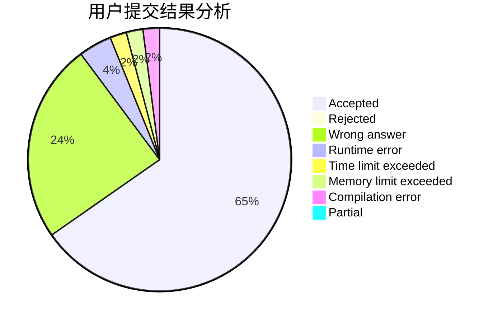
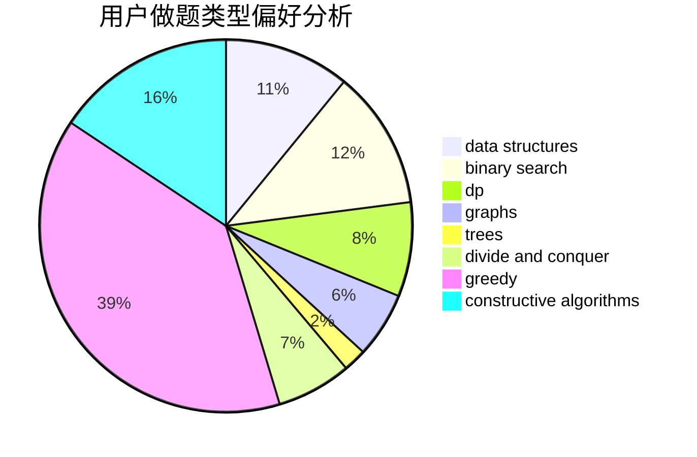

# Fortran_must_add_too
<!-- tabs:start -->
#### **用户提交结果分析**

#### **用户做题类型偏好分析**

#### **用户错题知识点分析**

<!-- tabs:end -->
# 推荐题目
[Make Square](http://codeforces.com/problemset/problem/1028/H)		math		  
[Olympic Medal](http://codeforces.com/problemset/problem/215/B)		greedy,
                        math		  
[BerDonalds](http://codeforces.com/problemset/problem/266/D)		graphs,
                        math,
                        shortest paths		  
[Vasya and Templates](https://codeforces.com/contest/1087/problem/E)		greedy,
                        implementation,
                        strings		  
[Sasha and a Bit of Relax](https://codeforces.com/contest/1113/problem/C)		dp,
                        implementation		  
[Write The Contest](http://codeforces.com/problemset/problem/1056/F)		binary search,
                        dp,
                        math		  
[Ordering T-Shirts](http://codeforces.com/problemset/problem/859/F)		greedy		  
[Guess two numbers](https://codeforces.com/contest/1008/problem/E)		binary search,
                        interactive		  
[Wooden Raft](http://codeforces.com/problemset/problem/1223/G)		binary search,
                        math,
                        number theory		  
[Guard Towers](http://codeforces.com/problemset/problem/85/E)		binary search,
                        dsu,
                        geometry,
                        graphs,
                        sortings		  
<!-- tabs:start -->
#### **data structures**
[Make Square](http://codeforces.com/problemset/problem/777/C)		binary search,
                        data structures,
                        dp,
                        greedy,
                        implementation,
                        two pointers		  
[Olympic Medal](http://codeforces.com/problemset/problem/802/O)		binary search,
                        data structures,
                        flows		  
[BerDonalds](http://codeforces.com/problemset/problem/1263/F)		data structures,
                        dfs and similar,
                        dp,
                        flows,
                        graphs,
                        trees		  
[Vasya and Templates](http://codeforces.com/problemset/problem/633/C)		data structures,
                        dp,
                        hashing,
                        implementation,
                        sortings,
                        string suffix structures,
                        strings		  
[Sasha and a Bit of Relax](http://codeforces.com/problemset/problem/1396/D)		data structures,
                        sortings,
                        two pointers		  
[Write The Contest](http://codeforces.com/problemset/problem/1110/F)		data structures,
                        trees		  
[Ordering T-Shirts](http://codeforces.com/problemset/problem/538/H)		2-sat,
                        data structures,
                        dfs and similar,
                        greedy		  
[Guess two numbers](http://codeforces.com/problemset/problem/85/D)		binary search,
                        brute force,
                        data structures,
                        implementation		  
[Wooden Raft](http://codeforces.com/problemset/problem/1474/D)		data structures,
                        dp,
                        greedy,
                        math		  
[Guard Towers](http://codeforces.com/problemset/problem/1492/C)		binary search,
                        data structures,
                        dp,
                        greedy,
                        two pointers		  
#### **binary search**
[Make Square](http://codeforces.com/problemset/problem/1056/F)		binary search,
                        dp,
                        math		  
[Olympic Medal](https://codeforces.com/contest/1008/problem/E)		binary search,
                        interactive		  
[BerDonalds](http://codeforces.com/problemset/problem/1223/G)		binary search,
                        math,
                        number theory		  
[Vasya and Templates](http://codeforces.com/problemset/problem/85/E)		binary search,
                        dsu,
                        geometry,
                        graphs,
                        sortings		  
[Sasha and a Bit of Relax](https://codeforces.com/contest/504/problem/C)		binary search,
                        combinatorics,
                        implementation		  
[Write The Contest](http://codeforces.com/problemset/problem/777/C)		binary search,
                        data structures,
                        dp,
                        greedy,
                        implementation,
                        two pointers		  
[Ordering T-Shirts](http://codeforces.com/problemset/problem/802/O)		binary search,
                        data structures,
                        flows		  
[Guess two numbers](http://codeforces.com/problemset/problem/1077/D)		binary search,
                        sortings		  
[Wooden Raft](http://codeforces.com/problemset/problem/333/E)		binary search,
                        bitmasks,
                        brute force,
                        geometry,
                        sortings		  
[Guard Towers](http://codeforces.com/problemset/problem/1060/C)		binary search,
                        implementation,
                        two pointers		  
#### **dp**
[Make Square](https://codeforces.com/contest/1113/problem/C)		dp,
                        implementation		  
[Olympic Medal](http://codeforces.com/problemset/problem/1056/F)		binary search,
                        dp,
                        math		  
[BerDonalds](http://codeforces.com/problemset/problem/777/C)		binary search,
                        data structures,
                        dp,
                        greedy,
                        implementation,
                        two pointers		  
[Vasya and Templates](https://codeforces.com/contest/1173/problem/E2)		dp,
                        probabilities		  
[Sasha and a Bit of Relax](http://codeforces.com/problemset/problem/546/D)		constructive algorithms,
                        dp,
                        math,
                        number theory		  
[Write The Contest](http://codeforces.com/problemset/problem/1146/F)		dp,
                        trees		  
[Ordering T-Shirts](http://codeforces.com/problemset/problem/766/C)		brute force,
                        dp,
                        greedy,
                        strings		  
[Guess two numbers](http://codeforces.com/problemset/problem/859/C)		dp,
                        games		  
[Wooden Raft](http://codeforces.com/problemset/problem/1263/F)		data structures,
                        dfs and similar,
                        dp,
                        flows,
                        graphs,
                        trees		  
[Guard Towers](http://codeforces.com/problemset/problem/441/E)		bitmasks,
                        dp,
                        math,
                        probabilities		  
#### **graph**
[Make Square](http://codeforces.com/problemset/problem/266/D)		graphs,
                        math,
                        shortest paths		  
[Olympic Medal](http://codeforces.com/problemset/problem/85/E)		binary search,
                        dsu,
                        geometry,
                        graphs,
                        sortings		  
[BerDonalds](http://codeforces.com/problemset/problem/859/E)		combinatorics,
                        dfs and similar,
                        dsu,
                        graphs,
                        trees		  
[Vasya and Templates](http://codeforces.com/problemset/problem/1263/F)		data structures,
                        dfs and similar,
                        dp,
                        flows,
                        graphs,
                        trees		  
[Sasha and a Bit of Relax](https://codeforces.com/contest/602/problem/C)		graphs,
                        shortest paths		  
[Write The Contest](http://codeforces.com/problemset/problem/1487/C)		brute force,
                        constructive algorithms,
                        dfs and similar,
                        graphs,
                        greedy,
                        implementation,
                        math		  
[Ordering T-Shirts](http://codeforces.com/problemset/problem/1437/C)		dp,
                        flows,
                        graph matchings,
                        greedy,
                        math,
                        sortings		  
[Guess two numbers](http://codeforces.com/problemset/problem/1470/D)		constructive algorithms,
                        dfs and similar,
                        graph matchings,
                        graphs,
                        greedy		  
[Wooden Raft](http://codeforces.com/problemset/problem/1476/C)		dp,
                        graphs,
                        greedy		  
[Guard Towers](http://codeforces.com/problemset/problem/1304/D)		constructive algorithms,
                        graphs,
                        greedy,
                        two pointers		  
#### **trees**
[Make Square](http://codeforces.com/problemset/problem/859/E)		combinatorics,
                        dfs and similar,
                        dsu,
                        graphs,
                        trees		  
[Olympic Medal](http://codeforces.com/problemset/problem/1146/F)		dp,
                        trees		  
[BerDonalds](http://codeforces.com/problemset/problem/1263/F)		data structures,
                        dfs and similar,
                        dp,
                        flows,
                        graphs,
                        trees		  
[Vasya and Templates](http://codeforces.com/problemset/problem/1205/D)		constructive algorithms,
                        trees		  
[Sasha and a Bit of Relax](http://codeforces.com/problemset/problem/1110/F)		data structures,
                        trees		  
[Write The Contest](http://codeforces.com/problemset/problem/1491/E)		brute force,
                        dfs and similar,
                        divide and conquer,
                        number theory,
                        trees		  
[Ordering T-Shirts](http://codeforces.com/problemset/problem/1479/D)		binary search,
                        bitmasks,
                        brute force,
                        data structures,
                        probabilities,
                        trees		  
[Guess two numbers](http://codeforces.com/problemset/problem/1511/C)		brute force,
                        data structures,
                        implementation,
                        trees		  
[Wooden Raft](http://codeforces.com/problemset/problem/1499/F)		combinatorics,
                        dfs and similar,
                        dp,
                        trees		  
[Guard Towers](http://codeforces.com/problemset/problem/1491/E)		brute force,
                        dfs and similar,
                        divide and conquer,
                        number theory,
                        trees		  
#### **divide and conquer**
[Make Square](http://codeforces.com/problemset/problem/1250/M)		constructive algorithms,
                        divide and conquer		  
[Olympic Medal](http://codeforces.com/problemset/problem/1491/E)		brute force,
                        dfs and similar,
                        divide and conquer,
                        number theory,
                        trees		  
[BerDonalds](http://codeforces.com/problemset/problem/1461/D)		binary search,
                        brute force,
                        data structures,
                        divide and conquer,
                        implementation,
                        sortings		  
[Vasya and Templates](http://codeforces.com/problemset/problem/1466/G)		combinatorics,
                        divide and conquer,
                        hashing,
                        math,
                        string suffix structures,
                        strings		  
[Sasha and a Bit of Relax](http://codeforces.com/problemset/problem/1490/D)		dfs and similar,
                        divide and conquer,
                        implementation		  
[Write The Contest](https://codeforces.com/contest/1483/problem/C)		data structures,
                        divide and conquer,
                        dp		  
[Ordering T-Shirts](http://codeforces.com/problemset/problem/1491/E)		brute force,
                        dfs and similar,
                        divide and conquer,
                        number theory,
                        trees		  
[Guess two numbers](http://codeforces.com/problemset/problem/1303/G)		data structures,
                        divide and conquer,
                        geometry,
                        trees		  
[Wooden Raft](http://codeforces.com/problemset/problem/1494/D)		constructive algorithms,
                        data structures,
                        dfs and similar,
                        divide and conquer,
                        dsu,
                        greedy,
                        sortings,
                        trees		  
[Guard Towers](http://codeforces.com/problemset/problem/1482/E)		data structures,
                        divide and conquer,
                        dp		  
#### **greedy**
[Make Square](http://codeforces.com/problemset/problem/215/B)		greedy,
                        math		  
[Olympic Medal](https://codeforces.com/contest/1087/problem/E)		greedy,
                        implementation,
                        strings		  
[BerDonalds](http://codeforces.com/problemset/problem/859/F)		greedy		  
[Vasya and Templates](http://codeforces.com/problemset/problem/777/C)		binary search,
                        data structures,
                        dp,
                        greedy,
                        implementation,
                        two pointers		  
[Sasha and a Bit of Relax](http://codeforces.com/problemset/problem/339/A)		greedy,
                        implementation,
                        sortings,
                        strings		  
[Write The Contest](http://codeforces.com/problemset/problem/729/D)		constructive algorithms,
                        greedy,
                        math		  
[Ordering T-Shirts](http://codeforces.com/problemset/problem/766/C)		brute force,
                        dp,
                        greedy,
                        strings		  
[Guess two numbers](http://codeforces.com/problemset/problem/810/B)		greedy,
                        sortings		  
[Wooden Raft](http://codeforces.com/problemset/problem/1451/C)		dp,
                        greedy,
                        hashing,
                        implementation,
                        strings		  
[Guard Towers](http://codeforces.com/problemset/problem/538/H)		2-sat,
                        data structures,
                        dfs and similar,
                        greedy		  
#### **constructive algorithms**
[Make Square](http://codeforces.com/problemset/problem/1250/M)		constructive algorithms,
                        divide and conquer		  
[Olympic Medal](https://codeforces.com/contest/1130/problem/E)		constructive algorithms		  
[BerDonalds](http://codeforces.com/problemset/problem/729/D)		constructive algorithms,
                        greedy,
                        math		  
[Vasya and Templates](http://codeforces.com/problemset/problem/85/A)		constructive algorithms,
                        implementation		  
[Sasha and a Bit of Relax](http://codeforces.com/problemset/problem/546/D)		constructive algorithms,
                        dp,
                        math,
                        number theory		  
[Write The Contest](http://codeforces.com/problemset/problem/1205/D)		constructive algorithms,
                        trees		  
[Ordering T-Shirts](http://codeforces.com/problemset/problem/316/F3)		constructive algorithms,
                        dfs and similar,
                        implementation		  
[Guess two numbers](http://codeforces.com/problemset/problem/1254/C)		constructive algorithms,
                        geometry,
                        interactive,
                        math		  
[Wooden Raft](http://codeforces.com/problemset/problem/1037/A)		constructive algorithms,
                        greedy,
                        math		  
[Guard Towers](http://codeforces.com/problemset/problem/1493/A)		constructive algorithms,
                        greedy		  
#### **sortings**
[Make Square](http://codeforces.com/problemset/problem/85/E)		binary search,
                        dsu,
                        geometry,
                        graphs,
                        sortings		  
[Olympic Medal](http://codeforces.com/problemset/problem/339/A)		greedy,
                        implementation,
                        sortings,
                        strings		  
[BerDonalds](http://codeforces.com/problemset/problem/1077/D)		binary search,
                        sortings		  
[Vasya and Templates](http://codeforces.com/problemset/problem/333/E)		binary search,
                        bitmasks,
                        brute force,
                        geometry,
                        sortings		  
[Sasha and a Bit of Relax](http://codeforces.com/problemset/problem/810/B)		greedy,
                        sortings		  
[Write The Contest](http://codeforces.com/problemset/problem/633/C)		data structures,
                        dp,
                        hashing,
                        implementation,
                        sortings,
                        string suffix structures,
                        strings		  
[Ordering T-Shirts](http://codeforces.com/problemset/problem/1396/D)		data structures,
                        sortings,
                        two pointers		  
[Guess two numbers](https://codeforces.com/contest/1496/problem/C)		geometry,
                        greedy,
                        math,
                        sortings		  
[Wooden Raft](http://codeforces.com/problemset/problem/1495/A)		geometry,
                        greedy,
                        math,
                        sortings		  
[Guard Towers](http://codeforces.com/problemset/problem/1497/A)		brute force,
                        data structures,
                        greedy,
                        sortings		  
<!-- tabs:end -->
