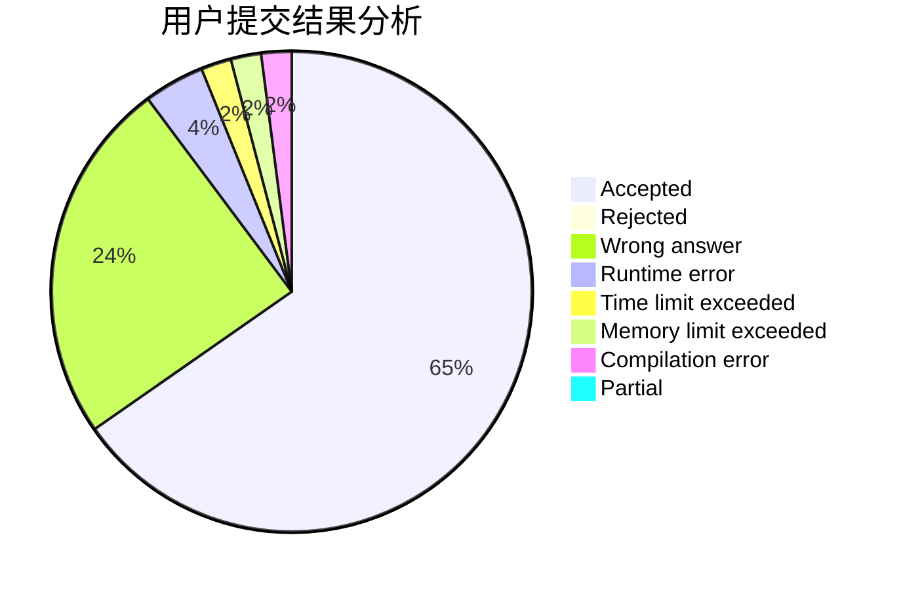
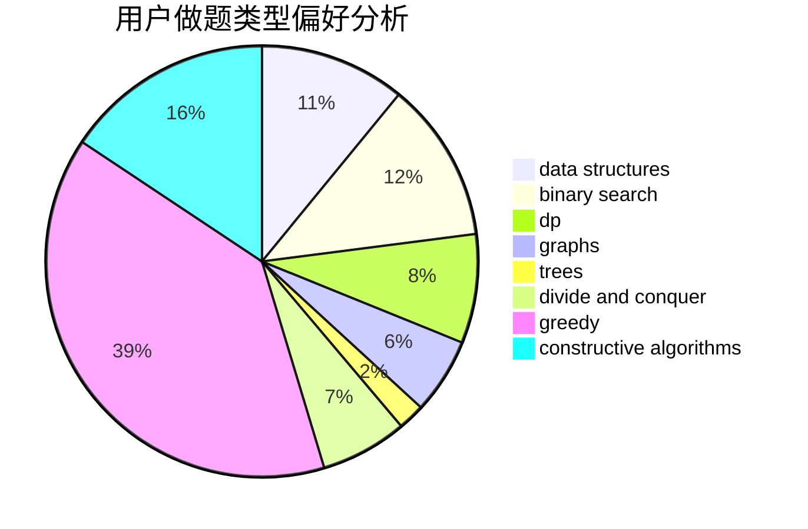

# Fortran_must_add_too

<!-- tabs:start -->

#### **用户提交结果分析**

#### **用户做题类型偏好分析**

#### **用户错题知识点分析**

<!-- tabs:end -->
# 推荐题目
[1113C](https://codeforces.com/contest/1113/problem/C)		dsu,graphs,sortings,trees		  
[1028H](https://codeforces.com/contest/1028/problem/H)		math		  
[266D](https://codeforces.com/contest/266/problem/D)		graphs,
                        math,
                        shortest paths		  
[215B](https://codeforces.com/contest/215/problem/B)		greedy,
                        math		  
[1087E](https://codeforces.com/contest/1087/problem/E)		dsu,graphs,sortings,trees		  
[729D](https://codeforces.com/contest/729/problem/D)		constructive algorithms,
                        greedy,
                        math		  
[859F](https://codeforces.com/contest/859/problem/F)		greedy		  
[777C](https://codeforces.com/contest/777/problem/C)		binary search,
                        data structures,
                        dp,
                        greedy,
                        implementation,
                        two pointers		  
[838C](https://codeforces.com/contest/838/problem/C)		dp,
                        games		  
[1451C](https://codeforces.com/contest/1451/problem/C)		dp,
                        greedy,
                        hashing,
                        implementation,
                        strings		  
