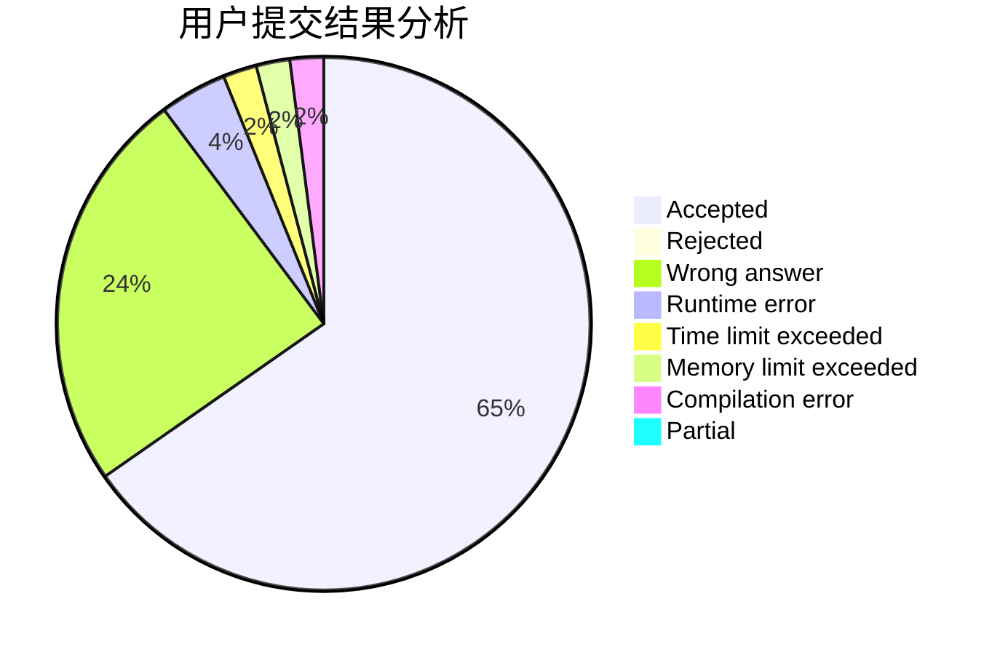
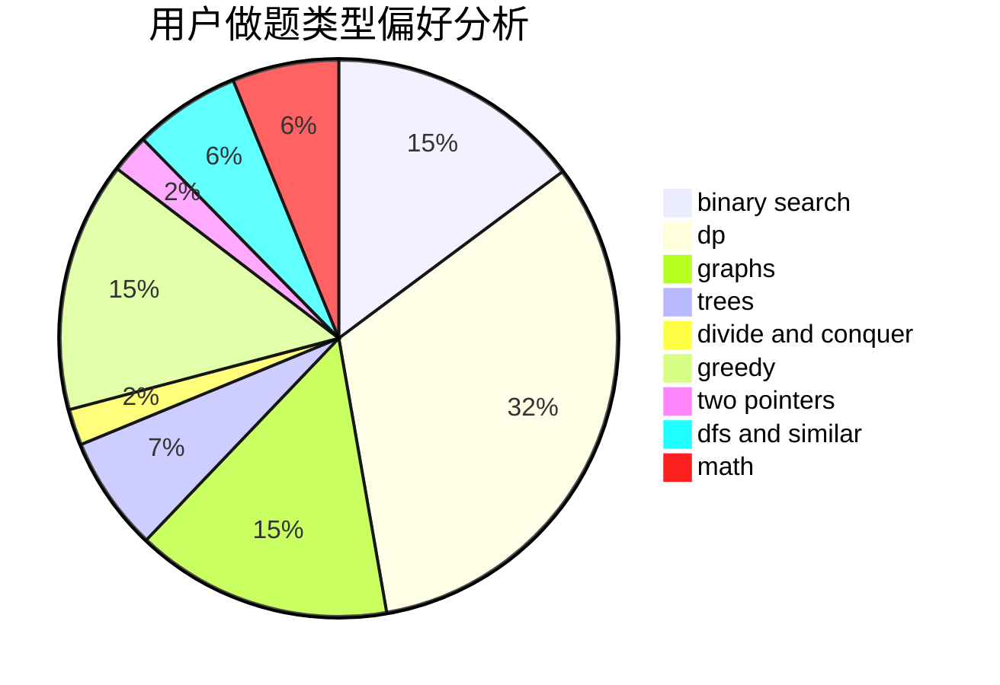

# Fortran_must_add_too

<!-- tabs:start -->

#### **用户提交结果分析**

#### **用户做题类型偏好分析**

<!-- tabs:end -->
# 推荐题目
[1114A](https://codeforces.com/contest/1114/problem/A)
[1029C](https://codeforces.com/contest/1029/problem/C)
[282C](https://codeforces.com/contest/282/problem/C)
[234A](https://codeforces.com/contest/234/problem/A)
[1088B](https://codeforces.com/contest/1088/problem/B)
[746D](https://codeforces.com/contest/746/problem/D)
[877C](https://codeforces.com/contest/877/problem/C)
[795K](https://codeforces.com/contest/795/problem/K)
[856C](https://codeforces.com/contest/856/problem/C)
[145C](https://codeforces.com/contest/145/problem/C)
