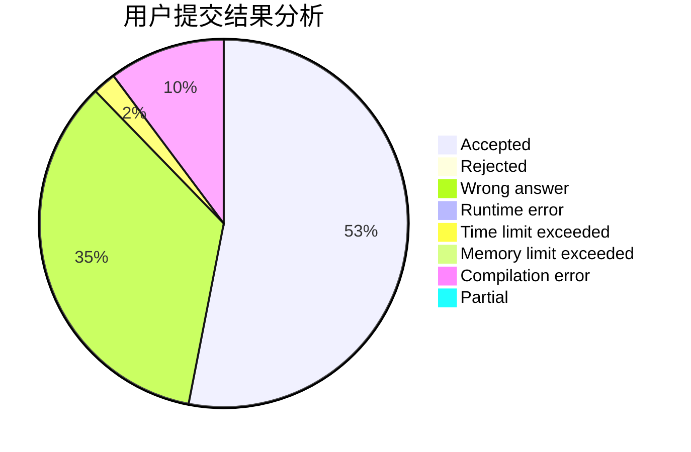
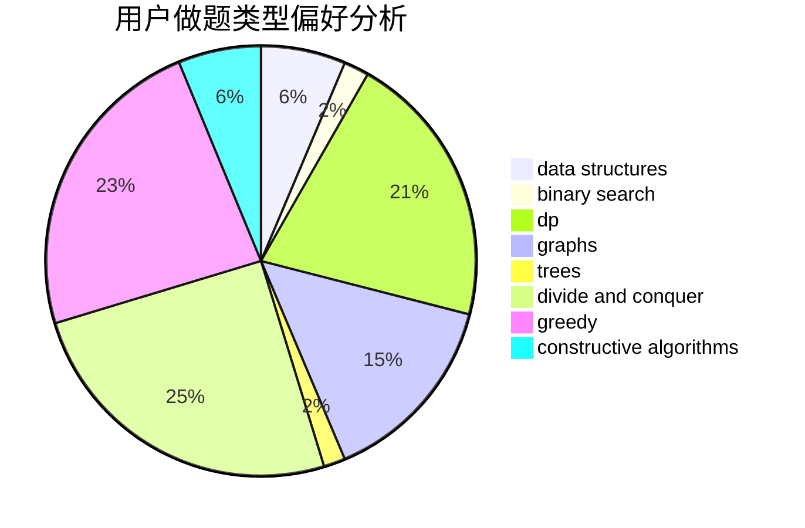

# 2019112325

<!-- tabs:start -->

#### **用户提交结果分析**

#### **用户做题类型偏好分析**

#### **用户错题知识点分析**

<!-- tabs:end -->
# 推荐题目
[1278D](https://codeforces.com/contest/1278/problem/D)		data structures,
                        dsu,
                        graphs,
                        trees		  
[1279A](https://codeforces.com/contest/1279/problem/A)		math		  
[1166F](https://codeforces.com/contest/1166/problem/F)		data structures,
                        dsu,
                        graphs,
                        hashing		  
[1276F](https://codeforces.com/contest/1276/problem/F)		string suffix structures		  
[1279E](https://codeforces.com/contest/1279/problem/E)		combinatorics,
                        dp		  
[1278A](https://codeforces.com/contest/1278/problem/A)		brute force,
                        implementation,
                        strings		  
[127A](https://codeforces.com/contest/127/problem/A)		geometry		  
[1278F](https://codeforces.com/contest/1278/problem/F)		combinatorics,
                        dp,
                        math,
                        number theory,
                        probabilities		  
[1265C](https://codeforces.com/contest/1265/problem/C)		dsu,graphs,sortings,trees		  
[1280A](https://codeforces.com/contest/1280/problem/A)		implementation,
                        math		  
