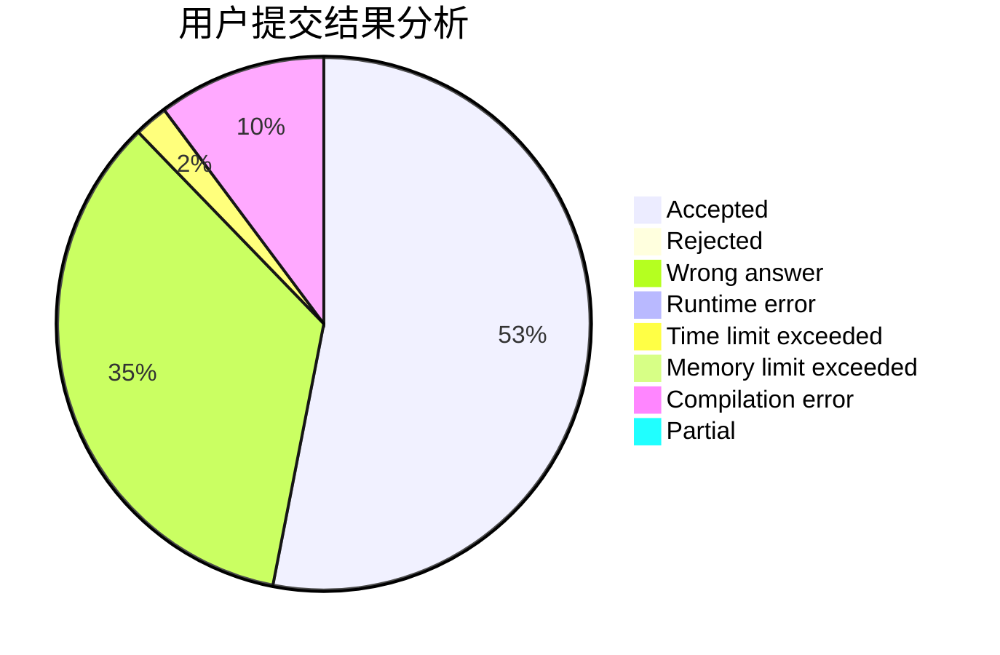
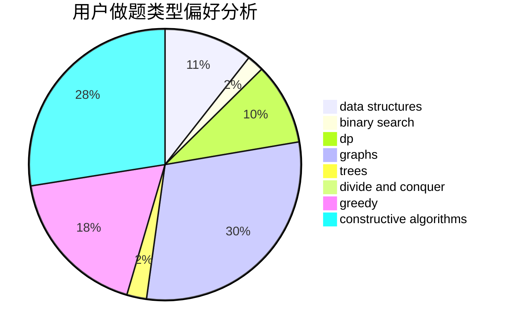

# 2019112325
<!-- tabs:start -->
#### **用户提交结果分析**

#### **用户做题类型偏好分析**

#### **用户错题知识点分析**

<!-- tabs:end -->
# 推荐题目
[Strange Device](http://codeforces.com/problemset/problem/1270/D)		constructive algorithms,
                        interactive,
                        math,
                        sortings		  
[Key Storage](http://codeforces.com/problemset/problem/1267/K)		combinatorics,
                        math		  
[Domino for Young](https://codeforces.com/contest/1269/problem/D)		dp,
                        greedy,
                        math		  
[Game Relics](http://codeforces.com/problemset/problem/1267/G)		math,
                        probabilities		  
[Measuring Lengths in Baden](http://codeforces.com/problemset/problem/125/A)		math		  
[Equation](http://codeforces.com/problemset/problem/1269/A)		brute force,
                        math		  
[Equilateral Triangles (2 points)](https://codeforces.com/contest/1164/problem/P)		nan		  
[Card Game](http://codeforces.com/problemset/problem/1270/A)		games,
                        greedy,
                        math		  
[Password](http://codeforces.com/problemset/problem/126/B)		binary search,
                        dp,
                        hashing,
                        string suffix structures,
                        strings		  
[Number of Components](http://codeforces.com/problemset/problem/1270/H)		data structures		  
<!-- tabs:start -->
#### **data structures**
[Strange Device](http://codeforces.com/problemset/problem/1270/H)		data structures		  
[Key Storage](https://codeforces.com/contest/1269/problem/E)		binary search,
                        data structures		  
[Domino for Young](http://codeforces.com/problemset/problem/1268/C)		binary search,
                        data structures		  
[Game Relics](http://codeforces.com/problemset/problem/1492/C)		binary search,
                        data structures,
                        dp,
                        greedy,
                        two pointers		  
[Measuring Lengths in Baden](http://codeforces.com/problemset/problem/1490/G)		binary search,
                        data structures,
                        math		  
[Equation](http://codeforces.com/problemset/problem/1479/D)		binary search,
                        bitmasks,
                        brute force,
                        data structures,
                        probabilities,
                        trees		  
[Equilateral Triangles (2 points)](http://codeforces.com/problemset/problem/1497/A)		brute force,
                        data structures,
                        greedy,
                        sortings		  
[Card Game](http://codeforces.com/problemset/problem/1491/C)		brute force,
                        data structures,
                        dp,
                        greedy,
                        implementation		  
[Password](http://codeforces.com/problemset/problem/1492/B)		data structures,
                        greedy,
                        math		  
[Number of Components](http://codeforces.com/problemset/problem/1436/E)		binary search,
                        data structures,
                        two pointers		  
#### **binary search**
[Strange Device](http://codeforces.com/problemset/problem/126/B)		binary search,
                        dp,
                        hashing,
                        string suffix structures,
                        strings		  
[Key Storage](https://codeforces.com/contest/1269/problem/E)		binary search,
                        data structures		  
[Domino for Young](http://codeforces.com/problemset/problem/1268/C)		binary search,
                        data structures		  
[Game Relics](http://codeforces.com/problemset/problem/1492/C)		binary search,
                        data structures,
                        dp,
                        greedy,
                        two pointers		  
[Measuring Lengths in Baden](http://codeforces.com/problemset/problem/1463/D)		binary search,
                        constructive algorithms,
                        greedy,
                        two pointers		  
[Equation](http://codeforces.com/problemset/problem/1490/G)		binary search,
                        data structures,
                        math		  
[Equilateral Triangles (2 points)](http://codeforces.com/problemset/problem/1479/D)		binary search,
                        bitmasks,
                        brute force,
                        data structures,
                        probabilities,
                        trees		  
[Card Game](http://codeforces.com/problemset/problem/1436/E)		binary search,
                        data structures,
                        two pointers		  
[Password](http://codeforces.com/problemset/problem/1461/D)		binary search,
                        brute force,
                        data structures,
                        divide and conquer,
                        implementation,
                        sortings		  
[Number of Components](http://codeforces.com/problemset/problem/1493/C)		binary search,
                        brute force,
                        constructive algorithms,
                        greedy,
                        strings		  
#### **dp**
[Strange Device](https://codeforces.com/contest/1269/problem/D)		dp,
                        greedy,
                        math		  
[Key Storage](http://codeforces.com/problemset/problem/126/B)		binary search,
                        dp,
                        hashing,
                        string suffix structures,
                        strings		  
[Domino for Young](http://codeforces.com/problemset/problem/1268/E)		dp		  
[Game Relics](http://codeforces.com/problemset/problem/1158/F)		dp,
                        math		  
[Measuring Lengths in Baden](http://codeforces.com/problemset/problem/1268/B)		dp,
                        greedy,
                        math		  
[Equation](http://codeforces.com/problemset/problem/1492/C)		binary search,
                        data structures,
                        dp,
                        greedy,
                        two pointers		  
[Equilateral Triangles (2 points)](https://codeforces.com/contest/1457/problem/C)		brute force,
                        dp,
                        implementation		  
[Card Game](http://codeforces.com/problemset/problem/1491/C)		brute force,
                        data structures,
                        dp,
                        greedy,
                        implementation		  
[Password](http://codeforces.com/problemset/problem/1437/C)		dp,
                        flows,
                        graph matchings,
                        greedy,
                        math,
                        sortings		  
[Number of Components](http://codeforces.com/problemset/problem/1499/B)		brute force,
                        dp,
                        greedy,
                        implementation		  
#### **graph**
[Strange Device](http://codeforces.com/problemset/problem/1267/F)		graphs		  
[Key Storage](http://codeforces.com/problemset/problem/1270/G)		constructive algorithms,
                        dfs and similar,
                        graphs,
                        math		  
[Domino for Young](https://codeforces.com/contest/1229/problem/C)		graphs		  
[Game Relics](http://codeforces.com/problemset/problem/1268/D)		brute force,
                        divide and conquer,
                        graphs,
                        math		  
[Measuring Lengths in Baden](http://codeforces.com/problemset/problem/1487/C)		brute force,
                        constructive algorithms,
                        dfs and similar,
                        graphs,
                        greedy,
                        implementation,
                        math		  
[Equation](http://codeforces.com/problemset/problem/1437/C)		dp,
                        flows,
                        graph matchings,
                        greedy,
                        math,
                        sortings		  
[Equilateral Triangles (2 points)](http://codeforces.com/problemset/problem/1470/D)		constructive algorithms,
                        dfs and similar,
                        graph matchings,
                        graphs,
                        greedy		  
[Card Game](http://codeforces.com/problemset/problem/1476/C)		dp,
                        graphs,
                        greedy		  
[Password](http://codeforces.com/problemset/problem/1304/D)		constructive algorithms,
                        graphs,
                        greedy,
                        two pointers		  
[Number of Components](http://codeforces.com/problemset/problem/1475/C)		combinatorics,
                        graphs,
                        math		  
#### **trees**
[Strange Device](http://codeforces.com/problemset/problem/1479/D)		binary search,
                        bitmasks,
                        brute force,
                        data structures,
                        probabilities,
                        trees		  
[Key Storage](http://codeforces.com/problemset/problem/1511/C)		brute force,
                        data structures,
                        implementation,
                        trees		  
[Domino for Young](http://codeforces.com/problemset/problem/1499/F)		combinatorics,
                        dfs and similar,
                        dp,
                        trees		  
[Game Relics](http://codeforces.com/problemset/problem/1491/E)		brute force,
                        dfs and similar,
                        divide and conquer,
                        number theory,
                        trees		  
[Measuring Lengths in Baden](http://codeforces.com/problemset/problem/1466/D)		data structures,
                        greedy,
                        sortings,
                        trees		  
[Equation](http://codeforces.com/problemset/problem/1495/D)		combinatorics,
                        dfs and similar,
                        graphs,
                        math,
                        shortest paths,
                        trees		  
[Equilateral Triangles (2 points)](http://codeforces.com/problemset/problem/1303/G)		data structures,
                        divide and conquer,
                        geometry,
                        trees		  
[Card Game](http://codeforces.com/problemset/problem/1454/E)		combinatorics,
                        dfs and similar,
                        graphs,
                        trees		  
[Password](http://codeforces.com/problemset/problem/1494/D)		constructive algorithms,
                        data structures,
                        dfs and similar,
                        divide and conquer,
                        dsu,
                        greedy,
                        sortings,
                        trees		  
[Number of Components](http://codeforces.com/problemset/problem/1292/C)		combinatorics,
                        dfs and similar,
                        dp,
                        greedy,
                        trees		  
#### **divide and conquer**
[Strange Device](http://codeforces.com/problemset/problem/1268/D)		brute force,
                        divide and conquer,
                        graphs,
                        math		  
[Key Storage](http://codeforces.com/problemset/problem/1167/B)		brute force,
                        divide and conquer,
                        interactive,
                        math		  
[Domino for Young](http://codeforces.com/problemset/problem/1461/D)		binary search,
                        brute force,
                        data structures,
                        divide and conquer,
                        implementation,
                        sortings		  
[Game Relics](http://codeforces.com/problemset/problem/1466/G)		combinatorics,
                        divide and conquer,
                        hashing,
                        math,
                        string suffix structures,
                        strings		  
[Measuring Lengths in Baden](http://codeforces.com/problemset/problem/1490/D)		dfs and similar,
                        divide and conquer,
                        implementation		  
[Equation](https://codeforces.com/contest/1483/problem/C)		data structures,
                        divide and conquer,
                        dp		  
[Equilateral Triangles (2 points)](http://codeforces.com/problemset/problem/1491/E)		brute force,
                        dfs and similar,
                        divide and conquer,
                        number theory,
                        trees		  
[Card Game](http://codeforces.com/problemset/problem/1303/G)		data structures,
                        divide and conquer,
                        geometry,
                        trees		  
[Password](http://codeforces.com/problemset/problem/1494/D)		constructive algorithms,
                        data structures,
                        dfs and similar,
                        divide and conquer,
                        dsu,
                        greedy,
                        sortings,
                        trees		  
[Number of Components](http://codeforces.com/problemset/problem/1482/E)		data structures,
                        divide and conquer,
                        dp		  
#### **greedy**
[Strange Device](https://codeforces.com/contest/1269/problem/D)		dp,
                        greedy,
                        math		  
[Key Storage](http://codeforces.com/problemset/problem/1270/A)		games,
                        greedy,
                        math		  
[Domino for Young](http://codeforces.com/problemset/problem/1271/A)		brute force,
                        greedy,
                        math		  
[Game Relics](https://codeforces.com/contest/1269/problem/C)		constructive algorithms,
                        greedy,
                        implementation,
                        strings		  
[Measuring Lengths in Baden](http://codeforces.com/problemset/problem/1267/E)		greedy		  
[Equation](http://codeforces.com/problemset/problem/1268/A)		constructive algorithms,
                        greedy,
                        implementation,
                        strings		  
[Equilateral Triangles (2 points)](http://codeforces.com/problemset/problem/1267/J)		greedy,
                        implementation,
                        math		  
[Card Game](http://codeforces.com/problemset/problem/1268/B)		dp,
                        greedy,
                        math		  
[Password](http://codeforces.com/problemset/problem/1270/B)		constructive algorithms,
                        greedy,
                        math		  
[Number of Components](http://codeforces.com/problemset/problem/1492/C)		binary search,
                        data structures,
                        dp,
                        greedy,
                        two pointers		  
#### **constructive algorithms**
[Strange Device](http://codeforces.com/problemset/problem/1270/D)		constructive algorithms,
                        interactive,
                        math,
                        sortings		  
[Key Storage](https://codeforces.com/contest/1269/problem/C)		constructive algorithms,
                        greedy,
                        implementation,
                        strings		  
[Domino for Young](http://codeforces.com/problemset/problem/1270/E)		constructive algorithms,
                        geometry,
                        math		  
[Game Relics](http://codeforces.com/problemset/problem/1270/I)		constructive algorithms,
                        fft,
                        math		  
[Measuring Lengths in Baden](http://codeforces.com/problemset/problem/1270/G)		constructive algorithms,
                        dfs and similar,
                        graphs,
                        math		  
[Equation](http://codeforces.com/problemset/problem/1267/L)		constructive algorithms,
                        strings		  
[Equilateral Triangles (2 points)](http://codeforces.com/problemset/problem/1270/C)		bitmasks,
                        constructive algorithms,
                        math		  
[Card Game](http://codeforces.com/problemset/problem/1267/I)		brute force,
                        constructive algorithms,
                        implementation,
                        interactive,
                        sortings		  
[Password](http://codeforces.com/problemset/problem/1268/A)		constructive algorithms,
                        greedy,
                        implementation,
                        strings		  
[Number of Components](http://codeforces.com/problemset/problem/1025/E)		constructive algorithms,
                        implementation,
                        matrices		  
#### **sortings**
[Strange Device](http://codeforces.com/problemset/problem/1270/D)		constructive algorithms,
                        interactive,
                        math,
                        sortings		  
[Key Storage](http://codeforces.com/problemset/problem/1269/B)		brute force,
                        sortings		  
[Domino for Young](http://codeforces.com/problemset/problem/1267/I)		brute force,
                        constructive algorithms,
                        implementation,
                        interactive,
                        sortings		  
[Game Relics](https://codeforces.com/contest/1496/problem/C)		geometry,
                        greedy,
                        math,
                        sortings		  
[Measuring Lengths in Baden](http://codeforces.com/problemset/problem/1495/A)		geometry,
                        greedy,
                        math,
                        sortings		  
[Equation](http://codeforces.com/problemset/problem/1497/A)		brute force,
                        data structures,
                        greedy,
                        sortings		  
[Equilateral Triangles (2 points)](http://codeforces.com/problemset/problem/1427/A)		math,
                        sortings		  
[Card Game](http://codeforces.com/problemset/problem/1461/D)		binary search,
                        brute force,
                        data structures,
                        divide and conquer,
                        implementation,
                        sortings		  
[Password](http://codeforces.com/problemset/problem/1437/C)		dp,
                        flows,
                        graph matchings,
                        greedy,
                        math,
                        sortings		  
[Number of Components](http://codeforces.com/problemset/problem/1473/A)		greedy,
                        implementation,
                        math,
                        sortings		  
<!-- tabs:end -->
