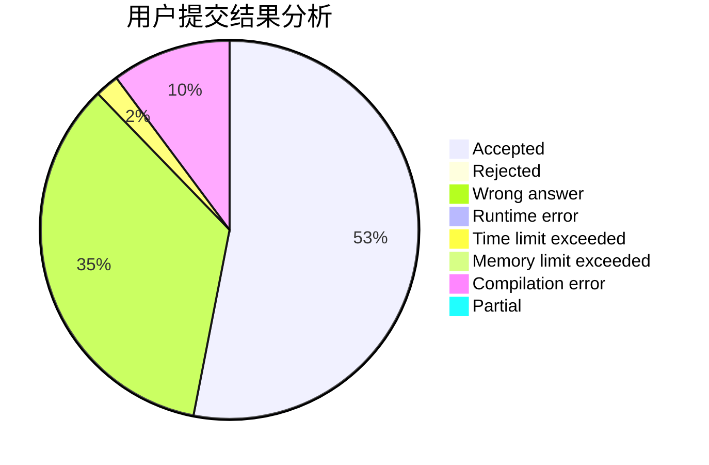
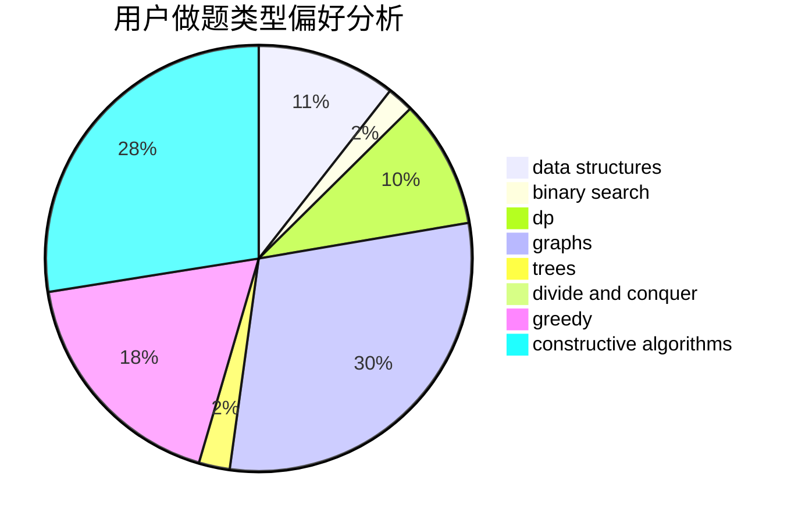

# 2019112325

<!-- tabs:start -->

#### **用户提交结果分析**

#### **用户做题类型偏好分析**

#### **用户错题知识点分析**

<!-- tabs:end -->
# 推荐题目
[1269D](https://codeforces.com/contest/1269/problem/D)		dsu,graphs,sortings,trees		  
[1270A](https://codeforces.com/contest/1270/problem/A)		games,
                        greedy,
                        math		  
[1164P](https://codeforces.com/contest/1164/problem/P)		dsu,graphs,sortings,trees		  
[1267K](https://codeforces.com/contest/1267/problem/K)		combinatorics,
                        math		  
[1270E](https://codeforces.com/contest/1270/problem/E)		constructive algorithms,
                        geometry,
                        math		  
[1269A](https://codeforces.com/contest/1269/problem/A)		brute force,
                        math		  
[1270G](https://codeforces.com/contest/1270/problem/G)		constructive algorithms,
                        dfs and similar,
                        graphs,
                        math		  
[126B](https://codeforces.com/contest/126/problem/B)		binary search,
                        dp,
                        hashing,
                        string suffix structures,
                        strings		  
[125A](https://codeforces.com/contest/125/problem/A)		math		  
[1270H](https://codeforces.com/contest/1270/problem/H)		data structures		  
