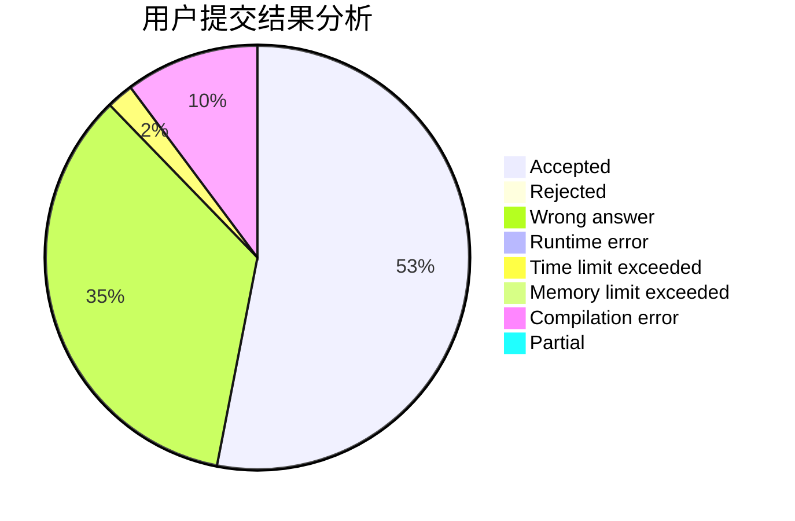
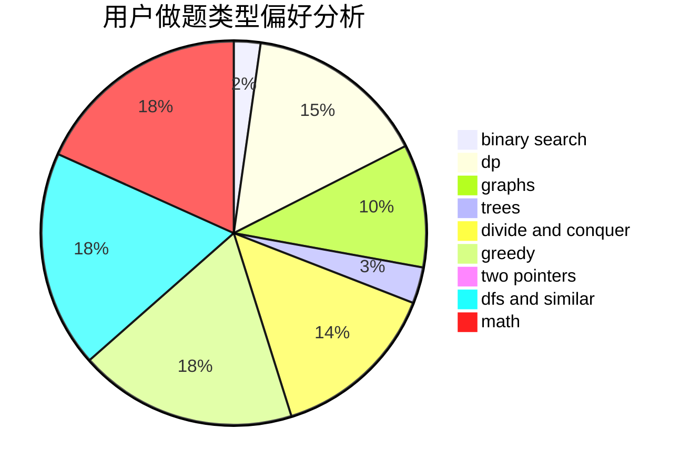

# 2019112325

<!-- tabs:start -->

#### **用户提交结果分析**

#### **用户做题类型偏好分析**

<!-- tabs:end -->
# 推荐题目
[1278D](https://codeforces.com/contest/1278/problem/D)
[1279A](https://codeforces.com/contest/1279/problem/A)
[1166F](https://codeforces.com/contest/1166/problem/F)
[1276F](https://codeforces.com/contest/1276/problem/F)
[1279E](https://codeforces.com/contest/1279/problem/E)
[1278A](https://codeforces.com/contest/1278/problem/A)
[127A](https://codeforces.com/contest/127/problem/A)
[1278F](https://codeforces.com/contest/1278/problem/F)
[1265C](https://codeforces.com/contest/1265/problem/C)
[1280A](https://codeforces.com/contest/1280/problem/A)
