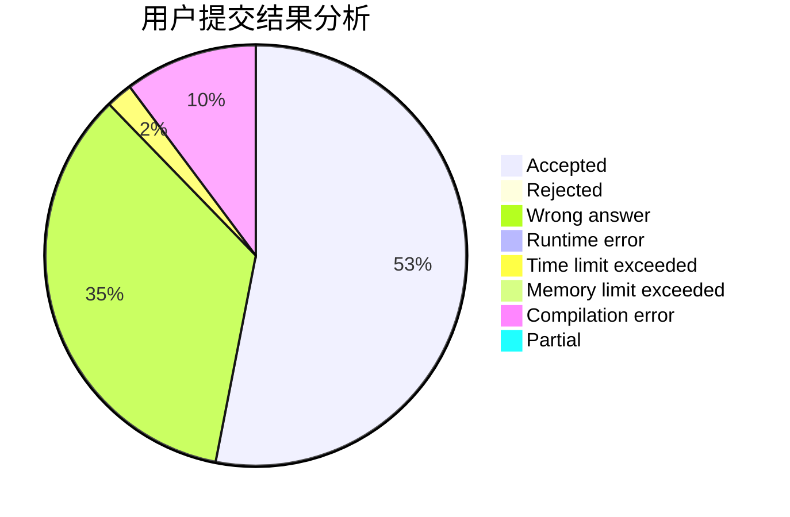
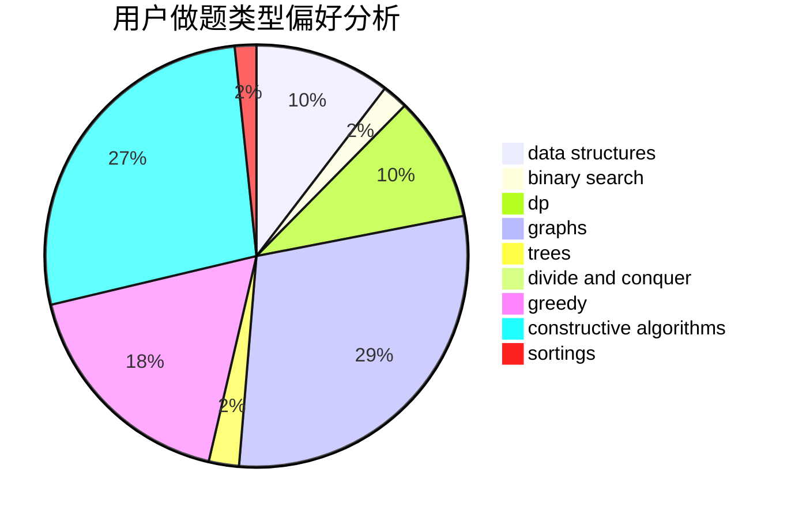

# 2019112325
<!-- tabs:start -->
#### **用户提交结果分析**

#### **用户做题类型偏好分析**

#### **用户错题知识点分析**

<!-- tabs:end -->
# 推荐题目
[1270D](http://codeforces.com/problemset/problem/1270/D)		constructive algorithms,
                        interactive,
                        math,
                        sortings		  
[1267K](http://codeforces.com/problemset/problem/1267/K)		combinatorics,
                        math		  
[1269D](https://codeforces.com/contest/1269/problem/D)		dp,
                        greedy,
                        math		  
[1267G](http://codeforces.com/problemset/problem/1267/G)		math,
                        probabilities		  
[125A](http://codeforces.com/problemset/problem/125/A)		math		  
[1269A](http://codeforces.com/problemset/problem/1269/A)		brute force,
                        math		  
[1164P](https://codeforces.com/contest/1164/problem/P)		nan		  
[1270A](http://codeforces.com/problemset/problem/1270/A)		games,
                        greedy,
                        math		  
[126B](http://codeforces.com/problemset/problem/126/B)		binary search,
                        dp,
                        hashing,
                        string suffix structures,
                        strings		  
[1270H](http://codeforces.com/problemset/problem/1270/H)		data structures		  
<!-- tabs:start -->
#### **data structures**
[1270H](http://codeforces.com/problemset/problem/1270/H)		data structures		  
[1269E](https://codeforces.com/contest/1269/problem/E)		binary search,
                        data structures		  
[1268C](http://codeforces.com/problemset/problem/1268/C)		binary search,
                        data structures		  
[1492C](http://codeforces.com/problemset/problem/1492/C)		binary search,
                        data structures,
                        dp,
                        greedy,
                        two pointers		  
[1490G](http://codeforces.com/problemset/problem/1490/G)		binary search,
                        data structures,
                        math		  
[1479D](http://codeforces.com/problemset/problem/1479/D)		binary search,
                        bitmasks,
                        brute force,
                        data structures,
                        probabilities,
                        trees		  
[1497A](http://codeforces.com/problemset/problem/1497/A)		brute force,
                        data structures,
                        greedy,
                        sortings		  
[1491C](http://codeforces.com/problemset/problem/1491/C)		brute force,
                        data structures,
                        dp,
                        greedy,
                        implementation		  
[1492B](http://codeforces.com/problemset/problem/1492/B)		data structures,
                        greedy,
                        math		  
[1436E](http://codeforces.com/problemset/problem/1436/E)		binary search,
                        data structures,
                        two pointers		  
#### **binary search**
[126B](http://codeforces.com/problemset/problem/126/B)		binary search,
                        dp,
                        hashing,
                        string suffix structures,
                        strings		  
[1269E](https://codeforces.com/contest/1269/problem/E)		binary search,
                        data structures		  
[1268C](http://codeforces.com/problemset/problem/1268/C)		binary search,
                        data structures		  
[1492C](http://codeforces.com/problemset/problem/1492/C)		binary search,
                        data structures,
                        dp,
                        greedy,
                        two pointers		  
[1463D](http://codeforces.com/problemset/problem/1463/D)		binary search,
                        constructive algorithms,
                        greedy,
                        two pointers		  
[1490G](http://codeforces.com/problemset/problem/1490/G)		binary search,
                        data structures,
                        math		  
[1479D](http://codeforces.com/problemset/problem/1479/D)		binary search,
                        bitmasks,
                        brute force,
                        data structures,
                        probabilities,
                        trees		  
[1436E](http://codeforces.com/problemset/problem/1436/E)		binary search,
                        data structures,
                        two pointers		  
[1461D](http://codeforces.com/problemset/problem/1461/D)		binary search,
                        brute force,
                        data structures,
                        divide and conquer,
                        implementation,
                        sortings		  
[1493C](http://codeforces.com/problemset/problem/1493/C)		binary search,
                        brute force,
                        constructive algorithms,
                        greedy,
                        strings		  
#### **dp**
[1269D](https://codeforces.com/contest/1269/problem/D)		dp,
                        greedy,
                        math		  
[126B](http://codeforces.com/problemset/problem/126/B)		binary search,
                        dp,
                        hashing,
                        string suffix structures,
                        strings		  
[1268E](http://codeforces.com/problemset/problem/1268/E)		dp		  
[1158F](http://codeforces.com/problemset/problem/1158/F)		dp,
                        math		  
[1268B](http://codeforces.com/problemset/problem/1268/B)		dp,
                        greedy,
                        math		  
[1492C](http://codeforces.com/problemset/problem/1492/C)		binary search,
                        data structures,
                        dp,
                        greedy,
                        two pointers		  
[1457C](https://codeforces.com/contest/1457/problem/C)		brute force,
                        dp,
                        implementation		  
[1491C](http://codeforces.com/problemset/problem/1491/C)		brute force,
                        data structures,
                        dp,
                        greedy,
                        implementation		  
[1437C](http://codeforces.com/problemset/problem/1437/C)		dp,
                        flows,
                        graph matchings,
                        greedy,
                        math,
                        sortings		  
[1499B](http://codeforces.com/problemset/problem/1499/B)		brute force,
                        dp,
                        greedy,
                        implementation		  
#### **graph**
[1267F](http://codeforces.com/problemset/problem/1267/F)		graphs		  
[1270G](http://codeforces.com/problemset/problem/1270/G)		constructive algorithms,
                        dfs and similar,
                        graphs,
                        math		  
[1229C](https://codeforces.com/contest/1229/problem/C)		graphs		  
[1268D](http://codeforces.com/problemset/problem/1268/D)		brute force,
                        divide and conquer,
                        graphs,
                        math		  
[1487C](http://codeforces.com/problemset/problem/1487/C)		brute force,
                        constructive algorithms,
                        dfs and similar,
                        graphs,
                        greedy,
                        implementation,
                        math		  
[1437C](http://codeforces.com/problemset/problem/1437/C)		dp,
                        flows,
                        graph matchings,
                        greedy,
                        math,
                        sortings		  
[1470D](http://codeforces.com/problemset/problem/1470/D)		constructive algorithms,
                        dfs and similar,
                        graph matchings,
                        graphs,
                        greedy		  
[1476C](http://codeforces.com/problemset/problem/1476/C)		dp,
                        graphs,
                        greedy		  
[1304D](http://codeforces.com/problemset/problem/1304/D)		constructive algorithms,
                        graphs,
                        greedy,
                        two pointers		  
[1475C](http://codeforces.com/problemset/problem/1475/C)		combinatorics,
                        graphs,
                        math		  
#### **trees**
[1479D](http://codeforces.com/problemset/problem/1479/D)		binary search,
                        bitmasks,
                        brute force,
                        data structures,
                        probabilities,
                        trees		  
[1511C](http://codeforces.com/problemset/problem/1511/C)		brute force,
                        data structures,
                        implementation,
                        trees		  
[1499F](http://codeforces.com/problemset/problem/1499/F)		combinatorics,
                        dfs and similar,
                        dp,
                        trees		  
[1491E](http://codeforces.com/problemset/problem/1491/E)		brute force,
                        dfs and similar,
                        divide and conquer,
                        number theory,
                        trees		  
[1466D](http://codeforces.com/problemset/problem/1466/D)		data structures,
                        greedy,
                        sortings,
                        trees		  
[1495D](http://codeforces.com/problemset/problem/1495/D)		combinatorics,
                        dfs and similar,
                        graphs,
                        math,
                        shortest paths,
                        trees		  
[1303G](http://codeforces.com/problemset/problem/1303/G)		data structures,
                        divide and conquer,
                        geometry,
                        trees		  
[1454E](http://codeforces.com/problemset/problem/1454/E)		combinatorics,
                        dfs and similar,
                        graphs,
                        trees		  
[1494D](http://codeforces.com/problemset/problem/1494/D)		constructive algorithms,
                        data structures,
                        dfs and similar,
                        divide and conquer,
                        dsu,
                        greedy,
                        sortings,
                        trees		  
[1292C](http://codeforces.com/problemset/problem/1292/C)		combinatorics,
                        dfs and similar,
                        dp,
                        greedy,
                        trees		  
#### **divide and conquer**
[1268D](http://codeforces.com/problemset/problem/1268/D)		brute force,
                        divide and conquer,
                        graphs,
                        math		  
[1167B](http://codeforces.com/problemset/problem/1167/B)		brute force,
                        divide and conquer,
                        interactive,
                        math		  
[1461D](http://codeforces.com/problemset/problem/1461/D)		binary search,
                        brute force,
                        data structures,
                        divide and conquer,
                        implementation,
                        sortings		  
[1466G](http://codeforces.com/problemset/problem/1466/G)		combinatorics,
                        divide and conquer,
                        hashing,
                        math,
                        string suffix structures,
                        strings		  
[1490D](http://codeforces.com/problemset/problem/1490/D)		dfs and similar,
                        divide and conquer,
                        implementation		  
[1483C](https://codeforces.com/contest/1483/problem/C)		data structures,
                        divide and conquer,
                        dp		  
[1491E](http://codeforces.com/problemset/problem/1491/E)		brute force,
                        dfs and similar,
                        divide and conquer,
                        number theory,
                        trees		  
[1303G](http://codeforces.com/problemset/problem/1303/G)		data structures,
                        divide and conquer,
                        geometry,
                        trees		  
[1494D](http://codeforces.com/problemset/problem/1494/D)		constructive algorithms,
                        data structures,
                        dfs and similar,
                        divide and conquer,
                        dsu,
                        greedy,
                        sortings,
                        trees		  
[1482E](http://codeforces.com/problemset/problem/1482/E)		data structures,
                        divide and conquer,
                        dp		  
#### **greedy**
[1269D](https://codeforces.com/contest/1269/problem/D)		dp,
                        greedy,
                        math		  
[1270A](http://codeforces.com/problemset/problem/1270/A)		games,
                        greedy,
                        math		  
[1271A](http://codeforces.com/problemset/problem/1271/A)		brute force,
                        greedy,
                        math		  
[1269C](https://codeforces.com/contest/1269/problem/C)		constructive algorithms,
                        greedy,
                        implementation,
                        strings		  
[1267E](http://codeforces.com/problemset/problem/1267/E)		greedy		  
[1268A](http://codeforces.com/problemset/problem/1268/A)		constructive algorithms,
                        greedy,
                        implementation,
                        strings		  
[1267J](http://codeforces.com/problemset/problem/1267/J)		greedy,
                        implementation,
                        math		  
[1268B](http://codeforces.com/problemset/problem/1268/B)		dp,
                        greedy,
                        math		  
[1270B](http://codeforces.com/problemset/problem/1270/B)		constructive algorithms,
                        greedy,
                        math		  
[1492C](http://codeforces.com/problemset/problem/1492/C)		binary search,
                        data structures,
                        dp,
                        greedy,
                        two pointers		  
#### **constructive algorithms**
[1270D](http://codeforces.com/problemset/problem/1270/D)		constructive algorithms,
                        interactive,
                        math,
                        sortings		  
[1269C](https://codeforces.com/contest/1269/problem/C)		constructive algorithms,
                        greedy,
                        implementation,
                        strings		  
[1270E](http://codeforces.com/problemset/problem/1270/E)		constructive algorithms,
                        geometry,
                        math		  
[1270I](http://codeforces.com/problemset/problem/1270/I)		constructive algorithms,
                        fft,
                        math		  
[1270G](http://codeforces.com/problemset/problem/1270/G)		constructive algorithms,
                        dfs and similar,
                        graphs,
                        math		  
[1267L](http://codeforces.com/problemset/problem/1267/L)		constructive algorithms,
                        strings		  
[1270C](http://codeforces.com/problemset/problem/1270/C)		bitmasks,
                        constructive algorithms,
                        math		  
[1267I](http://codeforces.com/problemset/problem/1267/I)		brute force,
                        constructive algorithms,
                        implementation,
                        interactive,
                        sortings		  
[1268A](http://codeforces.com/problemset/problem/1268/A)		constructive algorithms,
                        greedy,
                        implementation,
                        strings		  
[1025E](http://codeforces.com/problemset/problem/1025/E)		constructive algorithms,
                        implementation,
                        matrices		  
#### **sortings**
[1270D](http://codeforces.com/problemset/problem/1270/D)		constructive algorithms,
                        interactive,
                        math,
                        sortings		  
[1269B](http://codeforces.com/problemset/problem/1269/B)		brute force,
                        sortings		  
[1267I](http://codeforces.com/problemset/problem/1267/I)		brute force,
                        constructive algorithms,
                        implementation,
                        interactive,
                        sortings		  
[1496C](https://codeforces.com/contest/1496/problem/C)		geometry,
                        greedy,
                        math,
                        sortings		  
[1495A](http://codeforces.com/problemset/problem/1495/A)		geometry,
                        greedy,
                        math,
                        sortings		  
[1497A](http://codeforces.com/problemset/problem/1497/A)		brute force,
                        data structures,
                        greedy,
                        sortings		  
[1427A](http://codeforces.com/problemset/problem/1427/A)		math,
                        sortings		  
[1461D](http://codeforces.com/problemset/problem/1461/D)		binary search,
                        brute force,
                        data structures,
                        divide and conquer,
                        implementation,
                        sortings		  
[1437C](http://codeforces.com/problemset/problem/1437/C)		dp,
                        flows,
                        graph matchings,
                        greedy,
                        math,
                        sortings		  
[1473A](http://codeforces.com/problemset/problem/1473/A)		greedy,
                        implementation,
                        math,
                        sortings		  
<!-- tabs:end -->
