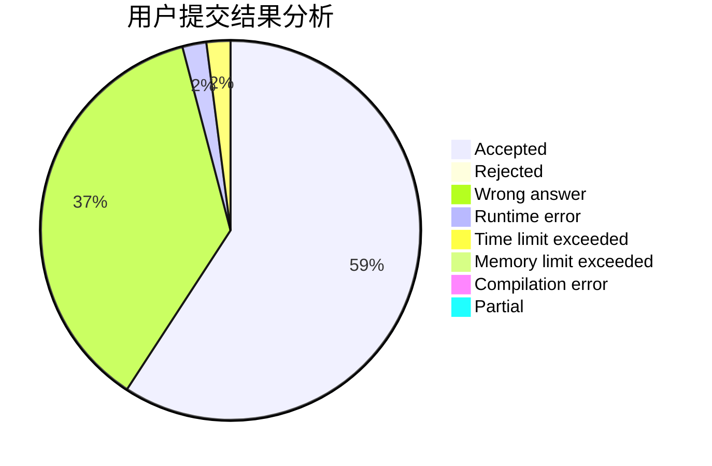
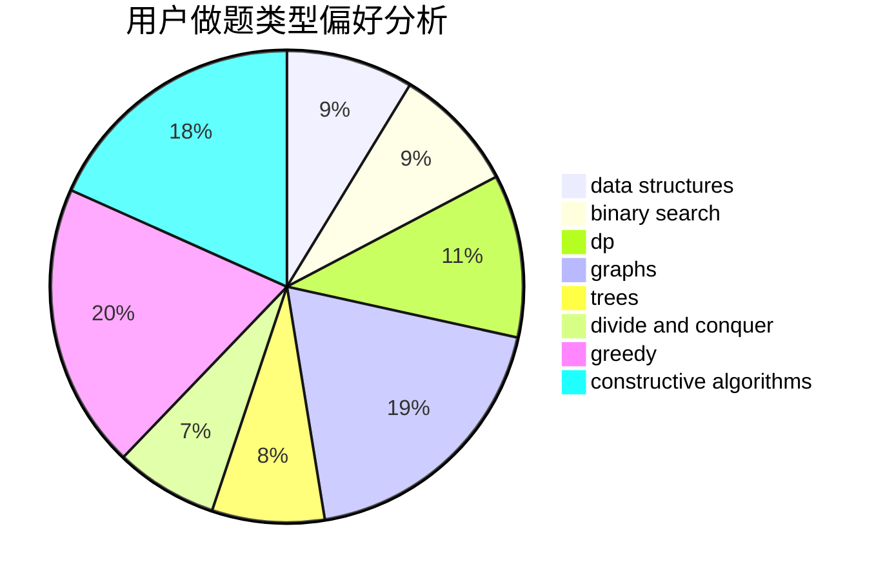
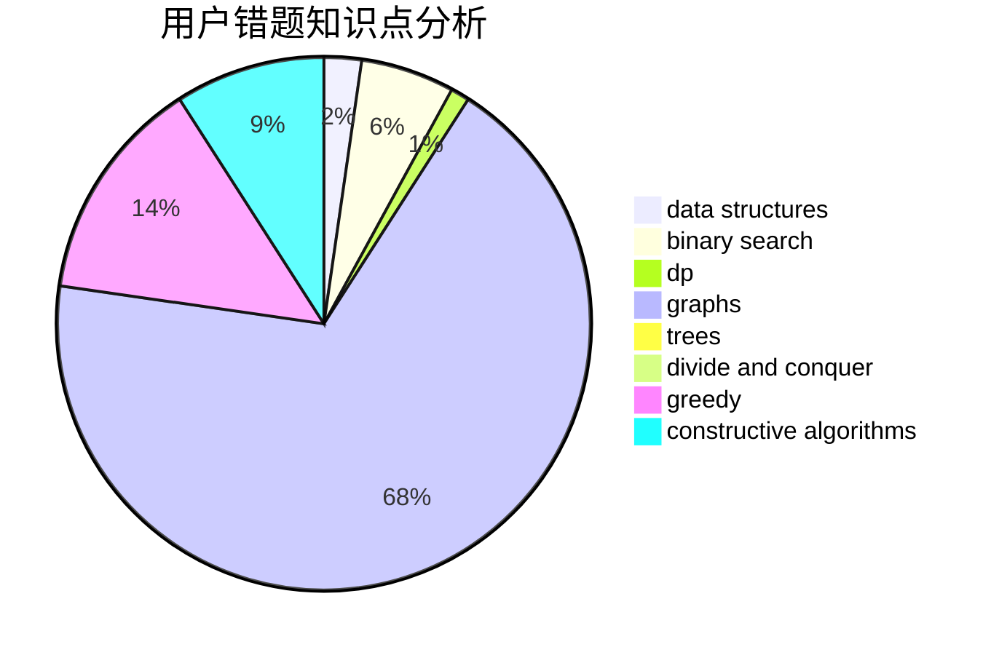

# FreshP_0325

<!-- tabs:start -->

#### **用户提交结果分析**

#### **用户做题类型偏好分析**

#### **用户错题知识点分析**

<!-- tabs:end -->
# 推荐题目
[665C](https://codeforces.com/contest/665/problem/C)		dp,
                        greedy,
                        strings		  
[288E](https://codeforces.com/contest/288/problem/E)		dp,
                        implementation,
                        math		  
[429A](https://codeforces.com/contest/429/problem/A)		dfs and similar,
                        trees		  
[520A](https://codeforces.com/contest/520/problem/A)		implementation,
                        strings		  
[1088F](https://codeforces.com/contest/1088/problem/F)		data structures,
                        trees		  
[701E](https://codeforces.com/contest/701/problem/E)		dsu,graphs,sortings,trees		  
[1505D](https://codeforces.com/contest/1505/problem/D)		number theory		  
[462A](https://codeforces.com/contest/462/problem/A)		brute force,
                        implementation		  
[543B](https://codeforces.com/contest/543/problem/B)		constructive algorithms,
                        graphs,
                        shortest paths		  
[1033A](https://codeforces.com/contest/1033/problem/A)		dfs and similar,
                        graphs,
                        implementation		  
