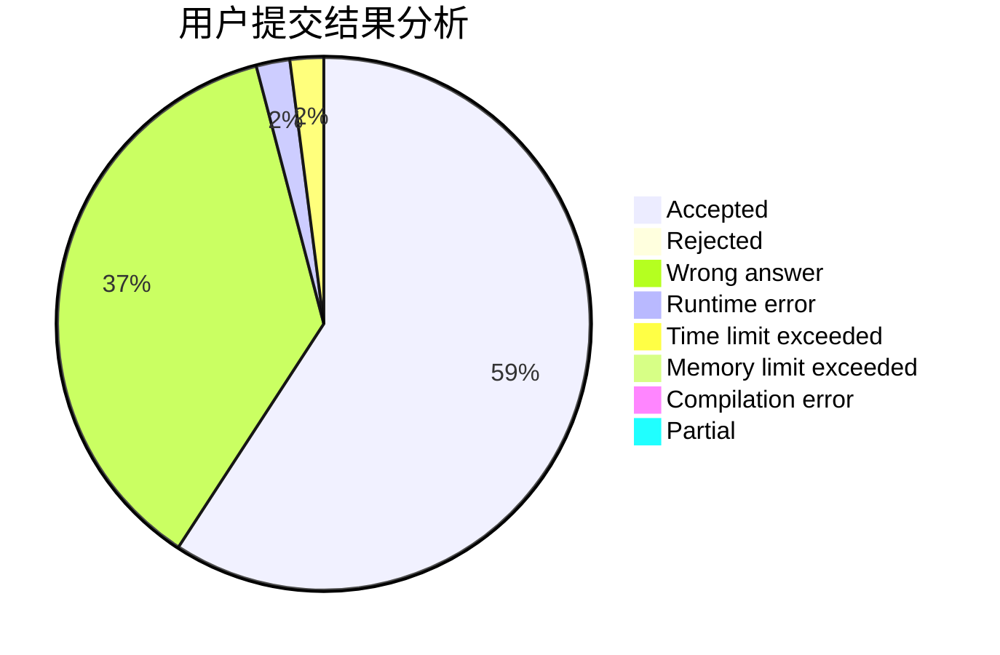
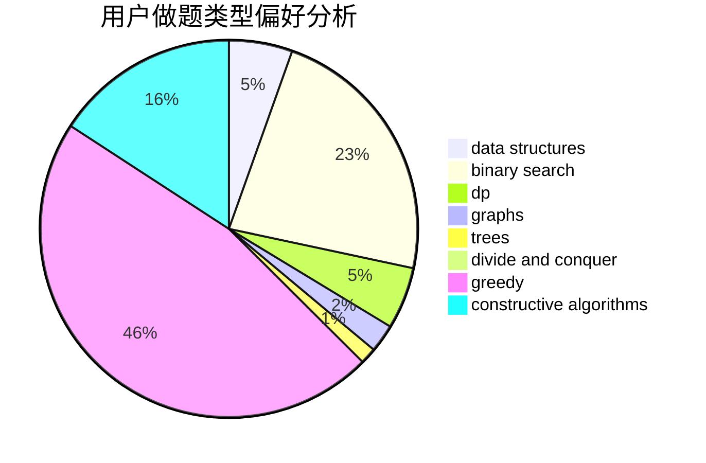
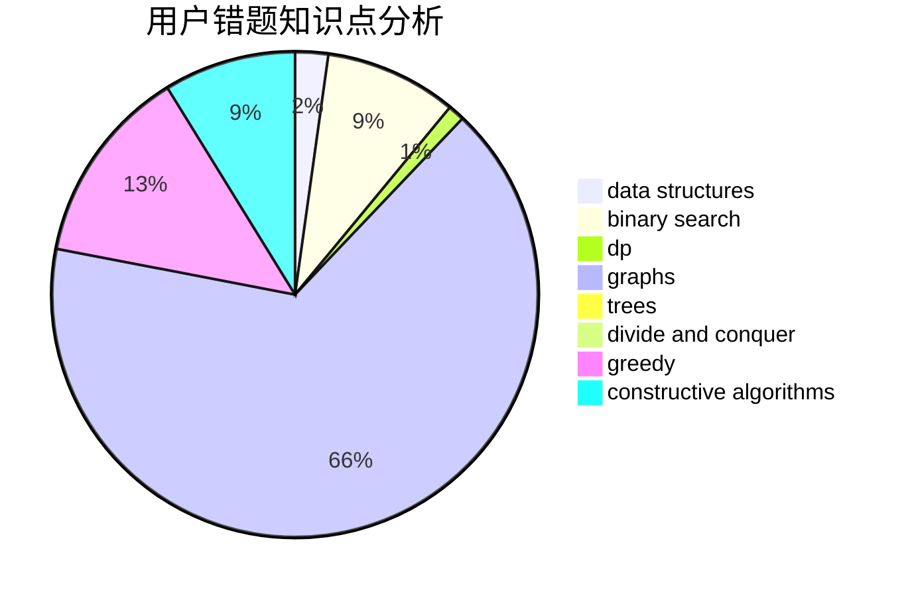

# FreshP_0325

<!-- tabs:start -->

#### **用户提交结果分析**

#### **用户做题类型偏好分析**

#### **用户错题知识点分析**

<!-- tabs:end -->
# 推荐题目
[633A](https://codeforces.com/contest/633/problem/A)		brute force,
                        math,
                        number theory		  
[272E](https://codeforces.com/contest/272/problem/E)		combinatorics,
                        constructive algorithms,
                        graphs		  
[39J](https://codeforces.com/contest/39/problem/J)		hashing,
                        implementation,
                        strings		  
[4A](https://codeforces.com/contest/4/problem/A)		brute force,
                        math		  
[1088C](https://codeforces.com/contest/1088/problem/C)		constructive algorithms,
                        greedy,
                        math		  
[678A](https://codeforces.com/contest/678/problem/A)		implementation,
                        math		  
[1496D](https://codeforces.com/contest/1496/problem/D)		dsu,graphs,sortings,trees		  
[441C](https://codeforces.com/contest/441/problem/C)		constructive algorithms,
                        dfs and similar,
                        implementation		  
[516B](https://codeforces.com/contest/516/problem/B)		dsu,graphs,sortings,trees		  
[1032D](https://codeforces.com/contest/1032/problem/D)		geometry,
                        implementation		  
