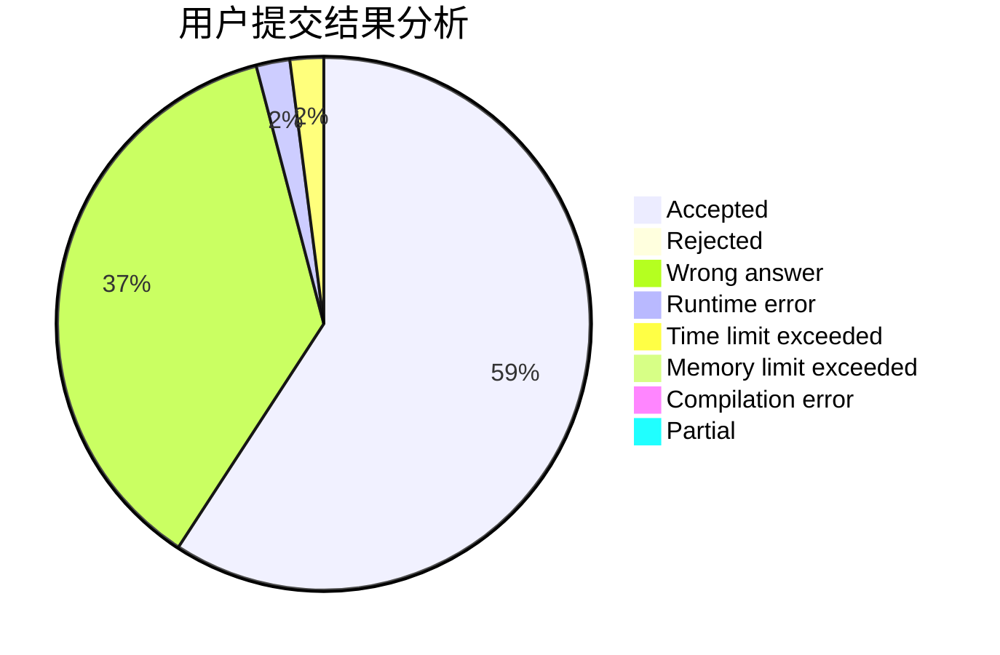
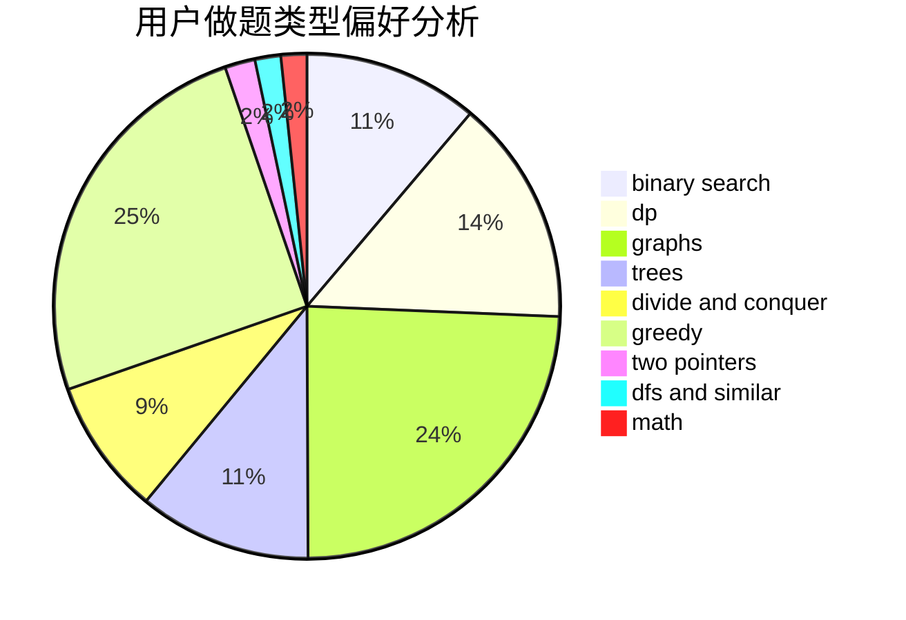

# FreshP_0325

<!-- tabs:start -->

#### **用户提交结果分析**

#### **用户做题类型偏好分析**

<!-- tabs:end -->
# 推荐题目
[665C](https://codeforces.com/contest/665/problem/C)
[288E](https://codeforces.com/contest/288/problem/E)
[429A](https://codeforces.com/contest/429/problem/A)
[520A](https://codeforces.com/contest/520/problem/A)
[1088F](https://codeforces.com/contest/1088/problem/F)
[701E](https://codeforces.com/contest/701/problem/E)
[1505D](https://codeforces.com/contest/1505/problem/D)
[462A](https://codeforces.com/contest/462/problem/A)
[543B](https://codeforces.com/contest/543/problem/B)
[1033A](https://codeforces.com/contest/1033/problem/A)
