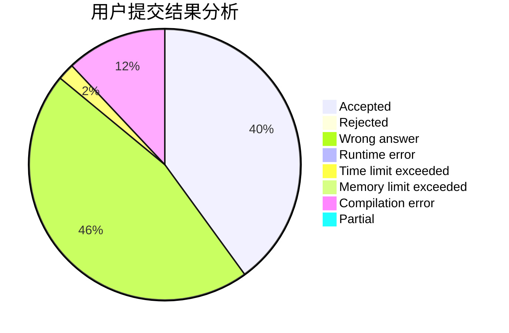
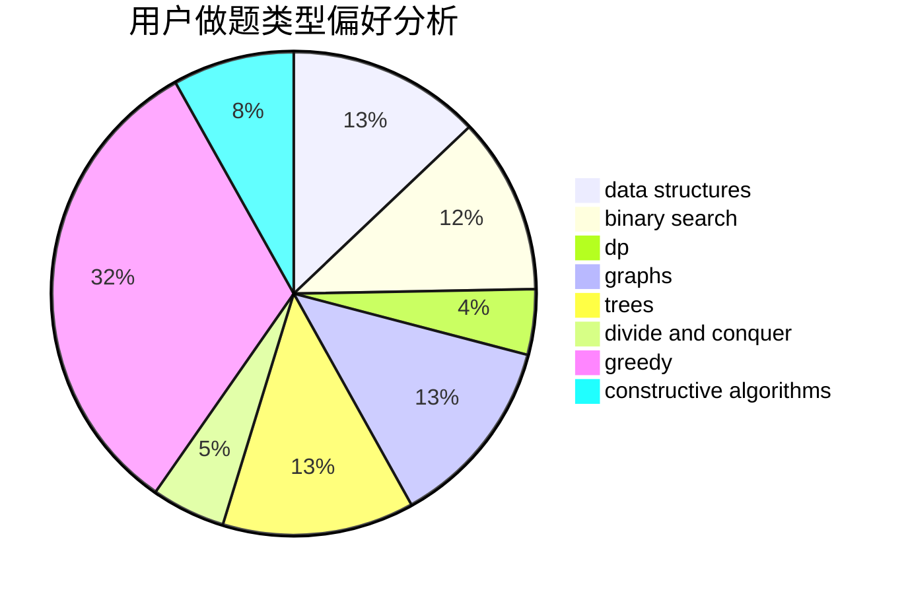
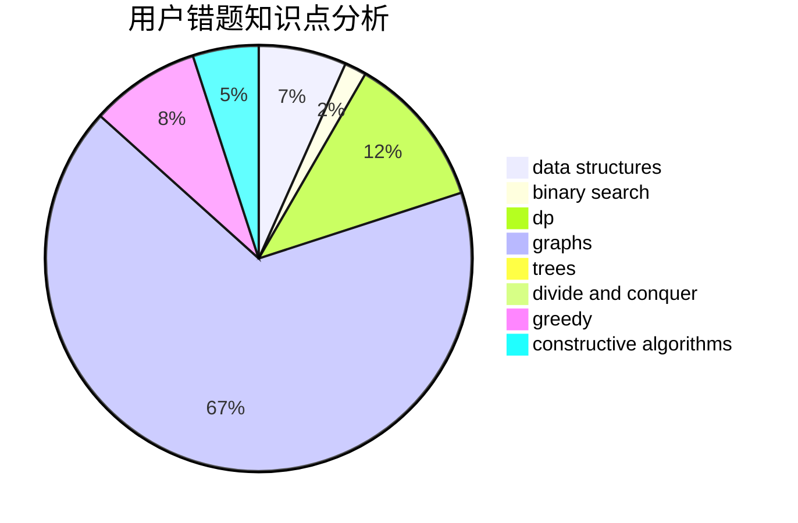

# FrigidPigeon
<!-- tabs:start -->
#### **用户提交结果分析**

#### **用户做题类型偏好分析**

#### **用户错题知识点分析**

<!-- tabs:end -->
# 推荐题目
[Lucky Conversion](https://codeforces.com/contest/146/problem/C)		greedy,
                        implementation		  
[Can Bash Save the Day?](http://codeforces.com/problemset/problem/757/G)		data structures,
                        divide and conquer,
                        graphs,
                        trees		  
[Bandit in a City](http://codeforces.com/problemset/problem/1436/D)		binary search,
                        dfs and similar,
                        graphs,
                        greedy,
                        trees		  
[Robot Control](http://codeforces.com/problemset/problem/346/D)		dp,
                        graphs,
                        shortest paths		  
[Streets and Avenues in Berhattan](http://codeforces.com/problemset/problem/1070/J)		dp		  
[Big Maximum Sum](http://codeforces.com/problemset/problem/75/D)		data structures,
                        dp,
                        greedy,
                        implementation,
                        math,
                        trees		  
[Oracle for majority function](http://codeforces.com/problemset/problem/1002/D3)		nan		  
[Heidi and Library (medium)](http://codeforces.com/problemset/problem/802/B)		data structures,
                        greedy		  
[The Thorny Path](http://codeforces.com/problemset/problem/1411/F)		greedy,
                        math		  
[Wizard's Tour](https://codeforces.com/contest/860/problem/D)		constructive algorithms,
                        dfs and similar,
                        graphs		  
<!-- tabs:start -->
#### **data structures**
[Lucky Conversion](http://codeforces.com/problemset/problem/757/G)		data structures,
                        divide and conquer,
                        graphs,
                        trees		  
[Can Bash Save the Day?](http://codeforces.com/problemset/problem/75/D)		data structures,
                        dp,
                        greedy,
                        implementation,
                        math,
                        trees		  
[Bandit in a City](http://codeforces.com/problemset/problem/802/B)		data structures,
                        greedy		  
[Robot Control](http://codeforces.com/problemset/problem/1227/D2)		data structures,
                        greedy		  
[Streets and Avenues in Berhattan](http://codeforces.com/problemset/problem/165/D)		data structures,
                        dsu,
                        trees		  
[Big Maximum Sum](https://codeforces.com/contest/397/problem/E)		data structures,
                        graphs,
                        trees		  
[Oracle for majority function](http://codeforces.com/problemset/problem/523/D)		*special problem,
                        data structures,
                        implementation		  
[Heidi and Library (medium)](http://codeforces.com/problemset/problem/860/E)		data structures,
                        dfs and similar,
                        trees		  
[The Thorny Path](http://codeforces.com/problemset/problem/707/D)		bitmasks,
                        data structures,
                        dfs and similar,
                        implementation		  
[Wizard's Tour](http://codeforces.com/problemset/problem/144/E)		data structures,
                        greedy		  
#### **binary search**
[Lucky Conversion](http://codeforces.com/problemset/problem/1436/D)		binary search,
                        dfs and similar,
                        graphs,
                        greedy,
                        trees		  
[Can Bash Save the Day?](http://codeforces.com/problemset/problem/1366/F)		binary search,
                        dp,
                        geometry,
                        graphs		  
[Bandit in a City](http://codeforces.com/problemset/problem/701/C)		binary search,
                        strings,
                        two pointers		  
[Robot Control](https://codeforces.com/contest/1435/problem/C)		binary search,
                        brute force,
                        dp,
                        implementation,
                        sortings,
                        two pointers		  
[Streets and Avenues in Berhattan](http://codeforces.com/problemset/problem/1366/E)		binary search,
                        brute force,
                        combinatorics,
                        constructive algorithms,
                        dp,
                        two pointers		  
[Big Maximum Sum](http://codeforces.com/problemset/problem/607/A)		binary search,
                        dp		  
[Oracle for majority function](http://codeforces.com/problemset/problem/1492/C)		binary search,
                        data structures,
                        dp,
                        greedy,
                        two pointers		  
[Heidi and Library (medium)](http://codeforces.com/problemset/problem/1463/D)		binary search,
                        constructive algorithms,
                        greedy,
                        two pointers		  
[The Thorny Path](http://codeforces.com/problemset/problem/1490/G)		binary search,
                        data structures,
                        math		  
[Wizard's Tour](http://codeforces.com/problemset/problem/1479/D)		binary search,
                        bitmasks,
                        brute force,
                        data structures,
                        probabilities,
                        trees		  
#### **dp**
[Lucky Conversion](http://codeforces.com/problemset/problem/346/D)		dp,
                        graphs,
                        shortest paths		  
[Can Bash Save the Day?](http://codeforces.com/problemset/problem/1070/J)		dp		  
[Bandit in a City](http://codeforces.com/problemset/problem/75/D)		data structures,
                        dp,
                        greedy,
                        implementation,
                        math,
                        trees		  
[Robot Control](http://codeforces.com/problemset/problem/1366/F)		binary search,
                        dp,
                        geometry,
                        graphs		  
[Streets and Avenues in Berhattan](http://codeforces.com/problemset/problem/219/C)		brute force,
                        dp,
                        greedy		  
[Big Maximum Sum](http://codeforces.com/problemset/problem/288/E)		dp,
                        implementation,
                        math		  
[Oracle for majority function](https://codeforces.com/contest/1435/problem/C)		binary search,
                        brute force,
                        dp,
                        implementation,
                        sortings,
                        two pointers		  
[Heidi and Library (medium)](http://codeforces.com/problemset/problem/1096/E)		combinatorics,
                        dp,
                        math,
                        probabilities		  
[The Thorny Path](http://codeforces.com/problemset/problem/848/D)		combinatorics,
                        dp,
                        flows,
                        graphs		  
[Wizard's Tour](http://codeforces.com/problemset/problem/425/C)		data structures,
                        dp		  
#### **graph**
[Lucky Conversion](http://codeforces.com/problemset/problem/757/G)		data structures,
                        divide and conquer,
                        graphs,
                        trees		  
[Can Bash Save the Day?](http://codeforces.com/problemset/problem/1436/D)		binary search,
                        dfs and similar,
                        graphs,
                        greedy,
                        trees		  
[Bandit in a City](http://codeforces.com/problemset/problem/346/D)		dp,
                        graphs,
                        shortest paths		  
[Robot Control](https://codeforces.com/contest/860/problem/D)		constructive algorithms,
                        dfs and similar,
                        graphs		  
[Streets and Avenues in Berhattan](http://codeforces.com/problemset/problem/1366/F)		binary search,
                        dp,
                        geometry,
                        graphs		  
[Big Maximum Sum](https://codeforces.com/contest/397/problem/E)		data structures,
                        graphs,
                        trees		  
[Oracle for majority function](http://codeforces.com/problemset/problem/1027/D)		dfs and similar,
                        graphs		  
[Heidi and Library (medium)](http://codeforces.com/problemset/problem/848/D)		combinatorics,
                        dp,
                        flows,
                        graphs		  
[The Thorny Path](http://codeforces.com/problemset/problem/1495/C)		constructive algorithms,
                        graphs		  
[Wizard's Tour](http://codeforces.com/problemset/problem/1416/D)		data structures,
                        dsu,
                        graphs,
                        implementation,
                        trees		  
#### **trees**
[Lucky Conversion](http://codeforces.com/problemset/problem/757/G)		data structures,
                        divide and conquer,
                        graphs,
                        trees		  
[Can Bash Save the Day?](http://codeforces.com/problemset/problem/1436/D)		binary search,
                        dfs and similar,
                        graphs,
                        greedy,
                        trees		  
[Bandit in a City](http://codeforces.com/problemset/problem/75/D)		data structures,
                        dp,
                        greedy,
                        implementation,
                        math,
                        trees		  
[Robot Control](http://codeforces.com/problemset/problem/165/D)		data structures,
                        dsu,
                        trees		  
[Streets and Avenues in Berhattan](https://codeforces.com/contest/397/problem/E)		data structures,
                        graphs,
                        trees		  
[Big Maximum Sum](http://codeforces.com/problemset/problem/860/E)		data structures,
                        dfs and similar,
                        trees		  
[Oracle for majority function](http://codeforces.com/problemset/problem/1175/E)		data structures,
                        dfs and similar,
                        divide and conquer,
                        dp,
                        greedy,
                        implementation,
                        trees		  
[Heidi and Library (medium)](http://codeforces.com/problemset/problem/1416/D)		data structures,
                        dsu,
                        graphs,
                        implementation,
                        trees		  
[The Thorny Path](http://codeforces.com/problemset/problem/1479/D)		binary search,
                        bitmasks,
                        brute force,
                        data structures,
                        probabilities,
                        trees		  
[Wizard's Tour](http://codeforces.com/problemset/problem/1511/C)		brute force,
                        data structures,
                        implementation,
                        trees		  
#### **divide and conquer**
[Lucky Conversion](http://codeforces.com/problemset/problem/757/G)		data structures,
                        divide and conquer,
                        graphs,
                        trees		  
[Can Bash Save the Day?](http://codeforces.com/problemset/problem/1175/E)		data structures,
                        dfs and similar,
                        divide and conquer,
                        dp,
                        greedy,
                        implementation,
                        trees		  
[Bandit in a City](http://codeforces.com/problemset/problem/1461/D)		binary search,
                        brute force,
                        data structures,
                        divide and conquer,
                        implementation,
                        sortings		  
[Robot Control](http://codeforces.com/problemset/problem/1466/G)		combinatorics,
                        divide and conquer,
                        hashing,
                        math,
                        string suffix structures,
                        strings		  
[Streets and Avenues in Berhattan](http://codeforces.com/problemset/problem/1490/D)		dfs and similar,
                        divide and conquer,
                        implementation		  
[Big Maximum Sum](https://codeforces.com/contest/1483/problem/C)		data structures,
                        divide and conquer,
                        dp		  
[Oracle for majority function](http://codeforces.com/problemset/problem/1491/E)		brute force,
                        dfs and similar,
                        divide and conquer,
                        number theory,
                        trees		  
[Heidi and Library (medium)](http://codeforces.com/problemset/problem/1303/G)		data structures,
                        divide and conquer,
                        geometry,
                        trees		  
[The Thorny Path](http://codeforces.com/problemset/problem/1494/D)		constructive algorithms,
                        data structures,
                        dfs and similar,
                        divide and conquer,
                        dsu,
                        greedy,
                        sortings,
                        trees		  
[Wizard's Tour](http://codeforces.com/problemset/problem/1482/E)		data structures,
                        divide and conquer,
                        dp		  
#### **greedy**
[Lucky Conversion](https://codeforces.com/contest/146/problem/C)		greedy,
                        implementation		  
[Can Bash Save the Day?](http://codeforces.com/problemset/problem/1436/D)		binary search,
                        dfs and similar,
                        graphs,
                        greedy,
                        trees		  
[Bandit in a City](http://codeforces.com/problemset/problem/75/D)		data structures,
                        dp,
                        greedy,
                        implementation,
                        math,
                        trees		  
[Robot Control](http://codeforces.com/problemset/problem/802/B)		data structures,
                        greedy		  
[Streets and Avenues in Berhattan](http://codeforces.com/problemset/problem/1411/F)		greedy,
                        math		  
[Big Maximum Sum](http://codeforces.com/problemset/problem/1227/D2)		data structures,
                        greedy		  
[Oracle for majority function](http://codeforces.com/problemset/problem/219/C)		brute force,
                        dp,
                        greedy		  
[Heidi and Library (medium)](https://codeforces.com/contest/860/problem/C)		greedy,
                        implementation		  
[The Thorny Path](http://codeforces.com/problemset/problem/339/E)		constructive algorithms,
                        dfs and similar,
                        greedy		  
[Wizard's Tour](http://codeforces.com/problemset/problem/1070/F)		greedy		  
#### **constructive algorithms**
[Lucky Conversion](https://codeforces.com/contest/860/problem/D)		constructive algorithms,
                        dfs and similar,
                        graphs		  
[Can Bash Save the Day?](http://codeforces.com/problemset/problem/339/E)		constructive algorithms,
                        dfs and similar,
                        greedy		  
[Bandit in a City](http://codeforces.com/problemset/problem/341/E)		constructive algorithms,
                        greedy		  
[Robot Control](https://codeforces.com/contest/1269/problem/C)		constructive algorithms,
                        greedy,
                        implementation,
                        strings		  
[Streets and Avenues in Berhattan](http://codeforces.com/problemset/problem/1495/C)		constructive algorithms,
                        graphs		  
[Big Maximum Sum](http://codeforces.com/problemset/problem/493/D)		constructive algorithms,
                        games,
                        math		  
[Oracle for majority function](http://codeforces.com/problemset/problem/1366/E)		binary search,
                        brute force,
                        combinatorics,
                        constructive algorithms,
                        dp,
                        two pointers		  
[Heidi and Library (medium)](http://codeforces.com/problemset/problem/1372/C)		constructive algorithms,
                        math		  
[The Thorny Path](http://codeforces.com/problemset/problem/1371/D)		constructive algorithms,
                        greedy,
                        implementation		  
[Wizard's Tour](http://codeforces.com/problemset/problem/1493/A)		constructive algorithms,
                        greedy		  
#### **sortings**
[Lucky Conversion](https://codeforces.com/contest/1435/problem/C)		binary search,
                        brute force,
                        dp,
                        implementation,
                        sortings,
                        two pointers		  
[Can Bash Save the Day?](https://codeforces.com/contest/1496/problem/C)		geometry,
                        greedy,
                        math,
                        sortings		  
[Bandit in a City](http://codeforces.com/problemset/problem/1495/A)		geometry,
                        greedy,
                        math,
                        sortings		  
[Robot Control](http://codeforces.com/problemset/problem/1497/A)		brute force,
                        data structures,
                        greedy,
                        sortings		  
[Streets and Avenues in Berhattan](http://codeforces.com/problemset/problem/1427/A)		math,
                        sortings		  
[Big Maximum Sum](http://codeforces.com/problemset/problem/1461/D)		binary search,
                        brute force,
                        data structures,
                        divide and conquer,
                        implementation,
                        sortings		  
[Oracle for majority function](http://codeforces.com/problemset/problem/1437/C)		dp,
                        flows,
                        graph matchings,
                        greedy,
                        math,
                        sortings		  
[Heidi and Library (medium)](http://codeforces.com/problemset/problem/1473/A)		greedy,
                        implementation,
                        math,
                        sortings		  
[The Thorny Path](http://codeforces.com/problemset/problem/1486/B)		binary search,
                        geometry,
                        shortest paths,
                        sortings		  
[Wizard's Tour](http://codeforces.com/problemset/problem/1480/B)		greedy,
                        implementation,
                        sortings		  
<!-- tabs:end -->
