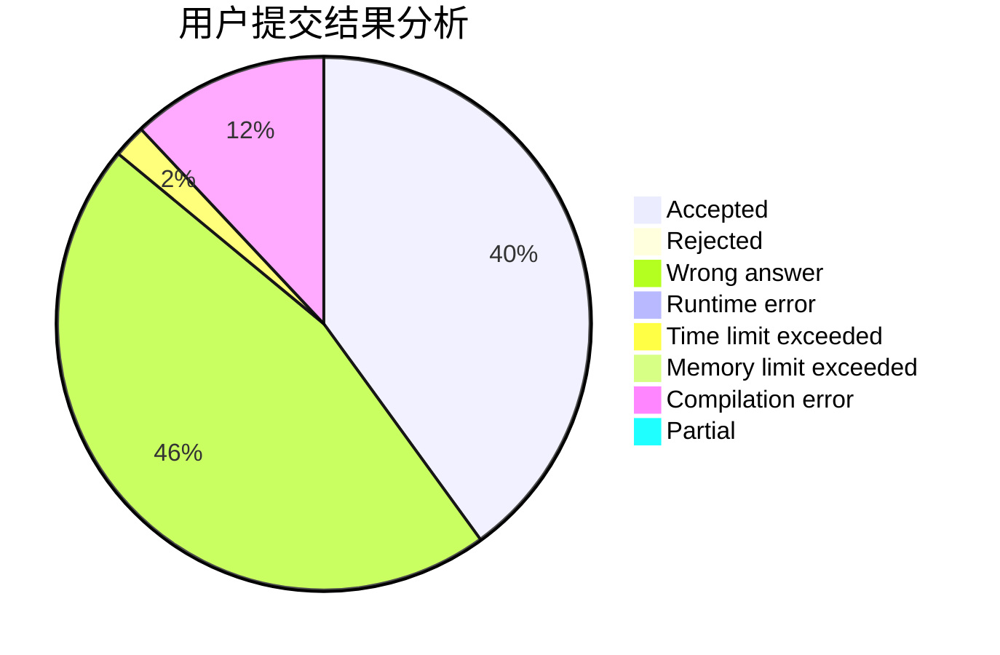
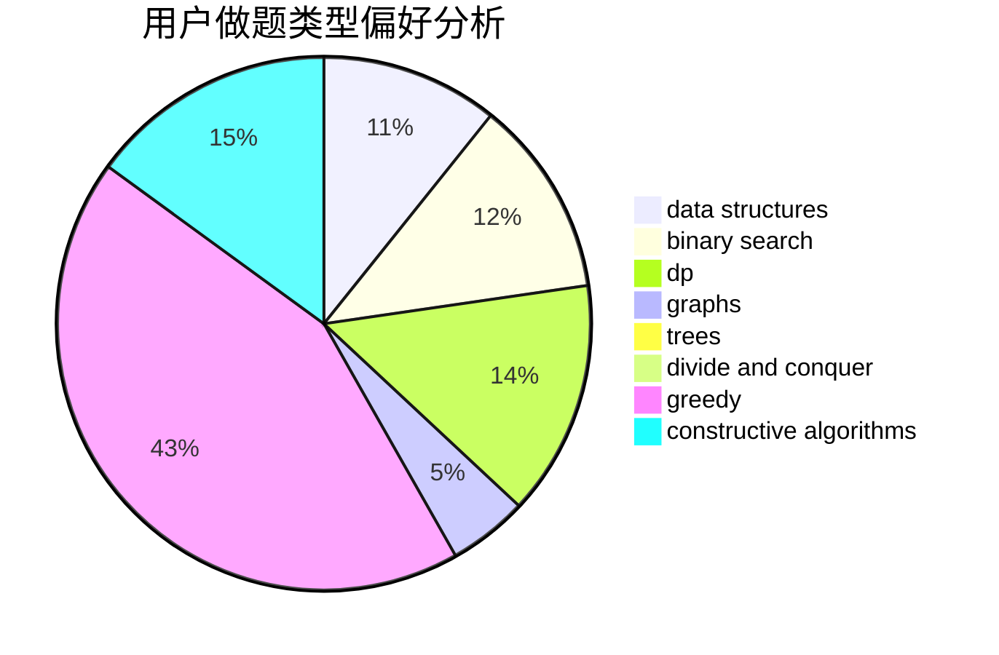
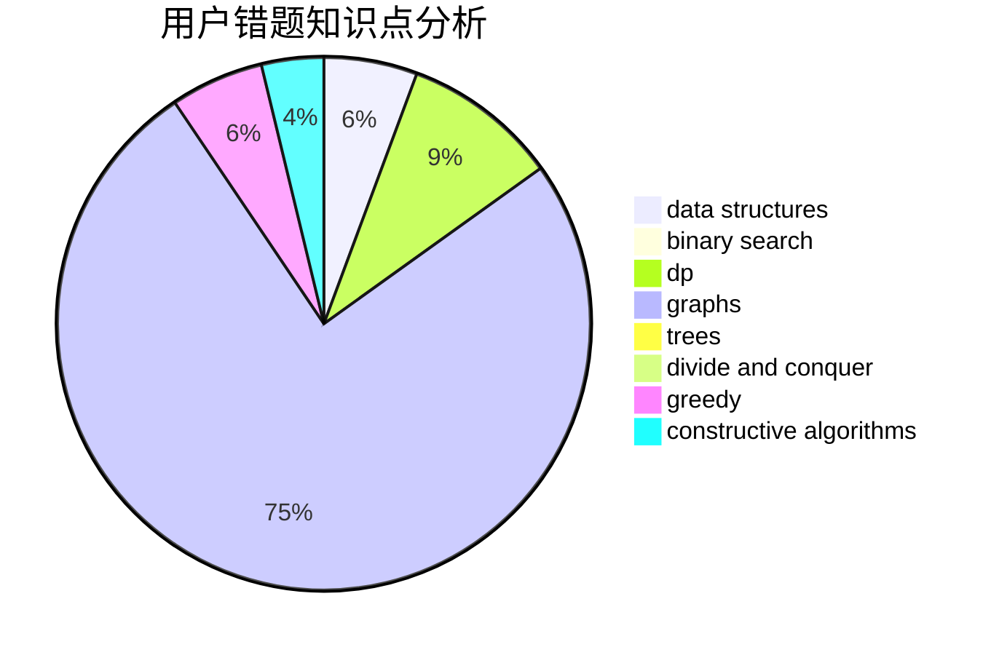

# FrigidPigeon

<!-- tabs:start -->

#### **用户提交结果分析**

#### **用户做题类型偏好分析**

#### **用户错题知识点分析**

<!-- tabs:end -->
# 推荐题目
[1445C](https://codeforces.com/contest/1445/problem/C)		dsu,graphs,sortings,trees		  
[1373E](https://codeforces.com/contest/1373/problem/E)		brute force,
                        constructive algorithms,
                        dp,
                        greedy		  
[878D](https://codeforces.com/contest/878/problem/D)		bitmasks		  
[30E](https://codeforces.com/contest/30/problem/E)		binary search,
                        constructive algorithms,
                        data structures,
                        greedy,
                        hashing,
                        strings		  
[817A](https://codeforces.com/contest/817/problem/A)		implementation,
                        math,
                        number theory		  
[1097A](https://codeforces.com/contest/1097/problem/A)		brute force,
                        implementation		  
[77B](https://codeforces.com/contest/77/problem/B)		math,
                        probabilities		  
[878E](https://codeforces.com/contest/878/problem/E)		combinatorics,
                        dp		  
[868A](https://codeforces.com/contest/868/problem/A)		brute force,
                        implementation,
                        strings		  
[878C](https://codeforces.com/contest/878/problem/C)		data structures,
                        graphs		  
