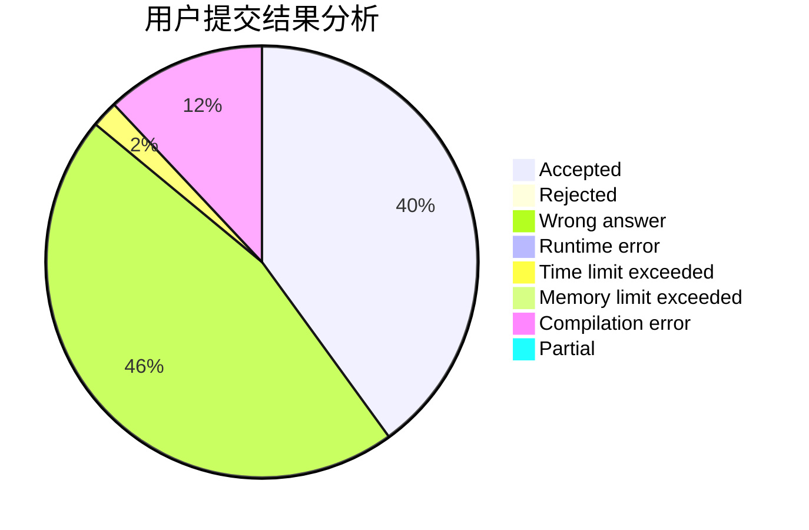
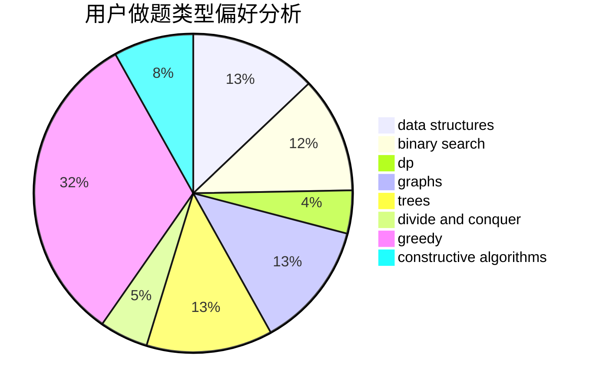
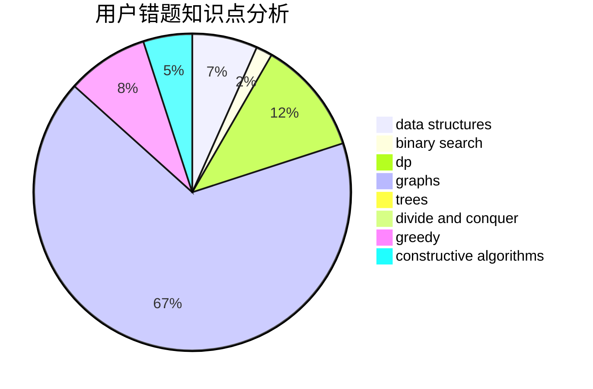

# FrigidPigeon

<!-- tabs:start -->

#### **用户提交结果分析**

#### **用户做题类型偏好分析**

#### **用户错题知识点分析**

<!-- tabs:end -->
# 推荐题目
[1435C](https://codeforces.com/contest/1435/problem/C)		dsu,graphs,sortings,trees		  
[1366F](https://codeforces.com/contest/1366/problem/F)		binary search,
                        dp,
                        geometry,
                        graphs		  
[860D](https://codeforces.com/contest/860/problem/D)		dsu,graphs,sortings,trees		  
[294C](https://codeforces.com/contest/294/problem/C)		combinatorics,
                        number theory		  
[802B](https://codeforces.com/contest/802/problem/B)		data structures,
                        greedy		  
[1096E](https://codeforces.com/contest/1096/problem/E)		combinatorics,
                        dp,
                        math,
                        probabilities		  
[75D](https://codeforces.com/contest/75/problem/D)		data structures,
                        dp,
                        greedy,
                        implementation,
                        math,
                        trees		  
[860E](https://codeforces.com/contest/860/problem/E)		data structures,
                        dfs and similar,
                        trees		  
[848D](https://codeforces.com/contest/848/problem/D)		combinatorics,
                        dp,
                        flows,
                        graphs		  
[860C](https://codeforces.com/contest/860/problem/C)		dsu,graphs,sortings,trees		  
