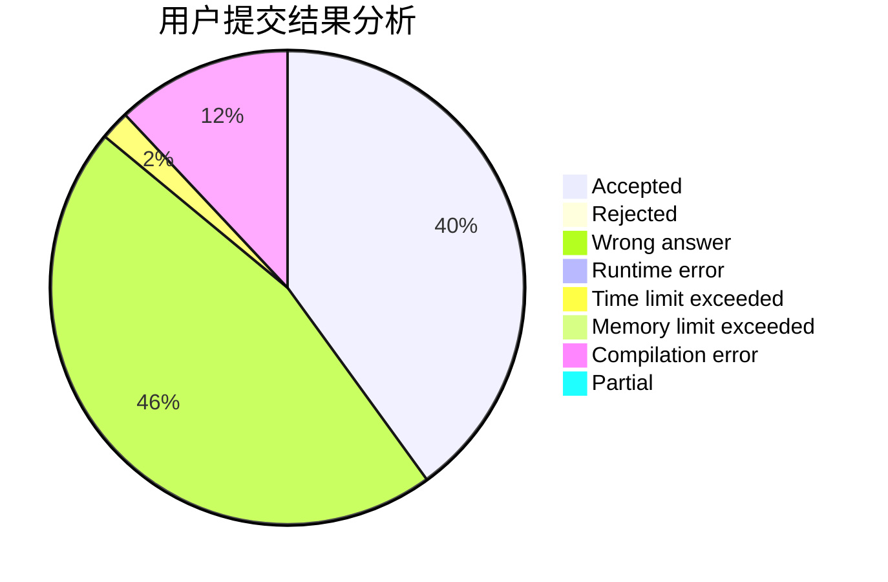
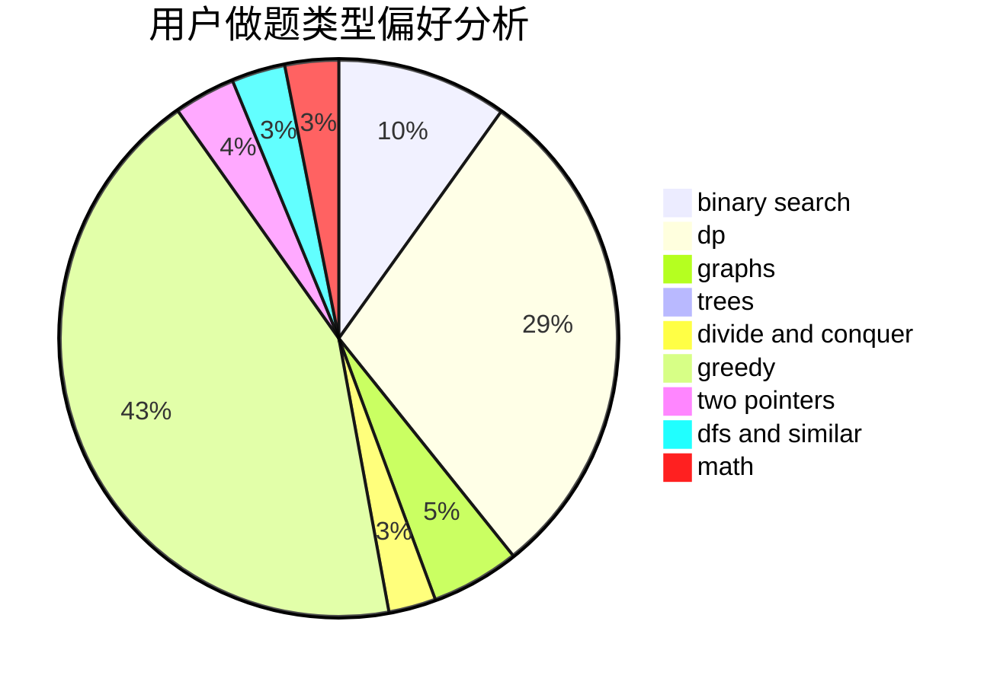

# FrigidPigeon

<!-- tabs:start -->

#### **用户提交结果分析**

#### **用户做题类型偏好分析**

<!-- tabs:end -->
# 推荐题目
[1445C](https://codeforces.com/contest/1445/problem/C)
[1373E](https://codeforces.com/contest/1373/problem/E)
[878D](https://codeforces.com/contest/878/problem/D)
[30E](https://codeforces.com/contest/30/problem/E)
[817A](https://codeforces.com/contest/817/problem/A)
[1097A](https://codeforces.com/contest/1097/problem/A)
[77B](https://codeforces.com/contest/77/problem/B)
[878E](https://codeforces.com/contest/878/problem/E)
[868A](https://codeforces.com/contest/868/problem/A)
[878C](https://codeforces.com/contest/878/problem/C)
