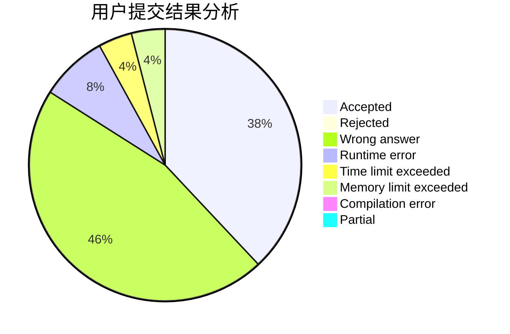
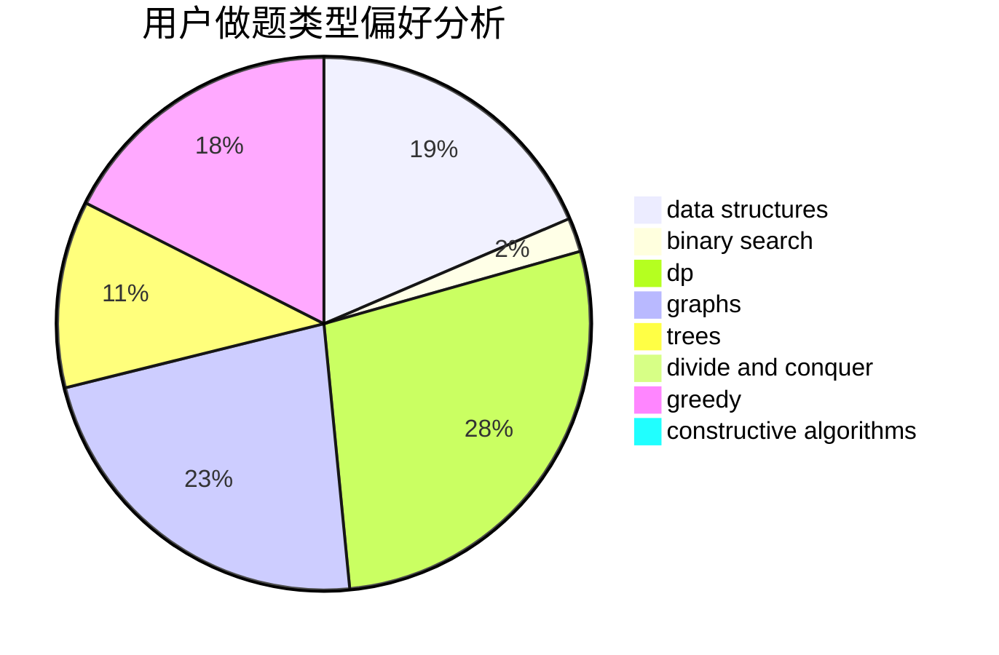
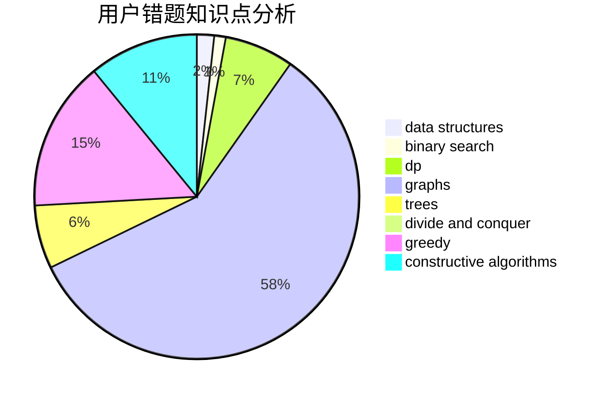

# Froggygua

<!-- tabs:start -->

#### **用户提交结果分析**

#### **用户做题类型偏好分析**

#### **用户错题知识点分析**

<!-- tabs:end -->
# 推荐题目
[1005C](https://codeforces.com/contest/1005/problem/C)		brute force,
                        greedy,
                        implementation		  
[793D](https://codeforces.com/contest/793/problem/D)		dp,
                        graphs,
                        shortest paths		  
[1469E](https://codeforces.com/contest/1469/problem/E)		bitmasks,
                        brute force,
                        hashing,
                        string suffix structures,
                        strings,
                        two pointers		  
[1247D](https://codeforces.com/contest/1247/problem/D)		dsu,graphs,sortings,trees		  
[841D](https://codeforces.com/contest/841/problem/D)		dsu,graphs,sortings,trees		  
[1119D](https://codeforces.com/contest/1119/problem/D)		binary search,
                        sortings		  
[277D](https://codeforces.com/contest/277/problem/D)		dp,
                        probabilities		  
[861A](https://codeforces.com/contest/861/problem/A)		dsu,graphs,sortings,trees		  
[861B](https://codeforces.com/contest/861/problem/B)		dsu,graphs,sortings,trees		  
[490F](https://codeforces.com/contest/490/problem/F)		data structures,
                        dfs and similar,
                        dp,
                        trees		  
