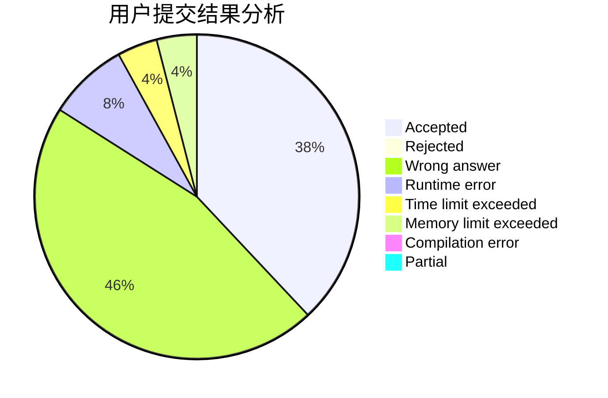
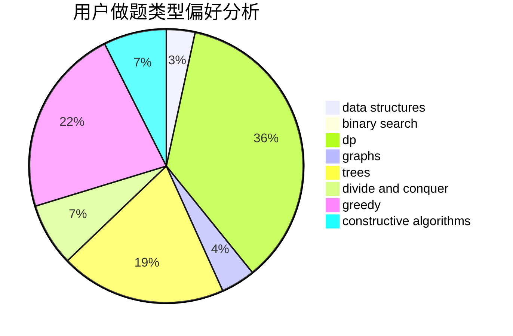
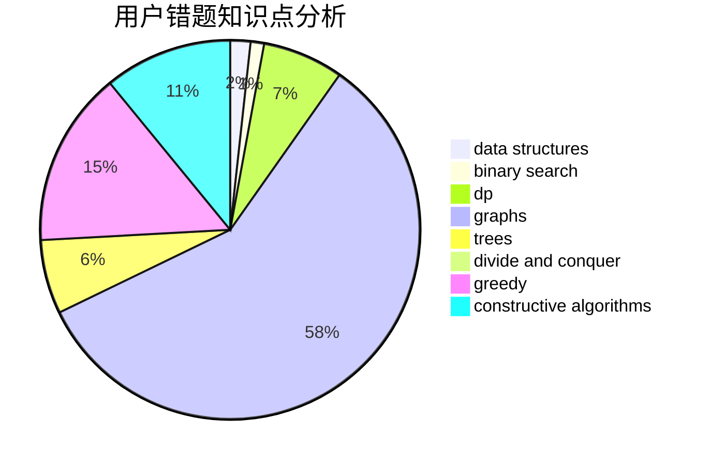

# Froggygua

<!-- tabs:start -->

#### **用户提交结果分析**

#### **用户做题类型偏好分析**

#### **用户错题知识点分析**

<!-- tabs:end -->
# 推荐题目
[1005D](https://codeforces.com/contest/1005/problem/D)		dp,
                        greedy,
                        number theory		  
[808F](https://codeforces.com/contest/808/problem/F)		binary search,
                        flows,
                        graphs		  
[1477F](https://codeforces.com/contest/1477/problem/F)		combinatorics,
                        fft,
                        math,
                        probabilities		  
[1251C](https://codeforces.com/contest/1251/problem/C)		greedy,
                        two pointers		  
[860D](https://codeforces.com/contest/860/problem/D)		dsu,graphs,sortings,trees		  
[11291](https://codeforces.com/contest/1129/problem/1)		dsu,graphs,sortings,trees		  
[292E](https://codeforces.com/contest/292/problem/E)		data structures		  
[879A](https://codeforces.com/contest/879/problem/A)		implementation		  
[879B](https://codeforces.com/contest/879/problem/B)		data structures,
                        implementation		  
[510E](https://codeforces.com/contest/510/problem/E)		flows		  
