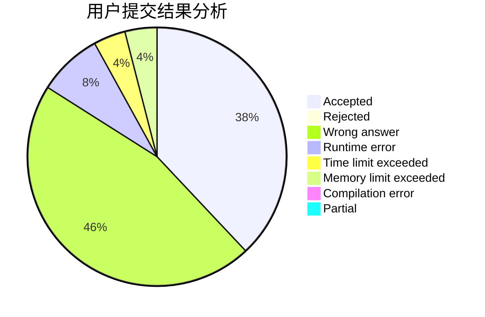
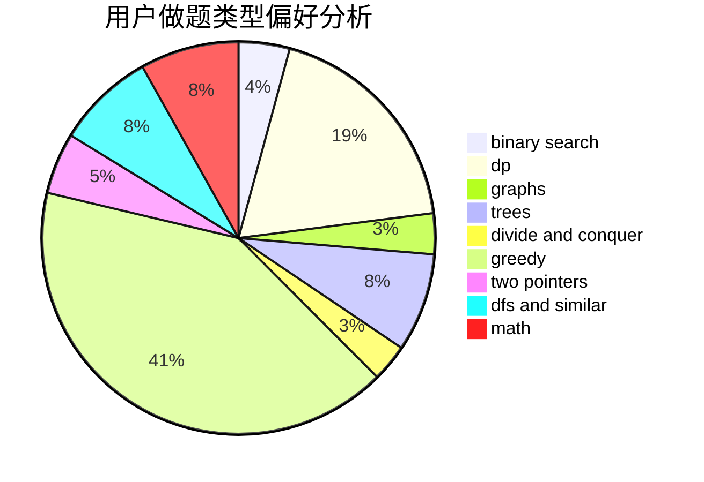

# Froggygua

<!-- tabs:start -->

#### **用户提交结果分析**

#### **用户做题类型偏好分析**

<!-- tabs:end -->
# 推荐题目
[1005D](https://codeforces.com/contest/1005/problem/D)
[808F](https://codeforces.com/contest/808/problem/F)
[1477F](https://codeforces.com/contest/1477/problem/F)
[1251C](https://codeforces.com/contest/1251/problem/C)
[860D](https://codeforces.com/contest/860/problem/D)
[11291](https://codeforces.com/contest/1129/problem/1)
[292E](https://codeforces.com/contest/292/problem/E)
[879A](https://codeforces.com/contest/879/problem/A)
[879B](https://codeforces.com/contest/879/problem/B)
[510E](https://codeforces.com/contest/510/problem/E)
