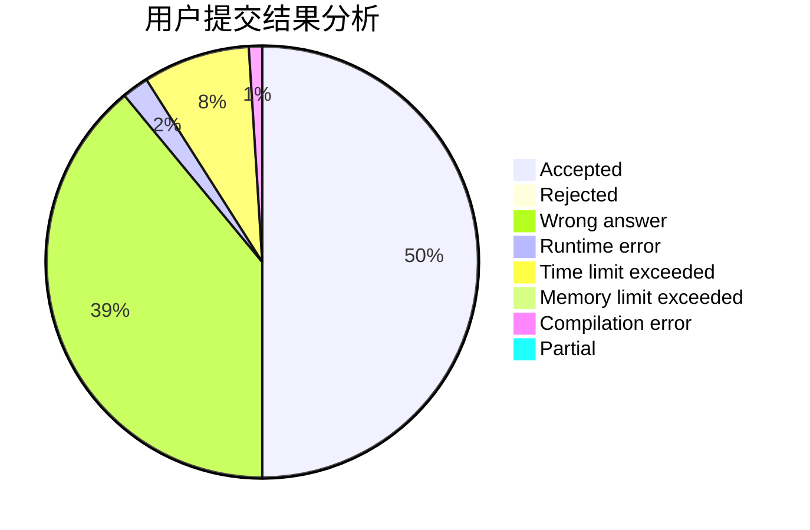
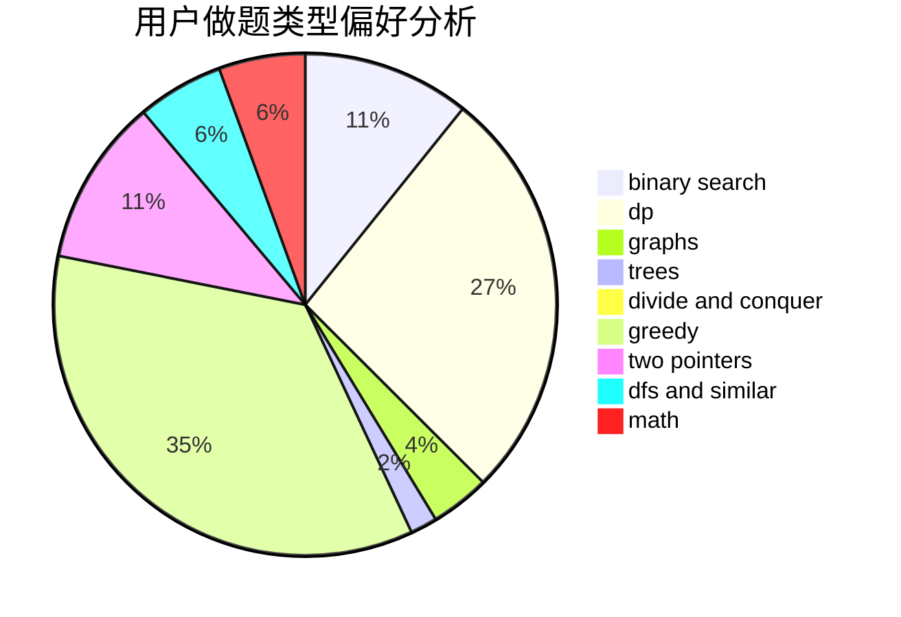

# Frozen_Guardian

<!-- tabs:start -->

#### **用户提交结果分析**

#### **用户做题类型偏好分析**

<!-- tabs:end -->
# 推荐题目
[1388B](https://codeforces.com/contest/1388/problem/B)
[75D](https://codeforces.com/contest/75/problem/D)
[883A](https://codeforces.com/contest/883/problem/A)
[378B](https://codeforces.com/contest/378/problem/B)
[666D](https://codeforces.com/contest/666/problem/D)
[195C](https://codeforces.com/contest/195/problem/C)
[879D](https://codeforces.com/contest/879/problem/D)
[87C](https://codeforces.com/contest/87/problem/C)
[1266G](https://codeforces.com/contest/1266/problem/G)
[1418D](https://codeforces.com/contest/1418/problem/D)
