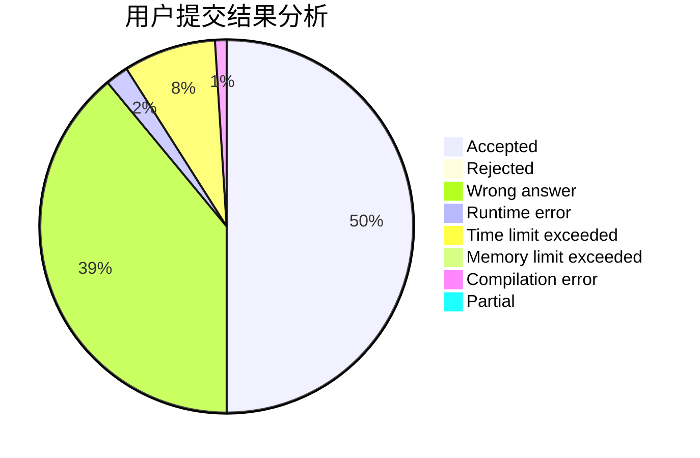
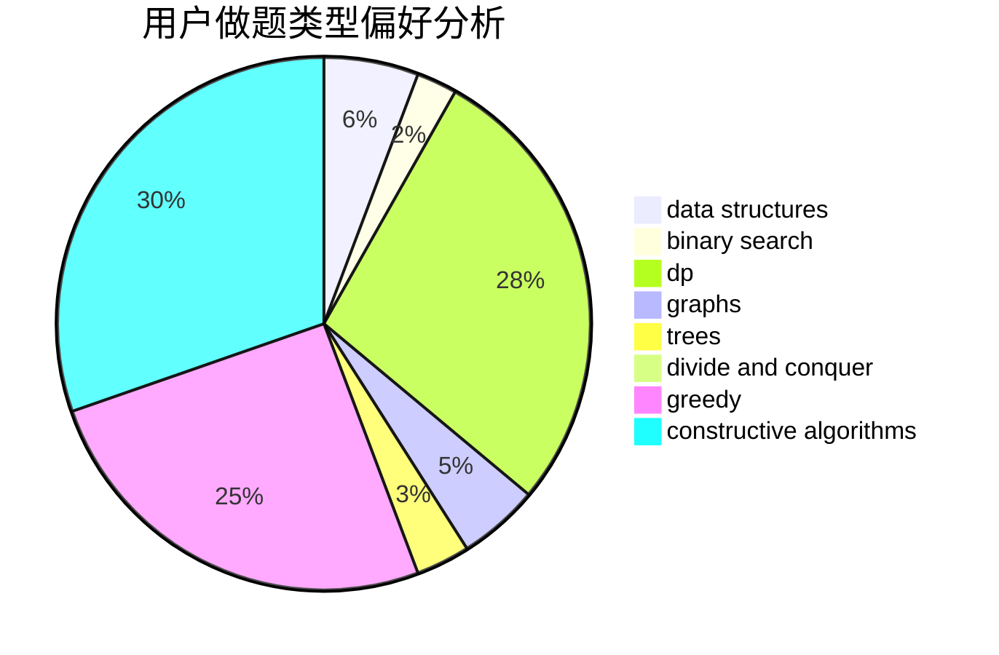
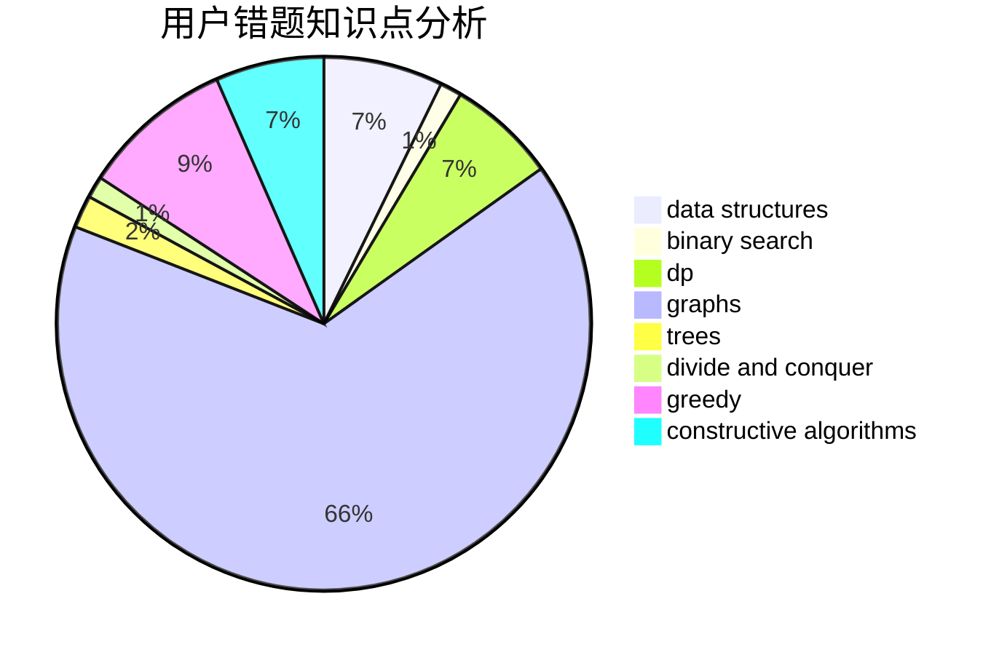

# Frozen_Guardian

<!-- tabs:start -->

#### **用户提交结果分析**

#### **用户做题类型偏好分析**

#### **用户错题知识点分析**

<!-- tabs:end -->
# 推荐题目
[1388B](https://codeforces.com/contest/1388/problem/B)		greedy,
                        math		  
[75D](https://codeforces.com/contest/75/problem/D)		data structures,
                        dp,
                        greedy,
                        implementation,
                        math,
                        trees		  
[883A](https://codeforces.com/contest/883/problem/A)		implementation		  
[378B](https://codeforces.com/contest/378/problem/B)		implementation,
                        sortings		  
[666D](https://codeforces.com/contest/666/problem/D)		brute force,
                        geometry		  
[195C](https://codeforces.com/contest/195/problem/C)		expression parsing,
                        implementation		  
[879D](https://codeforces.com/contest/879/problem/D)		dsu,graphs,sortings,trees		  
[87C](https://codeforces.com/contest/87/problem/C)		dp,
                        games,
                        math		  
[1266G](https://codeforces.com/contest/1266/problem/G)		string suffix structures		  
[1418D](https://codeforces.com/contest/1418/problem/D)		data structures,
                        implementation		  
